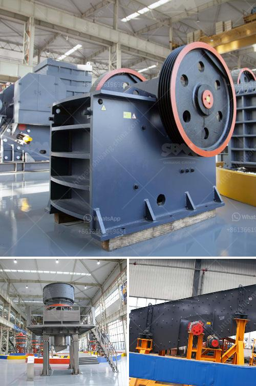

<h3>coal conveyor blet supplier from india</h3>
India, being one of the largest consumers of coal in the world, relies heavily on efficient transportation infrastructure to meet its energy demands. A crucial component of this infrastructure is the conveyor belt system, responsible for transporting coal from mines to power plants. In recent years, Indian coal conveyor belt suppliers have emerged as reliable partners for the country's growing energy sector.

One such prominent player in this industry is based in India, catering to the needs of both domestic and international clients. Over the years, this supplier has earned a reputation for delivering high-quality conveyor belts that are efficient, durable, and tailored to specific customer requirements.

One of the key challenges faced by the coal conveyor belt suppliers in India is ensuring the safety and reliability of their products. Given the harsh conditions in which these belts operate, such as high temperatures, dust, and heavy loads, it is crucial to design and manufacture belts that can withstand such demanding environments. The supplier mentioned earlier has invested heavily in research and development, constantly innovating to provide belts that can endure these challenges.

The coal conveyor belt supplier understands the importance of timely delivery and has established a robust network across the country, ensuring seamless transportation. They have strategically located warehouses and distribution centers, enabling them to serve clients efficiently and promptly. This attribute has contributed significantly to their success and has garnered them a loyal customer base.

Not only does this supplier excel in delivering superior products, but they also provide excellent after-sales service. They understand that maintenance and prompt repairs can significantly extend the lifespan of the conveyor belts. Therefore, they have a dedicated team of experts who offer timely assistance to customers, ensuring uninterrupted operations at coal mines and power plants.

In addition to serving the domestic market, the coal conveyor belt supplier from India has made a mark in the international arena as well. They have successfully exported their products to countries with a significant demand for coal, capitalizing on India's expertise in manufacturing high-quality conveyor belts. This has further strengthened India's position as a global supplier in the coal transportation industry.

Despite the success, the coal conveyor belt suppliers still face certain challenges. They need to stay updated with the latest technologies and advancements in the industry to meet the evolving needs of their customers. Additionally, the increasing environmental concerns regarding coal consumption are forcing suppliers to innovate and explore greener alternatives for transportation.

In conclusion, the coal conveyor belt supplier from India has played a crucial role in the country's energy sector. Their commitment to quality, safety, and timely service has helped them forge a strong presence in the market. As India continues to rely on coal for its energy needs, these suppliers will have to address evolving challenges and embrace sustainable practices to ensure long-term growth and success.
<h3>Contact us</h3><ul><li><strong>Whatsapp:&nbsp;<a href="https://wa.me/8613661969651">+8613661969651</a></strong></li><li><a href="https://swt.shibang-china.com/?git&amp;zhl&amp;coal conveyor blet supplier from india"><strong>Online Service(chat now)</strong></a></li></ul><h3>Related</h3><ul><li><a href='gold ore 300 550tph cs cone crusher for sale.md'>gold ore 300 550tph cs cone crusher for sale</a></li><li><a href='industrial gypsum rotary kiln.md'>industrial gypsum rotary kiln</a></li><li><a href='stone crushing plant manufacturers in.md'>stone crushing plant manufacturers in</a></li><li><a href='barite production lines manufacturers.md'>barite production lines manufacturers</a></li><li><a href='mobile crusher namibia.md'>mobile crusher namibia</a></li></ul>