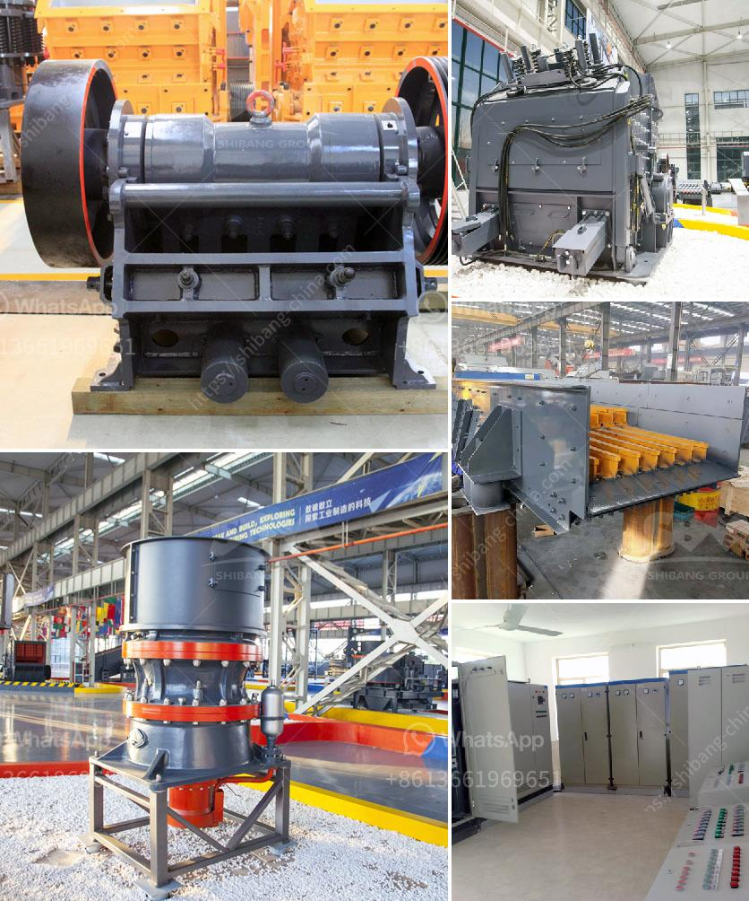

<h3>coal conveyor problem</h3>
Coal, a widely-utilized fossil fuel, continues to hold a significant place in the global energy sector. However, its journey from extraction to utilization is not without challenges. Among the hurdles faced during the coal transportation process, the problem of coal conveyor systems has emerged as a recurring issue. This article sheds light on the numerous complications associated with coal conveyors and potential solutions to overcome these hindrances.

Coal conveyors play a paramount role in efficiently transferring coal from mining sites to plants, ports, and other destinations. However, these conveyor systems often encounter a series of problems, resulting in inefficiencies and disruptions in the coal transportation process.

Continuous usage and exposure to abrasive coal particles cause the conveyor belts to endure significant wear over time. This leads to frequent replacements and repairs, imposing substantial maintenance costs. Furthermore, belt failures can result in unscheduled downtime, causing substantial financial losses and disrupted coal supply chains.

Conveyor belts sometimes experience misalignment due to improper installation, overloading, or uneven loading of coal onto the belt. Belt misalignment can lead to spillage, increased wear and tear, and even conveyor breakdowns, further exacerbating the operational issues.

Excessive coal dust generated during transportation poses various challenges. Not only does it contribute to environmental pollution, but it also leads to health risks for workers. Coal dust can accumulate on the belt, idlers, and other components, hampering the conveyor's efficiency and necessitating frequent cleaning.

Coal transportation is not devoid of environmental concerns. The extensive use of conveyor systems contributes to carbon emissions and climate change. Additionally, the transport of coal using conventional conveyor belts can involve the usage of significant energy resources, making it an inefficient and unsustainable process.

Utilizing advanced conveyor belt technologies can minimize wear and tear while increasing the overall lifespan of the belts. Innovative materials, such as abrasion-resistant compounds and reinforced polymers, can provide durability and longevity, reducing maintenance costs and downtime.

Implementing automated belt tracking systems can address the issue of belt misalignment. Real-time monitoring and adjustments ensure that the belts stay aligned, preventing spillage and reducing wear on the conveyor components.

Effective dust suppression systems, such as misting technologies and dust collection systems, can help mitigate the coal dust generated during transportation. By minimizing airborne particles, these systems minimize health risks and improve the working conditions for employees while ensuring environmental compliance.

Exploring sustainable alternatives to conventional conveyor systems is vital to reduce carbon emissions. Options such as rail-based transport or the utilization of conveyor belts powered by renewable energy sources can significantly lessen the environmental impact associated with coal transportation.

Coal conveyors have long been an integral part of the coal industry. Nevertheless, the recurring problems associated with these systems pose significant challenges to coal transportation. By adopting advanced technologies and sustainable alternatives, stakeholders can mitigate the wear and tear issues, address belt misalignment, control coal dust, and reduce the environmental impact. Optimizing these conveyor systems will ensure a smooth and efficient coal transportation process, benefitting both the industry and the environment in the long run.
<h3>Contact us</h3><ul><li><strong>Whatsapp:&nbsp;<a href="https://wa.me/8613661969651">+8613661969651</a></strong></li><li><a href="https://swt.shibang-china.com/?git&amp;zhl&amp;coal conveyor problem"><strong>Online Service(chat now)</strong></a></li></ul><h3>Related</h3><ul><li><a href='silica sand mines in maharashtra.md'>silica sand mines in maharashtra</a></li><li><a href='coal crushing and screening plant for sale south africa.md'>coal crushing and screening plant for sale south africa</a></li><li><a href='chrome ore mining plant sudan.md'>chrome ore mining plant sudan</a></li><li><a href='malaysia mobile cone crusher price.md'>malaysia mobile cone crusher price</a></li><li><a href='quartz powder manufacturers in india.md'>quartz powder manufacturers in india</a></li></ul>