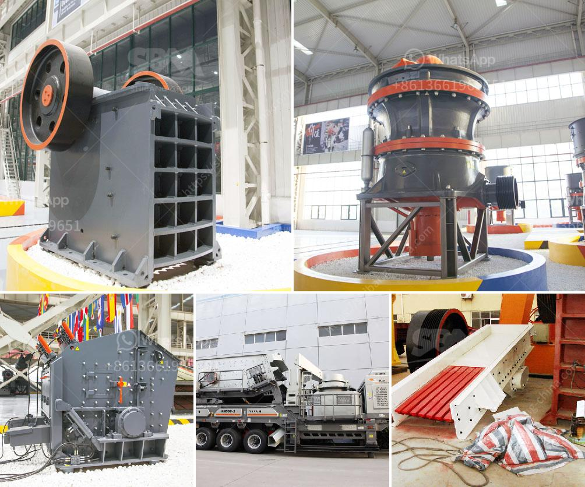

<h3>coal crusher 6mm</h3>
Coal, a solid fossil fuel, is formed when plant material is buried and subjected to heat and pressure for millions of years. This carbon-rich fuel has played a crucial role in powering industries for decades. However, the extraction and burning of coal can have detrimental effects on the environment, contributing to air and water pollution and greenhouse gas emissions. As the world looks towards cleaner and more sustainable energy sources, the use of coal is gradually being phased out.

One vital step in the coal processing chain is the crushing of coal into smaller sizes suitable for combustion. This is where a coal crusher 6mm enters the picture. It breaks the coal into pieces measuring typically 6mm or lesser, enabling efficient combustion.

A coal crusher 6mm consists of various types, such as jaw crushers, impact crushers, cone crushers, hammer crushers, etc. The purpose of the crushing process is to reduce the size of coal particles, while preserving the coal's inherent properties. Crushing coal to a smaller size ensures that combustion is more complete, producing less ash and reducing greenhouse gas emissions.

Furthermore, a coal crusher 6mm helps to increase the calorific value of coal by removing impurities and reducing moisture content. This leads to higher energy efficiency and effective utilization of coal as a fuel source. Additionally, a well-designed coal crusher 6mm minimizes dust generation during the crushing process, promoting better air quality in and around the coal processing plant.

As the demand for cleaner energy sources such as renewable energy increases, the role of coal crushers 6mm may diminish in the future. However, in the present, these crushers still hold relevance in industries heavily dependent on coal for their operations. Therefore, it becomes crucial to employ cutting-edge technology and best practices in coal crushing to mitigate environmental impacts and ensure sustainable coal utilization.

In conclusion, a coal crusher 6mm is an essential tool for efficiently breaking down coal into smaller sizes suitable for combustion. It aids in reducing greenhouse gas emissions and increasing energy efficiency. With the world gradually moving towards cleaner energy sources, the role of coal crushers might change in the future. However, for now, their proper utilization is vital to ensure a sustainable and environmentally conscious coal industry.
<h3>Contact us</h3><ul><li><strong>Whatsapp:&nbsp;<a href="https://wa.me/8613661969651">+8613661969651</a></strong></li><li><a href="https://swt.shibang-china.com/?git&amp;zhl&amp;coal crusher 6mm"><strong>Online Service(chat now)</strong></a></li></ul><h3>Related</h3><ul><li><a href='stone crusher in spain.md'>stone crusher in spain</a></li><li><a href='complete aggregate crushing plant in usa.md'>complete aggregate crushing plant in usa</a></li><li><a href='stone crusher pfs price.md'>stone crusher pfs price</a></li><li><a href='sell jaw crusher.md'>sell jaw crusher</a></li><li><a href='ball mill micron.md'>ball mill micron</a></li></ul>