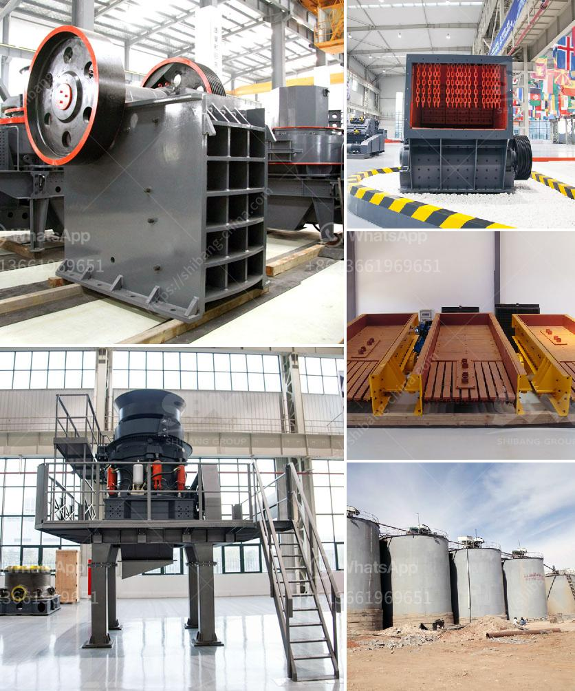

<h3>coal crusher buyer in philippines</h3>
Coal plays a vital role in electricity generation worldwide. Coal-fired power plants currently fuel 38% of global electricity and, in some countries, an even higher percentage. Coal 's role in electricity generation worldwide is likely to continue in the coming years. The Philippines is one of the countries with vast amounts of coal reserves, providing an excellent opportunity for coal crusher buyers.

The crusher machine is the indispensable mining equipment for coal's further utilization. The crawler mobile crusher with the high convenient and low cost has become the popular machine. Online PR News – 25-February-2021 – Zhengzhou City – For the mining machinery industry to tackle the obstacles blocking the coal crushers development, Henan Hongxing Crushing Machine innovates and developed the new European version of the hammer crusher, hammer crusher, jaw crusher machine, hammer crusher, roll crusher, compound crusher, cone crusher and crushing efficiency high, strong production capacity, greatly improving the capacity of use, both on the energy saving and environmental protection has a significant advantage.

The Philippines is a relatively minor coal producer but has a number of coal-fired power stations. The Philippine Department of Energy estimates that in 2005 coal-fired power stations accounted for 3,967 MW of the electricity generated in the country, representing approximately 27% of the total. In addition, the cement sector accounted for approximately 20% of the country's coal consumption.

To meet the increasing demand for coal in the Philippines, the company undertook various coal-fired power projects, which are expected to boost the coal demand in the country. In order to increase the coal utilization efficiency and protect the environment, as well as improve energy efficiency, the country’s coal crushing plant usually adopts the jaw crusher, cone crusher, hammer crusher and other mining equipment.

In coal crushing plant, a jaw crusher is generally used as the primary crushing equipment to crush raw coal into smaller sized sizes for the further progression of coal. Impact crusher or cone crusher is used as secondary coal crushing gear. Typically, cone crusher is perfect for secondary crushing while the final dimension is between 2 to 20 mm. In coal grinding process, which coal mining equipments is normally used ball mill, vertical mill, and ultrafine grinding mill. For coal mining, the impact crusher is suitable for medium and process.
<h3>Contact us</h3><ul><li><strong>Whatsapp:&nbsp;<a href="https://wa.me/8613661969651">+8613661969651</a></strong></li><li><a href="https://swt.shibang-china.com/?git&amp;zhl&amp;coal crusher buyer in philippines"><strong>Online Service(chat now)</strong></a></li></ul><h3>Related</h3><ul><li><a href='crushers in malaysia.md'>crushers in malaysia</a></li><li><a href='powder production line price.md'>powder production line price</a></li><li><a href='defination of machine aggregate crusher.md'>defination of machine aggregate crusher</a></li><li><a href='what is the best granite crusher machine.md'>what is the best granite crusher machine</a></li><li><a href='capacity of cone crusher.md'>capacity of cone crusher</a></li></ul>