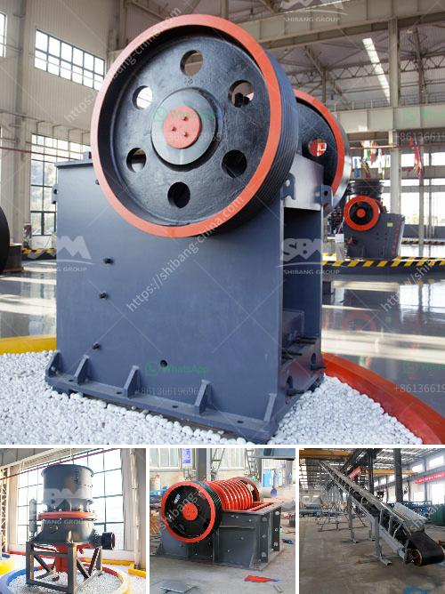

<h3>coal crusher capacity price</h3>
Coal is an essential resource for the world's energy needs, and its value is continually increasing due to the rise in energy demand. As a result, the coal mining industry is flourishing and becoming more profitable. However, in order to effectively extract and utilize coal, specialized equipment is required. One such essential tool is the coal crusher, which is used for crushing large chunks of coal into smaller pieces and facilitating the extraction process.

One crucial factor to consider when purchasing a coal crusher is its capacity. The capacity of a crusher determines the maximum size of the coal it can handle. Higher capacity crushers result in significant cost savings since fewer machines are required to achieve the same output. Therefore, understanding the coal crusher capacity and its price is crucial for any coal mine owner or operator.

The capacity of a coal crusher can vary widely, depending on the type and size of the machine. For example, a small impact crusher can handle 5-20 tons per hour of coal, while a large gyratory crusher can handle up to 7000 tons per hour. The price of a crusher also varies based on the capacity. Higher capacity crushers are generally more expensive compared to lower capacity ones. However, the long-term cost savings should be taken into account, as higher capacity crushers can handle more coal, reducing the need for additional machinery and decreasing operational expenses.

The price of a coal crusher depends not only on the capacity but also on various other factors such as brand, country of origin, and quality of the machine. It is essential to consider these factors before making a purchase decision. Additionally, it is advisable to compare prices from different suppliers or manufacturers to ensure a competitive price for the desired capacity.

Apart from the price, there are several other factors to consider when choosing a coal crusher. Durability and reliability are crucial, as the crusher will be subject to high levels of stress and wear. The material and construction of the machine should be able to withstand the harsh conditions of the coal mining environment. It is also recommended to choose a crusher with adjustable settings, which allows the operator to control the size of the coal particles produced.

In conclusion, the capacity and price of a coal crusher are critical factors to consider for any coal mine owner or operator. Higher capacity crushers can handle more coal, resulting in cost savings by reducing the need for additional machinery. The price of a crusher is influenced by various factors, including capacity, brand, origin, and quality. It is essential to consider all these aspects, compare prices, and choose a durable and reliable machine that meets the specific requirements of the coal mining operation.
<h3>Contact us</h3><ul><li><strong>Whatsapp:&nbsp;<a href="https://wa.me/8613661969651">+8613661969651</a></strong></li><li><a href="https://swt.shibang-china.com/?git&amp;zhl&amp;coal crusher capacity price"><strong>Online Service(chat now)</strong></a></li></ul><h3>Related</h3><ul><li><a href='ultrafine powder mill.md'>ultrafine powder mill</a></li><li><a href='concrete crusher in georgia.md'>concrete crusher in georgia</a></li><li><a href='kaolin crushing processing in india.md'>kaolin crushing processing in india</a></li><li><a href='vertical ball mills of india.md'>vertical ball mills of india</a></li><li><a href='bentonite mill project report.md'>bentonite mill project report</a></li></ul>