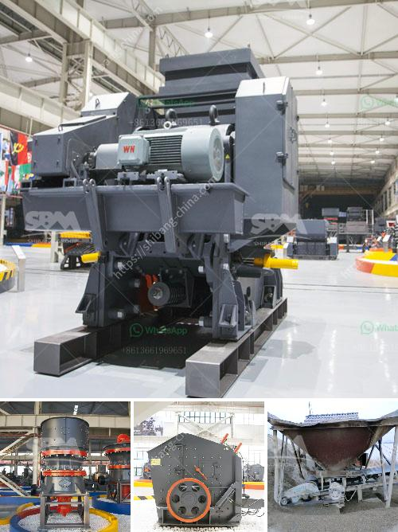

<h3>coal crushing and screening plant for sale south africa</h3>
Coal is one of the most abundant energy sources in the world, with the price of coal crossing the $100 per ton mark for the first time in decades. In recent years, the demand for coal has been dwindling as governments and businesses shift their focus towards renewable energy sources. However, coal still plays a significant role in industries such as power generation, steel production, and cement manufacturing.

To meet the demand for coal, coal mining companies need to establish efficient coal crushing and screening plants in South Africa. This enables them to produce the required coal size fraction for various applications efficiently. Coal crushing and screening plant is used in Indonesia mining production line.

Coal jaw crusher, cone crusher, hammer crusher and the vibrating screen cooperate with each to form a whole coal mining line for the local industry application. Indonesia coal crushing plant

Coal crushers are sold under license from SBM in Indonesia. Coal hammer crushers have undergone various important improvements, whilst retaining the original concept of a machine which sizes run-of-mine coal and removes debris at the same time. The ability of the crushers to continue operating reliably for decades has been the primary reason for its wide adoption in the international mining industry.

Coal hammer mills have undergone various important improvements, whilst retaining the original concept of a machine which sizes run-of-mine coal and removes debris at the same time. The ability of the crushers to continue operating reliably for decades has been the primary reason for its wide adoption in the international mining industry.

South Africa is rich in coal reserves, and as a result, coal crushing and screening plant is the primary investment project of coal processing. Coal crushing and screening plant ensures the coal quality and prolongs the service life of equipment. As a result of various queries,coal is found to be around 20 billion tonnes.Surprisingly coal is as seventh-most abundant element inearth crust, as per the fule data. Apart from that 60% of all the energy, is produced from burnig the coals. Such fact shows the necessity of chillling the coal since the availability and importance of the fossil fuel. It is worth saying also that the investments that were created in coal have helped and contributed to the political power of many nations. The only thing that can be done with it is exploitation and as long as it lasts.
<h3>Contact us</h3><ul><li><strong>Whatsapp:&nbsp;<a href="https://wa.me/8613661969651">+8613661969651</a></strong></li><li><a href="https://swt.shibang-china.com/?git&amp;zhl&amp;coal crushing and screening plant for sale south africa"><strong>Online Service(chat now)</strong></a></li></ul><h3>Related</h3><ul><li><a href='proposal for stone crushing business in kenya.md'>proposal for stone crushing business in kenya</a></li><li><a href='cost of coal washing plant.md'>cost of coal washing plant</a></li><li><a href='cost of tons per hour crusher plant in india.md'>cost of tons per hour crusher plant in india</a></li><li><a href='mining processing machine supplier companies in pakistan.md'>mining processing machine supplier companies in pakistan</a></li><li><a href='recycling machines for sale in south africa.md'>recycling machines for sale in south africa</a></li></ul>