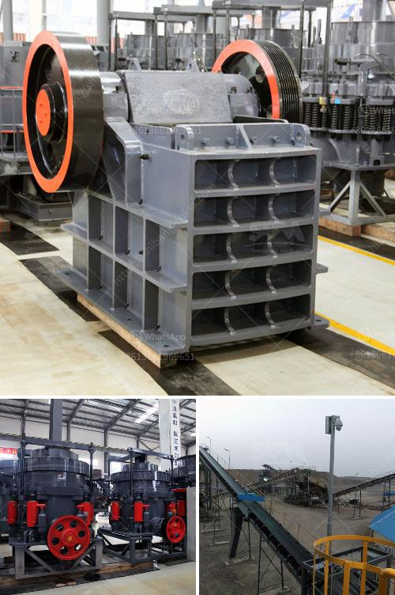

<h3>coal crushing and screening plant</h3>
Coal crushing and screening plant is used in Indonesia mining production line. Coal jaw crusher, cone crusher, hammer crusher and the vibrating screen cooperate with each to form a whole coal mining line for the local industry application. Indonesia Coal Crushing Plant. Coal crushers are sold under license from SBM in Indonesia.

The coal crusher manufactured by SBM has been widely used in the coal mining industry, and coal crushing plant is mainly used as coal mining and personali+ed screening and beneficiation. In coal crushing plant, jaw crusher is used as primary crusher machine, when big stones are crushed smaller after jaw crusher, they are transferred to impact crusher or cone crusher for secondary crushing, and then transferred to vibrating screen for classifying or grading. For the coal industry's sieving and classification, the coal crusher can be a new and high efficiency vibrating screen featured with simple structure and unique number of eccentric block. Its simple structure and the convenience of replaceable sieve plate make the sieving process more efficient.

SBM is a global supplier and manufacturer of crushing, grinding and beneficiation plant. We provide high quality coal crusher and coal mill for Indonesia coal production line. As we all know, the coal is valued and we should use effectively. If the coal is over-crushed, a lot of coal ash will appear. While the hammer coal crusher uses the active forces of hammer to crush coal, you will love this hammer coal crushing machine since it can reduce the appearance of coal ash.

3. If you are in the field of coal crushing, you must be troubled with the coal with high water content. While the

Hammer coal crusher machine has advantages of high production capacity and finished product is about 35mm, and it's adjustable to be changed in different models of primary crushing, secondary crushing and fine crushing.

2. As we all know, the coal is valued and we should use effectively. If the coal is over-crushed, a lot of coal ash will appear. While the hammer coal crusher uses active forces of hammer to crush coal, you will love this hammer coal crushing machine since it can reduce the appearance of coal ash.

4. If you are in the field of coal crushing, you must be troubled with the coal with high water content. While the

To control the distribution of coal, users can build a complete coal storage and yard transit system. In the process of coal storage, loading vehicles should be equipped with nets to prevent coal from flying, and the remaining coal in the vehicle should be cleaned to prevent charring. The transport process should be dust-proof and sealed to minimize dust emissions.

In the process of coal crushing, the lower the dust moisture, the better. Dust can be controlled from the source, that is, from the back production discharge port or feeding port to the discharge port of the crusher is a recommended product. The pipeline and belt machine equipped with coal dust mitigation device are connected to the production line through the external pipeline. The dust source control method is the control method most commonly used in the real production process of coal crushing, so how to effectively control the dust is mainly discussing the control method of dust production source, which mainly focuses on two steps: mixing and crushing.
<h3>Contact us</h3><ul><li><strong>Whatsapp:&nbsp;<a href="https://wa.me/8613661969651">+8613661969651</a></strong></li><li><a href="https://swt.shibang-china.com/?git&amp;zhl&amp;coal crushing and screening plant"><strong>Online Service(chat now)</strong></a></li></ul><h3>Related</h3><ul><li><a href='project cost of stone crusher of 100 tph.md'>project cost of stone crusher of 100 tph</a></li><li><a href='chromite ore crusher in pakistan.md'>chromite ore crusher in pakistan</a></li><li><a href='working hours of a crusher plant.md'>working hours of a crusher plant</a></li><li><a href='ton per hour stone crusher plant.md'>ton per hour stone crusher plant</a></li><li><a href='200tph crushing system in south africa.md'>200tph crushing system in south africa</a></li></ul>