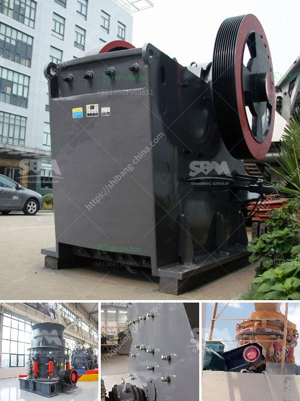

<h3>coal crushing and washing plant for sale in south africa</h3>
Coal is the main resource in the world. Coal crushers are the main coal crushing equipment, which includes jaw crusher, impact crusher, cone crusher, hammer crusher and mobile coal crusher. Coal crushing and washing plant for sale in South Africa is a complete coal processing plant that will vary from 100tph to 1100tph.

Coal crushing and washing plant for sale in South Africa consists of vibrating feeder, screen, and belt conveyor, which is a complete crushing plant with screening and conveying equipment. The crushing process includes a primary jaw crusher, a secondary gyratory crusher, and a tertiary cone crusher. It also involves screening and washing processes to remove impurities from the coal before it is sold.

Coal crushing and washing plant for sale in South Africa is a highly efficient crushing plant with multiple applications. It is designed with a compact structure, which is easy to operate and maintain. The crusher plant can be customized to fit your specific needs. This coal crushing and washing plant for sale in South Africa can adapt to different working environments and meet different crushing and grading requirements.

Coal is composed primarily of carbon along with various other elements, such as sulfur, hydrogen, oxygen, and nitrogen. Coal is the most important source of energy in the world and plays a crucial role in power generation, industrial production, and heating. The demand for coal is increasing rapidly in South Africa, which has abundant coal resources.

Coal crushing and washing plant for sale in South Africa is in great demand. Many processed coal has been sold in the local market at good prices, which has brought a lot of profits to the coal mining industry in South Africa. The reasons why more and more coal investors choose to buy coal crushing and washing plant for sale in South Africa are diverse.

Firstly, the largest advantage of coal crushing and washing plant for sale in South Africa is that it design ensures the crusher plant can be easily transported to any site or location. Secondly, it is easy to operate and maintain. The crushing and washing plant is simple and reliable. The technicians can quickly fix any issues that may arise, reducing downtime and increasing production efficiency.

Thirdly, the coal crushing and washing plant for sale in South Africa is able to produce fine coal. Coal can be upgraded to a higher grade by a process called coal washing. The plant removes rock, ash, sulfur, and other impurities from the coal, increasing its energy content and reducing emissions. This technique enables coal to be used more efficiently.

In conclusion, coal crushing and washing plant for sale in South Africa has a wide range of applications and high demands. It is an ideal crushing and processing equipment for intermediate and fine reduction of coal, limestone, cement clinker, and other materials. With its high efficiency, low cost investment, and easy maintenance, the coal crushing and washing plant is favored by customers from South Africa and around the world.
<h3>Contact us</h3><ul><li><strong>Whatsapp:&nbsp;<a href="https://wa.me/8613661969651">+8613661969651</a></strong></li><li><a href="https://swt.shibang-china.com/?git&amp;zhl&amp;coal crushing and washing plant for sale in south africa"><strong>Online Service(chat now)</strong></a></li></ul><h3>Related</h3><ul><li><a href='dry grinders mills.md'>dry grinders mills</a></li><li><a href='caco grinding grinder.md'>caco grinding grinder</a></li><li><a href='calcium carbonate ball mill.md'>calcium carbonate ball mill</a></li><li><a href='gyratory crusher copper mine.md'>gyratory crusher copper mine</a></li><li><a href='jaw crusher manufactures in saudi.md'>jaw crusher manufactures in saudi</a></li></ul>