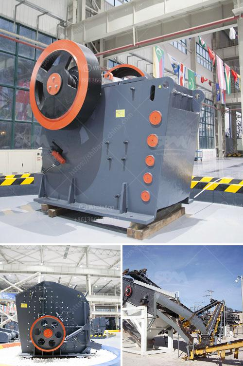

<h3>coal crushing plant for sale in south africa</h3>
Coal, a fossil fuel, is the largest source of energy for the generation of electricity worldwide, as well as one of the largest worldwide anthropogenic sources of carbon dioxide emissions. The coal industry continues to play a significant role in the development of South Africa's economy and infrastructure, making it a crucial part of the country's energy mix.

For the past few decades, South Africa has been relying heavily on coal for its energy needs. Coal has been instrumental in driving industrial growth in the region, providing electricity for businesses and households alike. However, with the growing concerns over climate change and the detrimental impact of coal on the environment, there has been a global push towards cleaner and more sustainable sources of energy.

As a result, the demand for coal has been declining in many parts of the world. This shift in the global energy landscape has led to an oversupply of coal in the market, resulting in reduced prices. Despite this, South Africa's coal mining industry still faces numerous challenges, including declining reserves, labor disputes, and regulatory uncertainties. These factors have contributed to a decline in the profitability of coal mines in the country, prompting many companies to consider divesting their coal assets.

One such asset that is up for sale is the coal crushing plant in South Africa. Built at a cost of over R1 billion ($70 million), it will deliver coal to Eskom, the state-owned power utility, for at least the next generation. With over 115 million tonnes of coal reserves, it is anticipated that the plant will remain in operation for many years to come. It is crucial to note that while coal is a finite resource, it still contributes significantly to South Africa's energy mix and will continue to do so for the foreseeable future.

The coal crushing plant for sale in South Africa has a wide range of applications, including coal gangue crushing, limestone crushing, iron ore crushing, copper ore crushing, dolomite crushing, granite crushing, basalt crushing, coal crushing and the like. Depending on the production capacity requirements, there are different specifications and models of equipment to choose from. From large primary jaw crushers and impact crushers to cone crushers and VSI crushers for tertiary and quaternary crushing, SBM has the right crusher and crusher parts to meet your material reduction requirements.

Apart from coal crusher machine, the conveying system can be considered as another essential part of the coal crushing plant. Coal handling system in South Africa plays a crucial role in the overall operation of the coal processing plant and is considered as the core support of the plant. Front-end loaders and bulldozers assist in moving coal particles from the plant to a railway siding for onward loading and transportation to end-users.

In conclusion, there is still a significant demand for coal in South Africa, despite the growing shift towards cleaner and more sustainable sources of energy. The coal crushing plant for sale in South Africa is key equipment in the generation of electricity, powering the country's homes and businesses to fuel its growth. With over 115 million tonnes of coal reserves, it will continue to provide a reliable and cost-effective source of energy for the foreseeable future.
<h3>Contact us</h3><ul><li><strong>Whatsapp:&nbsp;<a href="https://wa.me/8613661969651">+8613661969651</a></strong></li><li><a href="https://swt.shibang-china.com/?git&amp;zhl&amp;coal crushing plant for sale in south africa"><strong>Online Service(chat now)</strong></a></li></ul><h3>Related</h3><ul><li><a href='mobile crusher hire in south africa.md'>mobile crusher hire in south africa</a></li><li><a href='crushing equipment from.md'>crushing equipment from</a></li><li><a href='prices of aggregate crusher plants.md'>prices of aggregate crusher plants</a></li><li><a href='granite quarrying companies.md'>granite quarrying companies</a></li><li><a href='stone crusher plant south africa.md'>stone crusher plant south africa</a></li></ul>