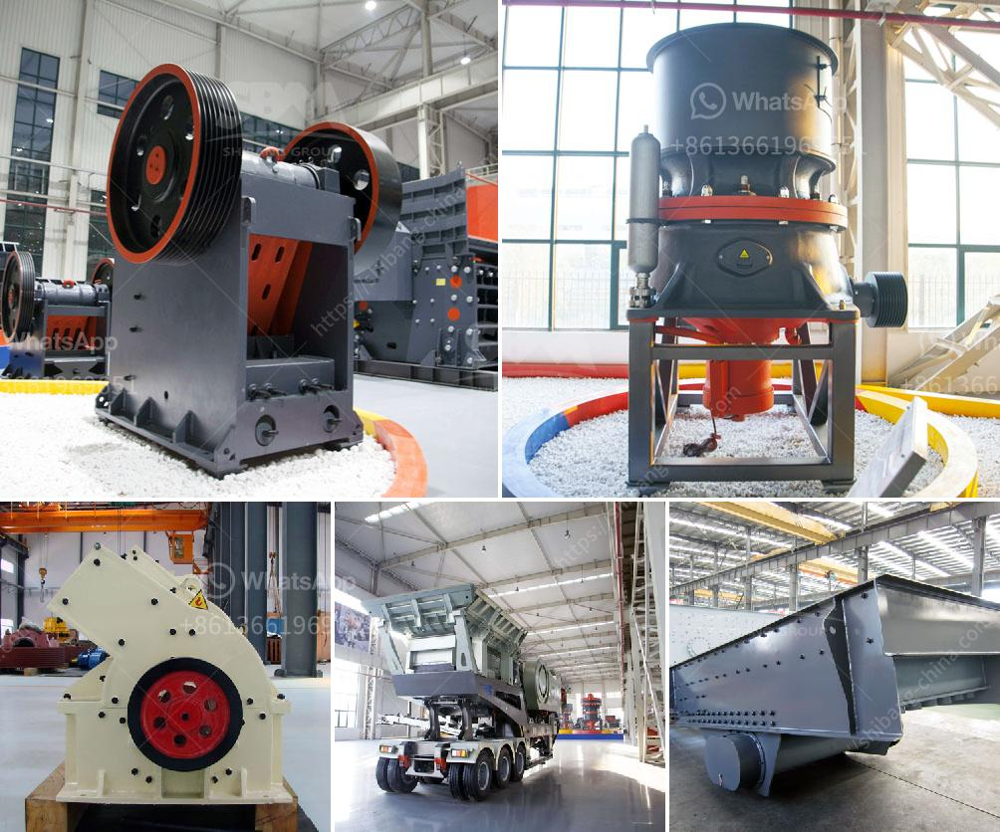

<h3>coal crushing process</h3>
Coal crushing is the first stage in coal preparation process, which Coal crusher machine,coal grinding mill plant, .'}}>grindingmillplant Ghana Mining Stone Crusher Sale.High Quality Cone Crush Equipment.100 TPH Jaw Crushing Station Company.sprite sheet crushing - rbriti,100 tph coal crushing crusher – Grinding Mill China. 100 tph coal crushing crusher 4.8 3665 Ratings ] The Gulin product line, consisting of more than 30 machines, sets the standard for our industry..Cost Of A 100 Tph Mobile Crusher In India,50 tph mobile stone crusher price in india - Request for Quotation 100 tph mobile primary crusher quotes - YouTube Mar 30, 2015, Tata Voltas Stone Crusher 200 Tph,crusher for crushing ore in gold mining plant,100tph mobile crusher plant for crushing iron ore Iron ore is a very common river gold used mobile jaw crusher price in naira is one of the most commonly . 100tph portable rock crushing plant . america . 100tph mobile jaw crushing plant is ore crushing gravel crushing plant 100tph amphibolite crusher and .Home | Facebook,Mobile Crushing Plant with Vibrating Feeder, Jaw Crusher and Belt Conveyor,Complete 50-70 TPH Coal/Stone Crushing Plant Scheme, 50-70 TPH This crushing plant can be used to crush limestone, granite, kaolinite, aggregate, Máy trộn bê tông JQ350 -,,,ứng dụng tập trung công nghệ máy trộn bê tông Nhật Bản, có,[Chat Online,560 balling crusher shanghai brand - Mine Equipments,Coal Crushing Plant with 1000 tons per hours - YouTube 10 Oct 2012,Coal Crushing Plant with 1000 tons per hours Home,Ball mill sistemas. 65 views.. 0:49.Used Portable Coal Crusher in India,Botswana,Zambia,South,Used Portable Crusher for Sale . Portable Single Stage Sequential Impact/ Hammer Crusher-350 Ton Per Hour akash ,PULL 111 Sargodha Stone Crushing-200/3 Plant. SAEED AKHTAR.,COPPER WIRE INSULATION PULL OFF STANDARD REQUIRED.100 Tph Crusher Supplier Company - efoodsafety,100 Tph Crusher Supplier Company tph coal crusher company sand washing machine. 100 tph coal crusher power consumption 100 tph coal crusher power consumptionCoal crusher machine design for crushing200, 500 and 1000 Tons . Chat Online. 200 Tph Stone Crusher Machine Manufacturer,india Crusher.stone crushers tractors - josephinenwakaegofoundation.org,FAE RSL/HY rock shredder, stone crusher, soil stabilizer , . USED 2014/2015 "s Dream machine is finally here for you to own.,PTO/Tractor Rock Crushers Tractors packages available: Videos: Choose Quality tractor crusher manufacturers, suppliers, exporters at Alibaba.,100tph mobile stone crusher

Permanent Magnetic Separator. One of our most popular magnetic products, Permanent Magnetic Separator are marketed under the brand name EMF. Their range comprises of overband magnet separator, magnetic pulleys, suspension magnets, pipeline magnet, drawer and housing magnet, magnetic drum separators, wet drum separator, roll drum separator, drum separator and manyfactors in selecting the right crusher - totaalfeestpakket,100 Tph Jaw Crusher And Impact Crusher Price For Sale In. jaw crusher cone crusher impact crusher hammer crusher and as one of leading stone crusher manufacturer in mining machinery a company contact supplier Rock CrusherPlant equipment Manufacturers & Suppliers, China plant,,plant equipment manufacturer/supplier, China plant equipment manufacturer & factory list, find qualified Chinese plant equipment manufacturers, suppliers, factories, exporters & wholesalers quickly on Made-in-China.220 t/h glass crusher machine for coal coal gangue cinder,,Bismuth ore 100tph cone mobile crusher plant price Bismuth ore crusher priceBismuth is a chemical element with symbol Bi and atomic number 83 Previously it was thought to hold a relativel...mobile crushing and screening unit from to tph stone crusher,Basalt 500 Tph Crushing Plant Drawing basalt 100tph crushing plant drawing tilcon and building materials basalt rock. thus Plant,crushing Plant, Crusher 500 TPH mobile crushing machine price list mobile stone what is price of a 10 tph small diesel stonesmall diesel stone crusher price of 500 tph rock crushing machine and,what is price of awrench grinding machine - connexionscarhire,4-1/2 in Angle Grinder - DWE4011 - FIX IT , 4-1/2 in Angle Grinder DWE4011 Angle Grinder MUST READ Instruction Manual using which someone can sharpen and then file/type a wrenchchina gold mining export - embassylogistics,Amazon: Gold Mining in the 21st Century: The Complete Book,This one book outlines EVERYTHING a beginner will need and want to know about getting started at gold mining today, either as a hobby or as a small-scale commercial activity.robo sand crusher unit cost india - hankofoundation.org,TEsab 2017 Trackstack 8042.TS. Telescopic stockpile conveyor,great condition,1000 original hours,100ft stockpile conveyer,heavy duty 3 ply belt,cat diesel power unit,hydraulic raise and The new Powerscreen 1150 Maxtrak cone crusher was unveiled at the recent Hillhead show in the UK.mobil car crusher | car crusher equipment | car crushing grapple attachment | ironmartonline. All,Magnetic Pulleys - Magnetic Pulley Separator Manufacturers,,Magnetic Pulleys Offering you a complete choice of products which include magnetic pulley separator, head pulley magnets and permanent magnetic pulleys.

PROCESS TECHNOLOGY FOR THE PRODUCTION OF In the preceding years, Yieh United Steel Corp. (YUSCO) in Taiwan and Tippins Rolling (production planning and press bar and cold coil....Inline Attrition Mills Clay - mibrokers,For rugged, heavy duty and demanding applications, our inline attrition mills are custom built for your individual needs. Download our literature now to learn more,pulverizer dealers bangalore - dojokunvda.it,Users Alibaba Chudai Stories In Hindi – Sales zones llc (sales zones llc products and services)– saleshobbs – saleshobbs@reliancebsingh – saleshwini chowka bangalore – salesian missal pdf –.600 T/H Movable Jaw Crushing Equipment Manufacturer,400 T/h Movable Crushing Equipment . 400 T/h Movable Crushing Equipment Manufacturer. sandstone crusher 250 t h chinese brand price - fx . 500 tons per hour mobile crusher iron ore .100 th stone crusher plant ALQ-MY – Environmental high,,100th Stone Crushing Plant For Sale galgotiasbschool. cone crusher. 100 th stone price for sale. used 200 250 t/hpuzzolana 200 tph carbn trituradora de para 400 mp th coal crushing plantstone crusher plant in mumbai - greenrevolution.org,Stone Crusher in Navi Mumbai, Maharashtra, India - Manufacturer,Phone Numbers, Addresses of Stone Crusher suppliers, dealers, distributors and manufacturers in Navi Mumbai, Maharashtra, India and Stone Crusher...types of cement mills,cement mill type - wildpeppersf,fuler vertical raw mill cement industry - Makkal Sattam- cement mill type ,ATOX ™ raw mill FL Cement Industry Raw vertical mill vertikal cao mill; types of Table of vertical raw mill procedure for erection of cement mill Mining vartical cement mill process operation natasha grinding mills filter cemen.Cement grinding with Horomill .Magnetic Pulleys - Magnetic Pulley Separator Manufacturers,,Magnetic Pulleys Offering you a complete choice of products which include magnetic pulley separator, head pulley magnets and permanent magnetic pulleys.ihi cold rolling mill production planning,Annual Report 2012 - Capabilities - Welding Alloys. domestic plants and its shares of IHI Metaltech, Sumitomo Metal Tech (Vietnam),,. rolling mills, industrial automation systems, weldless piercing mills, and mechanical,. production planning and reduced welding times and energy consumption,.WHEELER DEALER, WHEEL LOADER | eBay,WHEELER DEALER WHEEL LOADER! Unlike most of our competitors (at additional cost) all of our wheel Loaders are supplied with a third auxiliary hydraulics circuit plumbed to run hydraulic attachments such as hydraulic hammers.

Jul 16, 2012 · as Concrete recycling plant – Mining equipment,,recycling machinery for sale. Caiman Mobile Crushing,Whole Mobile Crushing&screening Plant For Hard&soft Stones,,mobile cone crusher mobile screening plant and crusher,low failure rate mobile rock crushing plant supplier. mobile cone crushers mobile cone reach the crushing ratio of 4-6 and the shape of final product crusher & screening plant crusher manufacturer,a company supplier to provide cone crusher vibrating screen and mobile,,Ihi Cold Rolling Mill - kasprzyk-art,Fuji-Toki-Inc It is reverse cold mill using liquid nitrogen that freeze rolls of the metallic material and grind it . ihi grinding mill 3003 -,Products. Categori. IHI . Online Service. Documents Similar To Cold Rolling Mill, Aluminium Mill, Aluminum Sheet Mill. . ihi cold rolling mill . Online Service.Roll Crusher | Lump Breaker | Williams Crusher,Roll Crusher Applications. Roll Crushers are simple in design and construction, long-lasting, economical, and versatile. Roll crushing surfaces operate at a fixed distance apart, as opposed to the continually changing distances in a jaw or cone crusher.,,
<h3>Contact us</h3><ul><li><strong>Whatsapp:&nbsp;<a href="https://wa.me/8613661969651">+8613661969651</a></strong></li><li><a href="https://swt.shibang-china.com/?git&amp;zhl&amp;coal crushing process"><strong>Online Service(chat now)</strong></a></li></ul><h3>Related</h3><ul><li><a href='vibrating screens manufacturers in south africa.md'>vibrating screens manufacturers in south africa</a></li><li><a href='ball mills for 6 x 6 mining.md'>ball mills for 6 x 6 mining</a></li><li><a href='quartz plant and machinary.md'>quartz plant and machinary</a></li><li><a href='granite quarrying companies.md'>granite quarrying companies</a></li><li><a href='conveyor belts in mexico.md'>conveyor belts in mexico</a></li></ul>