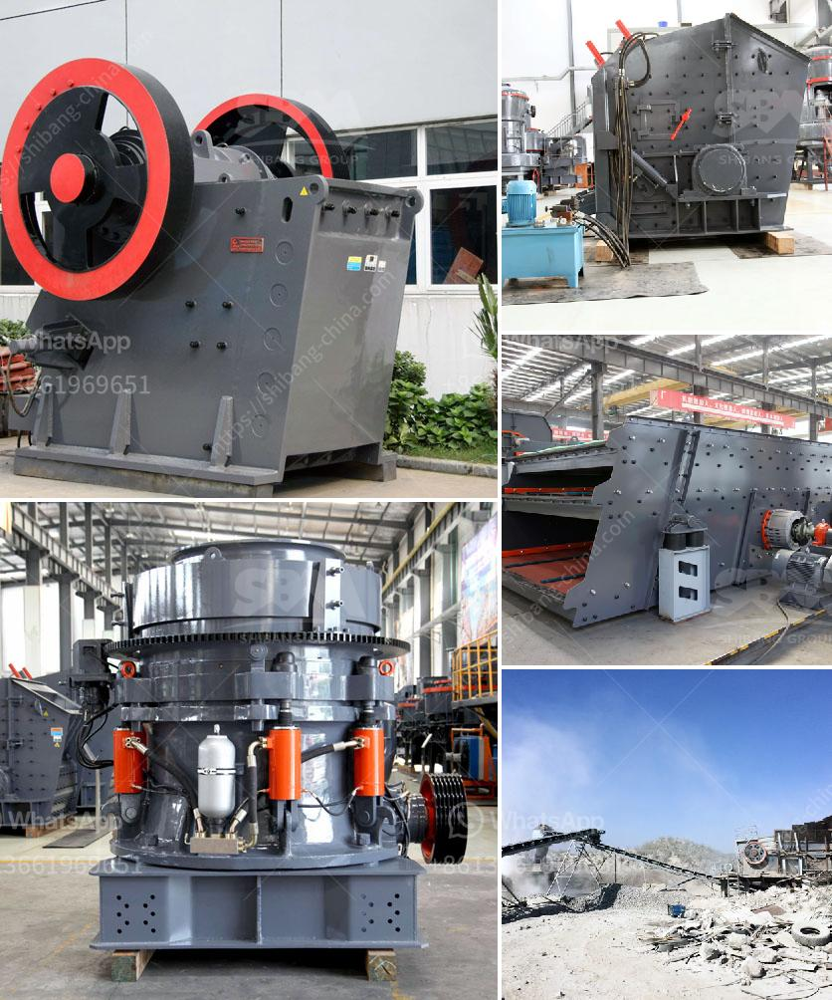

<h3>coal dry processing plant</h3>
Coal, being one of the world's most abundant resources, has served as a major source of energy for centuries. However, the traditional method of burning coal has led to various environmental concerns such as air pollution, greenhouse gas emissions, and release of harmful pollutants. To address these issues, coal dry processing plants have emerged as a promising solution.

Unlike conventional coal processing methods that involve washing, grading, and blending, coal dry processing plants utilize advanced technologies to remove impurities from raw coal without using water. This innovative approach not only enhances the energy efficiency of coal utilization but also significantly reduces water consumption and eliminates the need for large settling ponds.

One of the key advantages of coal dry processing plants is their ability to produce coal with a consistent quality. Through precise control of the separation process, these plants effectively remove unwanted minerals and contaminants, resulting in a high-grade coal product with improved heating value. This ensures optimal combustion and reduces the emission of pollutants during the combustion process.

Another notable benefit of coal dry processing plants is the reduced environmental footprint. By eliminating water usage, these plants eliminate the risk of water contamination and reduce the demand for freshwater resources. Furthermore, the absence of coal slurry and wastewater treatment facilities eliminates the potential for accidents and environmental hazards associated with traditional methods.

The implementation of coal dry processing plants also brings economic advantages. The reduction in water consumption results in substantial cost savings, while the production of high-quality coal increases its market value. Moreover, the reduced environmental impact enhances the social acceptance of coal utilization, leading to improved public perception and regulatory compliance.

In conclusion, coal dry processing plants represent a significant step forward in the coal industry's efforts towards efficiency and environmental sustainability. Through advanced separation technologies, these plants improve the quality of coal, reduce water consumption, and minimize environmental impacts. By embracing coal dry processing, the industry can achieve a more sustainable future while simultaneously meeting the growing energy demands of the world.
<h3>Contact us</h3><ul><li><strong>Whatsapp:&nbsp;<a href="https://wa.me/8613661969651">+8613661969651</a></strong></li><li><a href="https://swt.shibang-china.com/?git&amp;zhl&amp;coal dry processing plant"><strong>Online Service(chat now)</strong></a></li></ul><h3>Related</h3><ul><li><a href='crushers made in south korea.md'>crushers made in south korea</a></li><li><a href='how to grind sand into powder.md'>how to grind sand into powder</a></li><li><a href='equipments in gypsum powder production line.md'>equipments in gypsum powder production line</a></li><li><a href='stone crusher plant components.md'>stone crusher plant components</a></li><li><a href='cement boll mill grinding media charging formula.md'>cement boll mill grinding media charging formula</a></li></ul>