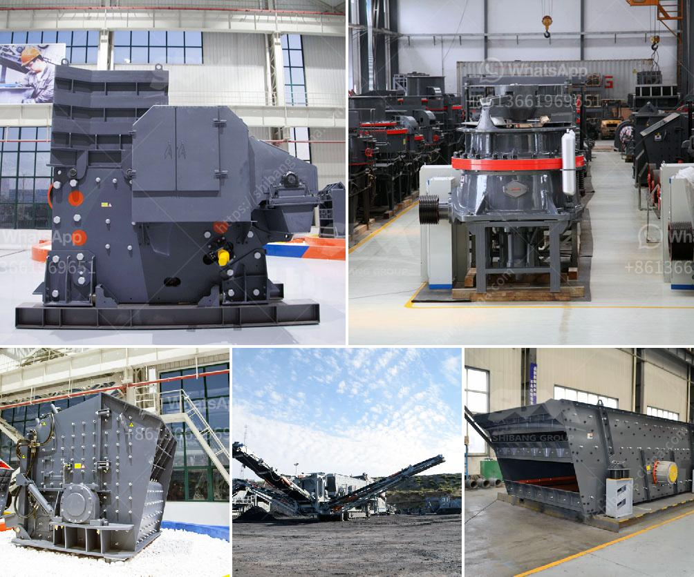

<h3>coal drying plant manufacture in india</h3>
India is one of the major producers and consumers of coal globally. With such high demand, efficient and sustainable coal drying processes become crucial. A coal drying plant, often known as a coal dryer, plays a significant role in removing moisture from coal, thereby increasing its heating value and reducing transportation costs. In recent years, the demand for coal drying plants in India has seen a remarkable increase, leading to the emergence of numerous manufacturers catering to this demand.

The primary objective of a coal drying plant is to eliminate moisture content from raw coal, making it usable for various applications such as power generation, steel production, cement manufacturing, and gasification. By reducing the moisture content, the efficiency of the coal combustion process improves significantly, resulting in reduced greenhouse gas emissions and cost savings.

The manufacture of coal drying plants in India involves advanced technologies and equipment to ensure optimum performance. Several leading companies specialize in designing, engineering, and manufacturing coal drying plants tailored to meet the specific requirements of Indian coal. These plants utilize cutting-edge techniques such as fluidized bed dryers, rotary dryers, and flash dryers to achieve efficient and cost-effective drying.

One prominent manufacturer of coal drying plants in India is ABC Company, known for its expertise and extensive experience in thermal drying systems. ABC Company offers a comprehensive range of coal drying plants to suit various scales of operations. Their plants are designed to handle different types of coal with varying moisture content.

ABC Company's coal drying plants feature state-of-the-art technology, including indirect drying and low-temperature drying processes, which ensure minimal energy consumption. These plants are also equipped with advanced control systems to monitor and optimize the drying process, resulting in consistent and high-quality dried coal. Additionally, they employ robust air pollution control systems to minimize emissions and adhere to environmental regulations.

Apart from ABC Company, several other manufacturers have emerged in India's coal drying plant market, leveraging advanced technology and their expertise. These manufacturers strive to offer customized solutions to their clients, optimized for their specific coal drying requirements. They prioritize energy efficiency, cost-effectiveness, and sustainability, catering to the growing need for environmentally responsible coal drying processes in India.

The demand for coal drying plants in India is expected to continue to rise due to the country's heavy reliance on coal for energy generation. As coal-fired power plants aim to reduce greenhouse gas emissions and increase overall efficiency, the utilization of efficient coal drying technologies becomes imperative. Manufacturers in India are well-positioned to meet this demand, providing innovative and sustainable solutions for coal drying.

In conclusion, the manufacture of coal drying plants in India has experienced significant growth due to the increasing demand for efficient and sustainable coal drying processes. Manufacturers like ABC Company and others have played a crucial role in developing advanced technologies and equipment tailored to meet the specific needs of Indian coal. With their expertise and focus on energy efficiency and environmental responsibility, these manufacturers are helping India achieve its coal drying goals, ensuring cleaner and more efficient use of this vital natural resource.
<h3>Contact us</h3><ul><li><strong>Whatsapp:&nbsp;<a href="https://wa.me/8613661969651">+8613661969651</a></strong></li><li><a href="https://swt.shibang-china.com/?git&amp;zhl&amp;coal drying plant manufacture in india"><strong>Online Service(chat now)</strong></a></li></ul><h3>Related</h3><ul><li><a href='gold mining crusher machinery.md'>gold mining crusher machinery</a></li><li><a href='clay making process nigeria.md'>clay making process nigeria</a></li><li><a href='100 per ton coal crush and screen plant.md'>100 per ton coal crush and screen plant</a></li><li><a href='granite edge cutting machine in sweden.md'>granite edge cutting machine in sweden</a></li><li><a href='jaw crusher specifications.md'>jaw crusher specifications</a></li></ul>