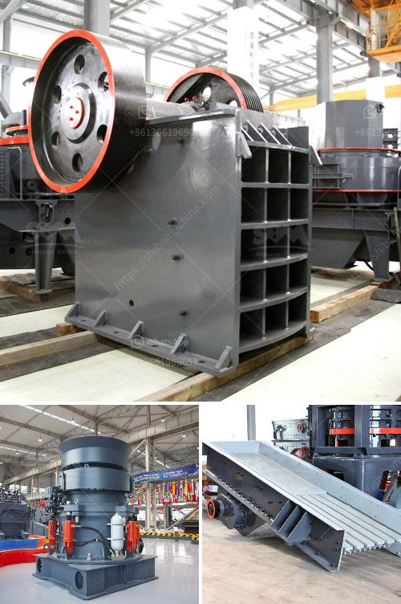

<h3>coal grinding machinery manufacture in india</h3>
Coal, a fossil fuel, is the largest source of energy for the generation of electricity worldwide. India, being one of the largest coal producers in the world, is heavily dependent on this abundant resource for meeting its energy requirements. In order to meet the growing demand for electricity, there is a need for efficient coal grinding machinery that can pulverize coal into fine particles for combustion in power plants. India, recognizing the importance of this sector, has been manufacturing and exporting coal grinding machinery to various countries.

Coal grinding machinery is essential for producing coal-fine particles used in the combustion process of coal-fired power plants. Coal, once mined, needs to be properly sized and ground before it can be burned efficiently. This is where coal grinding machinery plays a vital role. It pulverizes coal into fine particles, which have a greater surface area and are more easily combustible. These finely ground coal particles are then mixed with air and burned in a boiler to produce steam, which drives turbines to generate electricity.

Numerous manufacturers in India specialize in the production of coal grinding machinery. These manufacturers design and manufacture coal mills that are suitable for grinding coal of different types and grades. They use advanced technology and state-of-the-art equipment to ensure the efficient grinding of coal and the production of high-quality coal-fine particles. These coal grinding machinery manufacturers in India cater to the diverse needs and requirements of the coal-fired power industry, both domestically and globally.

One prominent manufacturer of coal grinding machinery in India is Laxmi Engineering Works. With over three decades of experience in the industry, Laxmi Engineering Works has established itself as a leading manufacturer of coal grinding machinery. The company offers a wide range of coal mills that are designed to grind coal of various types and grades. Their coal mills are highly efficient and are known for their robust construction, reliability, and long service life.

Another notable manufacturer of coal grinding machinery in India is Singhasini Industries. The company has been manufacturing coal mills since 1952 and has gained a reputation for delivering high-quality machinery. Singhasini Industries uses advanced technology and manufacturing techniques to produce coal mills that are energy-efficient and reliable. Their coal mills are designed to deliver consistent and fine grinding of coal, ensuring optimal combustion efficiency in power plants.

India's expertise in manufacturing coal grinding machinery has made it a global player in this sector. Indian manufacturers cater to the needs of not only domestic coal-fired power plants but also international clients. The coal grinding machinery manufactured in India is exported to countries like China, Indonesia, Vietnam, Bangladesh, and many others.

In conclusion, coal grinding machinery manufacture in India has gained significance due to the country's reliance on coal for meeting its energy needs. Indian manufacturers have invested in advanced technology and equipment to produce efficient coal mills that pulverize coal into fine particles for combustion in power plants. These manufacturers cater to both domestic and international clients, exporting coal grinding machinery to various countries. With the growing demand for electricity, the need for high-quality coal grinding machinery in India will continue to rise.
<h3>Contact us</h3><ul><li><strong>Whatsapp:&nbsp;<a href="https://wa.me/8613661969651">+8613661969651</a></strong></li><li><a href="https://swt.shibang-china.com/?git&amp;zhl&amp;coal grinding machinery manufacture in india"><strong>Online Service(chat now)</strong></a></li></ul><h3>Related</h3><ul><li><a href='barite mining crusher in nigeria.md'>barite mining crusher in nigeria</a></li><li><a href='lime and dolomite plant details.md'>lime and dolomite plant details</a></li><li><a href='impact crusher plant price.md'>impact crusher plant price</a></li><li><a href='used stone crusher in europe for sale.md'>used stone crusher in europe for sale</a></li><li><a href='crushers manufacturer turkey.md'>crushers manufacturer turkey</a></li></ul>