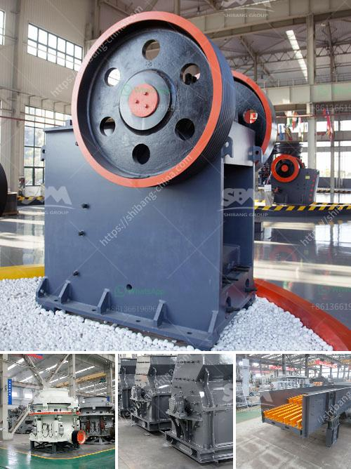

<h3>coal grinding mill in bhopal india</h3>
Bhopal, the capital city of Madhya Pradesh, India, has a rich history and is known for its cultural heritage. However, in recent years, Bhopal has also gained recognition as an important industrial hub. One of the key industries contributing to Bhopal's growth is the power sector, which heavily relies on coal as a fuel source for generating electricity. As a result, the demand for coal grinding mills in Bhopal has skyrocketed.

A coal grinding mill is a specialized piece of industrial equipment designed specifically for pulverizing coal into fine particles, which are then used for combustion in various power plants. This finely ground coal serves as the primary fuel in most coal-fired power plants, leading to a continuous supply of electricity to millions of households and industries.

The coal grinding mill plays a crucial role in the overall operation of a coal-fired power plant. The mill pulverizes the raw coal into a fine powder, which is then blown into the combustion chamber of the boiler. This process ensures that the coal particles are uniformly burned, thereby maximizing the efficiency of the power plant.

Bhopal, being home to several major power plants, requires a steady supply of coal. The nearby coal mines, such as the Singrauli coalfield, provide the raw material needed for power generation. However, before this coal can be used, it must undergo grinding to reduce its size and increase its surface area. This is where coal grinding mills come into play.

Coal grinding mills in Bhopal are designed to handle large quantities of coal efficiently. These mills employ rotating cylinders or rollers, along with grinding balls or rollers, to crush the coal into a fine powder. The coal is fed into the mill through a central inlet pipe and falls onto the rotating grinding table. As the table rotates, the coal particles are pulverized by the grinding rolls, ensuring a finely ground product.

The coal grinding mills in Bhopal are equipped with advanced technology to optimize their performance. These mills are often equipped with dynamic classifiers, which help control the size distribution of the pulverized coal. By accurately controlling the particle size, these mills ensure proper combustion and minimize the emission of pollutants from the power plants.

Furthermore, the design and operation of coal grinding mills in Bhopal prioritize safety and environmental sustainability. Dust collection systems are installed to minimize fugitive emissions of coal dust, ensuring a cleaner and healthier working environment. The mills are also equipped with fire detection and suppression systems to prevent any potential fire hazards.

In conclusion, coal grinding mills have become a vital industrial tool in Bhopal, India. Their efficient and reliable operation ensures a continuous supply of pulverized coal, which is used as fuel in the power plants. With the growing demand for electricity, these mills play a crucial role in meeting Bhopal's power generation needs. The implementation of advanced technology and safety measures ensures that these mills operate effectively while minimizing their environmental impact.
<h3>Contact us</h3><ul><li><strong>Whatsapp:&nbsp;<a href="https://wa.me/8613661969651">+8613661969651</a></strong></li><li><a href="https://swt.shibang-china.com/?git&amp;zhl&amp;coal grinding mill in bhopal india"><strong>Online Service(chat now)</strong></a></li></ul><h3>Related</h3><ul><li><a href='used vibro screener for sale.md'>used vibro screener for sale</a></li><li><a href='silver copper cone crusher.md'>silver copper cone crusher</a></li><li><a href='picture of silica sand process plant.md'>picture of silica sand process plant</a></li><li><a href='fine grinding ball mills.md'>fine grinding ball mills</a></li><li><a href='grinder mill powder singapore.md'>grinder mill powder singapore</a></li></ul>