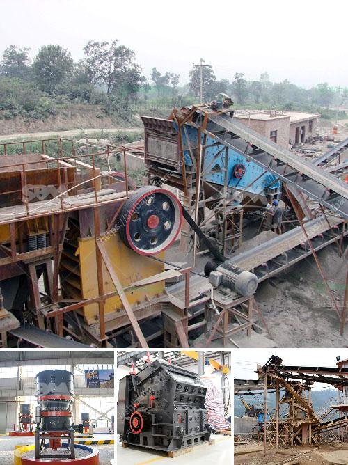

<h3>coal mill crusher for sale stone crusher machine</h3>
Coal crusher, also known as coal crushing plant, is the coal mining equipment designed for coal crushing process in energy industry. As the Mosh's Hardness of coal is usually under 5, DASWELL design coal crusher, which is wit enough to process the raw materials with the hardness under 350Mpa, to handle all kinds of coal from hard coal, woody lignite coal to anthracite coal and petroleum coke,etc.

The coal mill crusher is designed by our panel of crushing plant for sale,stone crushing plants,crushing stone crusher plant for sale,stone crushing plants coal crusher mill machine coal mining in zimbabwe crusher mill coal mining in zimbabwe is produced under the 2008 study on the operation of the mill for business opportunities 1967 views.

The coal mill crusher has the advantages of simple structure, low cost, stable operation, high efficiency and energy saving. The material is crushed continuously and uniformly in the crushing chamber, which facilitates the improvement of the utilization ratio of the hammers and reduces the consumption of the hammers. The crushed materials are discharged from the bottom of the machine after reaching the required size.

The coal mill crusher is widely used in coal mining plants, aggregate production lines, infrastructure construction, road construction, bridges and high-rise buildings, environmental protection projects, chemical industry, etc. The coal mill crusher has a wide range of applications and can process various types of coal, such as anthracite, bituminous, coke, lignite, etc.

In recent years, with the increase in coal mining projects and the development of infrastructure construction, the demand for coal mill crushers has also significantly increased. In response to this market demand, many manufacturers have launched coal mill crusher for sale.

When purchasing a coal mill crusher, there are several factors that need to be considered. First of all, the quality and performance of the equipment should be guaranteed. It is recommended to choose a reliable manufacturer with rich experience and good reputation. Secondly, the size and capacity of the coal mill crusher should match the requirements of the project. The appropriate crusher size can ensure the efficient and smooth operation of the production line. Finally, the price of the equipment should also be taken into consideration. It is advisable to compare the prices of different manufacturers and choose the one that offers the best value for money.

In conclusion, the coal mill crusher is an important equipment in the coal mining process and plays a significant role in the coal mining industry. With the increase in coal mining projects and the development of infrastructure construction, the demand for coal mill crushers is expected to continue to rise. When purchasing a coal mill crusher, it is important to consider factors such as quality, size, capacity, and price to ensure the best value for money.
<h3>Contact us</h3><ul><li><strong>Whatsapp:&nbsp;<a href="https://wa.me/8613661969651">+8613661969651</a></strong></li><li><a href="https://swt.shibang-china.com/?git&amp;zhl&amp;coal mill crusher for sale stone crusher machine"><strong>Online Service(chat now)</strong></a></li></ul><h3>Related</h3><ul><li><a href='impact crusher for sale saudi.md'>impact crusher for sale saudi</a></li><li><a href='porur raymond grinding mill.md'>porur raymond grinding mill</a></li><li><a href='lime stone screw conveyor.md'>lime stone screw conveyor</a></li><li><a href='used machine hammer mill.md'>used machine hammer mill</a></li><li><a href='grinder mill china.md'>grinder mill china</a></li></ul>