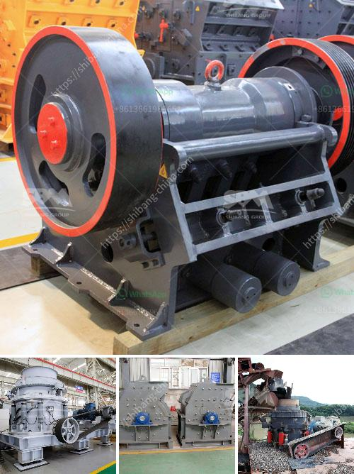

<h3>coal mill grinding rolls</h3>
Coal mill grinding rolls are crucial components in the power plants' grinding process, causing significant power consumption, energy inefficiency, and operational difficulties. In order to address these issues, manufacturers and researchers have developed advanced technologies and designs that can improve the grinding efficiency and reduce power consumption. This article provides an overview of coal mill grinding rolls and highlights some of the leading-edge technologies that can optimize their performance.

Coal mill grinding rolls are typically made out of hard-facing overlay materials such as high chromium carbide alloys welded onto a mild steel base. This overlay material forms a wear-resistant surface that withstands highly abrasive coal particles and ensures a long service life of the grinding rolls. However, over time, the surface of the grinding rolls can become worn out and damaged due to repeated grinding and contact with the coal particles. This significantly reduces their grinding efficiency and may lead to unexpected breakdowns and increased maintenance costs.

To address these issues, several manufacturers have introduced advanced grinding roll designs that can improve the overall performance of coal mills. One such design is the use of tungsten carbide coated grinding rolls. Tungsten carbide is a highly wear-resistant material that provides excellent protection against abrasive coal particles and extends the service life of the rolls. Additionally, the use of tungsten carbide coatings reduces the friction between the rolls and coal, resulting in lower power consumption and improved grinding efficiency.

Another technology that has been developed to optimize coal mill grinding rolls is the high-pressure grinding roll (HPGR). This technology is based on the principle of inter-particle comminution, where the feed material is exposed to very high pressure and undergoes crushing and grinding between two counter-rotating rolls. HPGRs have been successfully used in mining applications for many years and are now being applied to coal grinding processes. The main advantage of HPGRs is their ability to generate fine and uniform particles, resulting in improved combustion efficiency and reduced emissions.

In addition to these advanced technologies, it is also essential to implement regular maintenance and monitoring practices to ensure the optimal performance of coal mill grinding rolls. This includes routine inspection and measurement of the grinding roll wear patterns, adjustment of grinding pressure, and periodic resurfacing or replacement of worn-out rolls. By implementing these maintenance practices, power plant operators can minimize downtime, extend the service life of the grinding rolls, and optimize the grinding process.

In conclusion, coal mill grinding rolls play a crucial role in the power generation process. To improve their performance and address operational challenges, manufacturers and researchers have developed various advanced technologies and designs. These include the use of tungsten carbide coatings and high-pressure grinding rolls. By adopting these technologies and implementing effective maintenance practices, power plant operators can enhance the grinding efficiency, reduce power consumption, and optimize the overall performance of their coal mills.
<h3>Contact us</h3><ul><li><strong>Whatsapp:&nbsp;<a href="https://wa.me/8613661969651">+8613661969651</a></strong></li><li><a href="https://swt.shibang-china.com/?git&amp;zhl&amp;coal mill grinding rolls"><strong>Online Service(chat now)</strong></a></li></ul><h3>Related</h3><ul><li><a href='qustion about ball milling process.md'>qustion about ball milling process</a></li><li><a href='potential of mica wet grinding plant.md'>potential of mica wet grinding plant</a></li><li><a href='crusher plant in kenya.md'>crusher plant in kenya</a></li><li><a href='vibrating screens manufacturers india.md'>vibrating screens manufacturers india</a></li><li><a href='construction waste recycling.md'>construction waste recycling</a></li></ul>