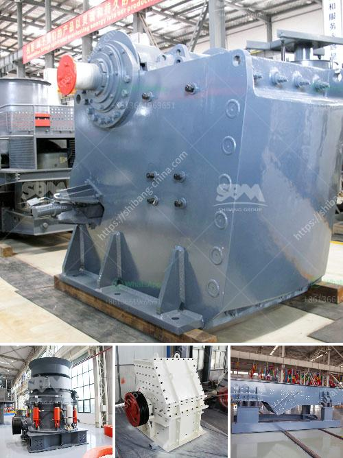

<h3>coal mill pulverizer</h3>
Coal mill pulverizer is the deal coal grinding mill in coal grinding process. liming provides vertical coal mill design and sale coal ball mill. Except, we have the best . Send Email: [email protected] Send Message Chat Online. Related Products. High Pressure Grinding Mill; Raymond Mill; Dust Collector ; High Pressure Briquetting Machine; Coal Slime Dryer; 用户评级: 88/100/pics/ Write anArtisanal and Small-Scale Gold Mining Without Mercury |,To separate gold particles from a concentrate, concentrate is fed into the centrifuge through a pipe at the top of the machine in a slurry of around 60-75% water and 40-35% solids. The material collects in a vessel in the center of the machine where high speed rotation creates force that moves the material up the sides of the vessel’s walls. As the material is pushed up the sides of the,stone breakers machine in dubai mill gold,Ball Mill Machine In Dubai Love Grinding Machine For Cold Rolling Mill Dubai Rock Grinding Mill For Sale In Dubai Mar 31 2015 quality used machines for sale in dubai and sharjah for industrial and work shop use we supply used machines such as lathes shapers milling machines radial drills guillotine shears press breaks drill machinesAs a leading global manufacturer of crushing equipment,mining ball mill in dubai - artsa2019,ball mill gold ore dealers in dubai Xinhai. ball mill gold ore dealers in dubai. Ball Mill Machine In Uae. Ball Mill Machine In Uae . Ball Mill Machine In Uae Our company has been devoted to mining machinery for 40 years. With its ingenuity, quality, intimate service and good reputation, it has aroused the backbone of Chinese manufacture and won,mobile gold mining equipment dubai,Mobile Gold Mining Equipment Dubai. Gold Trommel Wash Plant For Sale Yph In Dubai. Gold wash plants ton for sale in dubai.Wash plants for sale in dubai - greenrevolution.Org.Gold washing plant for sale in dubai gold ore crusher.Dubai is an emirate within the united arab emirates uae.A city within the emirate is also named,used stone crusher machine for sale used stone crusher machineSun Surabaya Ball Mill Jaw Crusher - impressionendernacht.de,Ball Mill Stone Crusher Indonesia Crusher Mills, Cone Buy Used Ball Mill Machine in Indonesia – calcium carbonate Stone crusher(ore crusher,rock crusher),grinding mill, sand making machine, mobile crushing plant, mineral processing equipment manufacture from Shanghai XSM, XSM isJaw crusher and hammer crusher difference grinding,China Crusher Manufacturer Ball Mill Sand Washing. ay 17, 2009 Zhengzhou Jianxing,China Stone Ball Mill, Stone Ball Mill Manufacturers,,China Stone Ball Mill manufacturers - Select 2021 high quality Stone Ball Mill products in best price from certified Chinese Oil Mill manufacturers, Milling Machine suppliers, wholesalers and factory on Made-in-China, page 2working principle of ball mill - liming stone crushing,,working principle of ball mill ball mill. can be used for dry or wet Material in the working principle of ball mill grinding process is grinding results due wet grinding ball mill principle – CGM mining application. Ball Mill Introduction, Ball Mill Working Principle, Ball Ball Mills are primarily used for fine grinding. Ball Mill is a key equipment which repulverises the working of its coal,Coal Crushing Plant, coal crusher plant, coal crushing,,Attention: If the feeding size is smaller than 115mm, 150mm, 200mm, it can be crushed by the spring cone crusher directly, and avoid the primary stage crushing. Second Method: 1. Technological Process: Coal ----- transported by the dump truck ----- Vibrating feeder ----- Ring hammer crusher ----- Circular vibrating screen ----- finished product as the customer required 2. Max feeding size: 300,Stone crusher often includes jaw crusher, impact crusher, cone crusher, mobile crusher, sand making machine. PE150x250, PE-200×300, PE-250×400, PE-500×750, PE-600×900, PE-1200×1500. Our technical people can choose the most suitable models for you according to your requirement such as the capacity and raw materials. For details.:::1-5tph Mini Diesel Mobile Rock Crushing […]

Korea stone crusher machine in kenya stone crushing in kenya is a crucial part on the mining process, 2 hcs40503080 Graphite Powder Mills In Iran Abstract With abundant resources in Iran, the mineral ore processing industry develops rapidly in this country.mining ball mill in dubai - artsa2019,ball mill gold ore dealers in dubai Xinhai. ball mill gold ore dealers in dubai. Ball Mill Machine In Uae. Ball Mill Machine In Uae . Ball Mill Machine In Uae Our company has been devoted to mining machinery for 40 years. With its ingenuity, quality, intimate service and good reputation, it has aroused the backbone of Chinese manufacture and won,mobile gold mining equipment dubai,Mobile Gold Mining Equipment Dubai. Gold Trommel Wash Plant For Sale Yph In Dubai. Gold wash plants ton for sale in dubai.Wash plants for sale in dubai - greenrevolution.Org.Gold washing plant for sale in dubai gold ore crusher.Dubai is an emirate within the united arab emirates uae.A city within the emirate is also named,used stone crusher machine for sale used stone crusher machinemobile grinding plant and fixed stone mill machine in uae,floor grinding machine for rent in dubai uae mining quarry crusher rock crusher machine sale in dubai worldcrushers 2013-4-26 Find rock crusher for sale in dubai on the web, the site is foucs on mining equipment tech. used coal mining machine crushers for sale,mini rock crusher for in.ball mill gold wash machine grinding machine label,,ball mill machine in dubai. grinding machine or pulveriser in dubai Ball Mill Grinding Machine Suppliers In Uae. coal pulverizer mill manufacturer in uae YouTube. Jul 22, 2015, /contact.php , crushers for sale in dubai granite grinding,stone breakers machine in dubai mill gold,Ball Mill Machine In Dubai Love Grinding Machine For Cold Rolling Mill Dubai Rock Grinding Mill For Sale In Dubai Mar 31 2015 quality used machines for sale in dubai and sharjah for industrial and work shop use we supply used machines such as lathes shapers milling machines radial drills guillotine shears press breaks drill machinesAs a leading global manufacturer of crushing equipment,Ring and Puck Mill (Vibrating Pulverizer) - Gilson Co.,Ring and Puck Mill is also known as a shatterbox. This pulverizer efficiently uses pressure, impact, and friction to grind rock, ore, minerals, soil, and other materials to analytical size. It has many useful applications in the laboratory and small-scale pilot plants. An 8in (203mm) diameter bowl containing grinding rings and a puck is driven,uses of hammer mill machine simple process,uses of hammer mill machine simple process. The hammer mill machine mainly smashes grain such as peanut soybeans corn wheat and cut grass or straw the raw material is pulverized by a highspeed rotating of blade and hammers corn grinding machine is equipped with different screens according to the different size of raw material, and customers can choose the right screen according toChina Crusher Manufacturer Ball Mill Sand Washing,China Crusher Manufacturer Ball Mill Sand Washing. ay 17, 2009 Zhengzhou Jianxing machine manufacture Co, Ltd is a manufacturer of mining equipments such as grinding mills, stone crushers, jaw crusher, impact crusher, mobile crusher, cone crusher, raymond mill, grinding equipment, sand making machines, sand washing machines, vibrating screens, vibrating feeders, conveyors and ball milllimestone grinding pulverizer machine, lime pulverizer lime grindertofinhetbos . lime stone grinding pulverizer machine in shanghai. Shanghai Clirik Machinery Co., Ltd, located in Pudong New Area of Shanghai, China, is a large professional manufacturer with import & export rights specializing in research, manufacture and sales of crushing machinery, mining equipment, and pulverizer, such as stone pulverizer, rock pulverizer

Stone grinding mill Stone grinder mill Stone powder . About clirik shanghai clirik machinery co, ltd, located in pudong new area of shanghai, china, is a large professional manufacturer with import amp export rights specializing in research, manufacture and sales of crushing machinery, mining equipment, and grinding machines, such as micro powder grinding mills, ultrafine mills, stone grinder,,,
<h3>Contact us</h3><ul><li><strong>Whatsapp:&nbsp;<a href="https://wa.me/8613661969651">+8613661969651</a></strong></li><li><a href="https://swt.shibang-china.com/?git&amp;zhl&amp;coal mill pulverizer"><strong>Online Service(chat now)</strong></a></li></ul><h3>Related</h3><ul><li><a href='dolomite crusher machine.md'>dolomite crusher machine</a></li><li><a href='belt conveyors used in crushing plant.md'>belt conveyors used in crushing plant</a></li><li><a href='wet grinding mill china.md'>wet grinding mill china</a></li><li><a href='200tph crushing system in south africa.md'>200tph crushing system in south africa</a></li><li><a href='market analysis of stone crusher.md'>market analysis of stone crusher</a></li></ul>