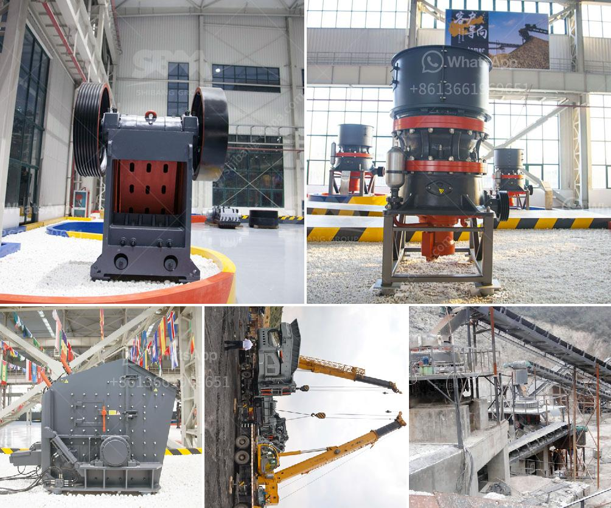

<h3>coal screening crushing machines</h3>
Coal screening crushing machines are widely used in coal processing plants and coal mines to separate and classify coal particles. In the screening process, high-efficiency screening equipment is adopted to maximize the screening efficiency and accuracy. The crushing process can break the coal blocks and improve the utilization efficiency of coal resources.

Coal screening crushing machines are widely used in coal mines, power plants, coking plants, cement plants, and other industries. They can effectively screen and crush coal materials to improve the comprehensive utilization of coal resources.

There are several types of coal screening crushing machines, such as circular vibrating screen, linear vibrating screen, roller screen, and trommel screen. Circular vibrating screen is mainly used for coarse screening and crushing; linear vibrating screen is generally used for screening and grading of medium and fine particles; roller screen is suitable for screening and grading of large-size coal; trommel screen is mainly used for screening and washing of coal.

The coal screening crushing machines are equipped with high-quality screen panels, which have good wear resistance and long service life. The screen panels can be easily replaced and maintained, reducing downtime and improving work efficiency.

In addition, the coal screening crushing machines are equipped with advanced control systems, which can monitor and control the whole screening and crushing process in real-time. The intelligent control system can adjust the feeding speed, amplitude, and angle of the vibrating screen according to the actual situation, ensuring the uniformity and accuracy of screening and crushing.

In conclusion, coal screening crushing machines are essential equipment in coal processing plants and coal mines. With the development of technology, the screening and crushing efficiency of coal machines are continuously improved, which not only improves the utilization efficiency of coal resources but also reduces environmental pollution. Coal screening crushing machines play a vital role in promoting the sustainable development of the coal industry.
<h3>Contact us</h3><ul><li><strong>Whatsapp:&nbsp;<a href="https://wa.me/8613661969651">+8613661969651</a></strong></li><li><a href="https://swt.shibang-china.com/?git&amp;zhl&amp;coal screening crushing machines"><strong>Online Service(chat now)</strong></a></li></ul><h3>Related</h3><ul><li><a href='business plan for stone grinding in ethiopia.md'>business plan for stone grinding in ethiopia</a></li><li><a href='stone crusher manufacture.md'>stone crusher manufacture</a></li><li><a href='dolomite crusher price.md'>dolomite crusher price</a></li><li><a href='sewa mobile stone crusher di indonesia.md'>sewa mobile stone crusher di indonesia</a></li><li><a href='price of copper smelting plant.md'>price of copper smelting plant</a></li></ul>