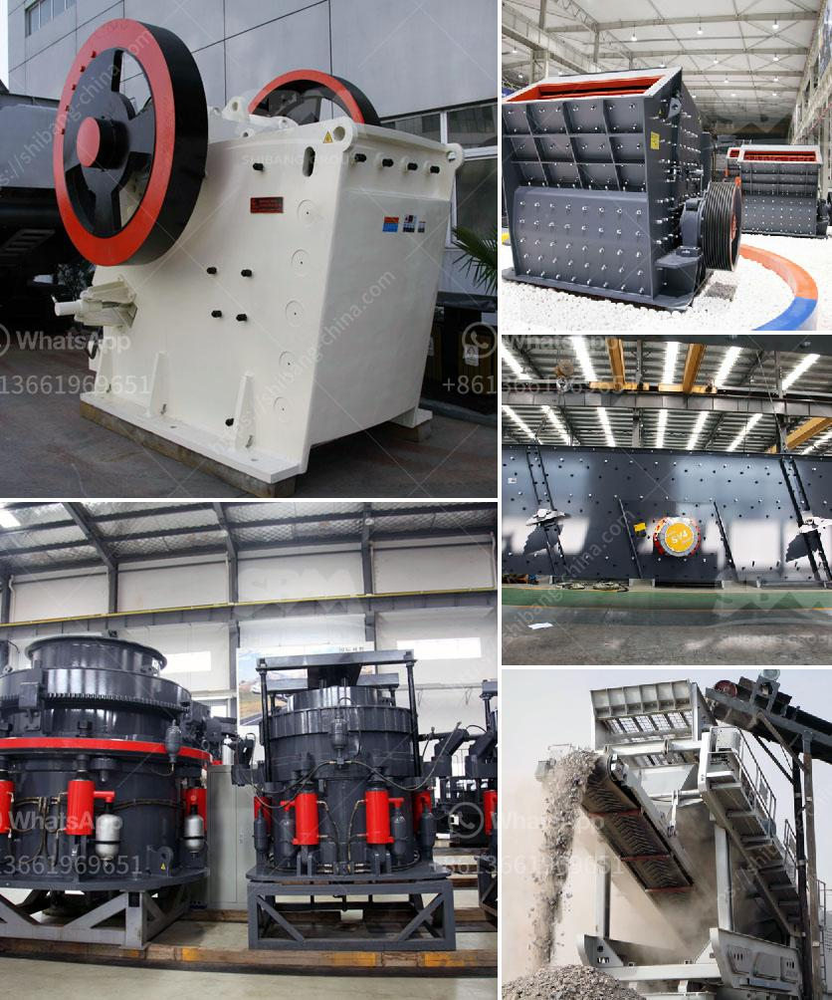

<h3>coal washing plant in philippines south africa</h3>
Coal washing plant refers to a facility that washes coal of soil and rock, crushes it into graded sized chunks, and prepares it for use as fuel for power plants, industrial ovens, and other purposes. The washing process is specifically designed to separate the valuable coal from the unwanted components, such as rock, slate, and mineral particles, and minimize ash content.

In South Africa, coal washing plants are a key part of the coal mining industry. The plants are responsible for breaking down the coal into different sizes, which can then be sold to power stations or used for industrial processes such as cement, steel production, and boiler fuel. Known as dense medium separation, these plants typically make use of a suspension of finely ground magnetite in water to separate the coal particles from the ash-forming minerals.

One of the leading coal washing plants in South Africa is Phola, located in Mpumalanga. Phola is a joint venture between Anglo American and BHP Billiton, with each owning 50%. The plant was established to process coal from the nearby mines, resulting in a reliable supply of quality coal for processing and consumption in South Africa's energy sector.

The Phola coal washing plant is part of a larger project that also includes a coal mine. The reason for the project was to supply coal to Eskom, South Africa's state-owned electricity utility. The coal washing plant, which includes most of the necessary infrastructure for washing and preparing coal, is vital for Phola's and Eskom's operations.

Coal washing plants help to minimize the ash content in coal, thus improving its quality. High ash content coal not only affects the efficiency of power stations but also pollutes the air when burned. By removing impurities through the washing process, coal washing plants play a critical role in reducing environmental pollution caused by coal combustion.

The benefits of coal washing plants extend beyond environmental considerations. These plants also contribute to the overall efficiency of power stations by facilitating the use of lower-grade coal. By treating low-grade coal, which would otherwise be discarded, South Africa's coal washing plants help to optimize the country's energy resources and minimize waste.

The Philippines, like South Africa, also utilizes coal for power generation. However, the country is heavily dependent on imported coal. Coal washing plants in the Philippines would help reduce the dependence on imported coal by treating locally sourced coal and improving its quality.

Although there might be challenges related to the establishment and operation of coal washing plants in the Philippines, such as the initial investment costs and sourcing of advanced technology, the long-term benefits would outweigh these challenges. A coal washing plant in the Philippines would not only improve the country's energy security but also contribute to environmental sustainability by reducing emissions and increasing the utilization of locally available coal resources.

In conclusion, coal washing plants play a vital role in South Africa's mining industry by preparing coal for various purposes. They help improve the quality of coal, reduce ash content, and minimize environmental pollution caused by coal combustion. Establishing coal washing plants in the Philippines would contribute to the country's energy security, reduce dependence on imported coal, and improve the utilization of locally available coal resources.
<h3>Contact us</h3><ul><li><strong>Whatsapp:&nbsp;<a href="https://wa.me/8613661969651">+8613661969651</a></strong></li><li><a href="https://swt.shibang-china.com/?git&amp;zhl&amp;coal washing plant in philippines south africa"><strong>Online Service(chat now)</strong></a></li></ul><h3>Related</h3><ul><li><a href='pulverizer coal with gasifier.md'>pulverizer coal with gasifier</a></li><li><a href='bentonite powder machine.md'>bentonite powder machine</a></li><li><a href='stone crusher hire south yorkshire.md'>stone crusher hire south yorkshire</a></li><li><a href='jaw crusher in german.md'>jaw crusher in german</a></li><li><a href='crushers of crushers.md'>crushers of crushers</a></li></ul>