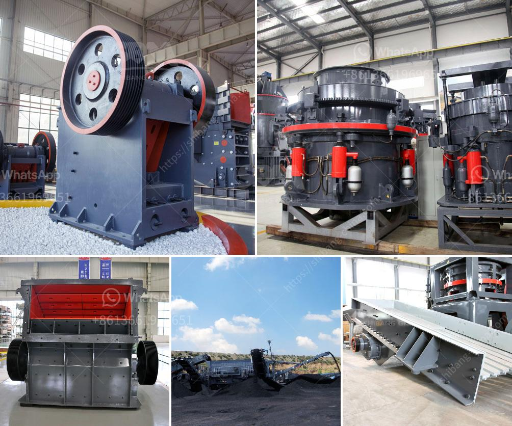

<h3>cobalt ore equipments nigeria</h3>
Nigeria is blessed with an abundance of natural resources, and cobalt ore is one of them. Cobalt is a critical element in many industries, including aerospace, electric vehicle batteries, and electronics. With the growing global demand for cobalt, Nigeria has the potential to become a major player in the cobalt market. However, to fully harness this potential, efficient cobalt ore equipment is vital.

Cobalt ore mining in Nigeria is still relatively new and untapped. With reserves of over 10,000 tons, it promises to be an industry worth exploring. Within the country, cobalt ores have been found in Taraba, Osun, and Ebonyi states. While there are no large-scale commercial mines actively producing cobalt ore in Nigeria at the moment, the opportunity is ripe for investors and mining companies willing to take advantage of this untapped resource.

To fully exploit Nigeria's cobalt ore reserves, it is crucial to invest in state-of-the-art mining equipment. The use of modern technology and advanced equipment can streamline the mining process, increase efficiency, and ensure optimal extraction yields. Cobalt ore equipment includes crushers, conveyors, mine ventilation systems, as well as underground loaders, trucks, and drills.

The primary machinery used in cobalt ore mining is the crusher. The crusher breaks down the large rocks into smaller pieces suitable for further processing. Different types of crushers are available, such as jaw crushers, gyratory crushers, and cone crushers. Each type has its advantages depending on the specific mining operation.

Conveyors are another essential piece of equipment in cobalt ore mining. They transport the ore from the crusher to the processing plant or storage facilities. Conveyors can significantly increase efficiency, as they automate the transportation process and reduce the need for manual labor.

Mine ventilation systems are crucial for ensuring a safe working environment in cobalt mines. Proper ventilation controls the air quality, temperature, and humidity in the mine, preventing the buildup of harmful gases and dust. Investing in high-quality ventilation systems is essential to protect the health and safety of mine workers.

When it comes to underground mining, loaders, trucks, and drills are indispensable. Loaders are used to scoop up the excavated cobalt ore and transport it to the surface, while trucks handle the transportation of ore between different mining sites or storage areas. Drills are used to create blast holes for explosive materials, facilitating the extraction process.

Investing in top-quality cobalt ore equipment is not only crucial for maximizing productivity and efficiency but also for minimizing environmental impact. Modern equipment is designed to be energy-efficient and environmentally friendly. By utilizing eco-friendly equipment, Nigeria can ensure responsible mining practices that comply with international standards and protect the environment.

In conclusion, Nigeria possesses vast cobalt ore reserves that have yet to be fully exploited. To unlock the potential of this natural resource, it is essential to invest in modern, efficient cobalt ore equipment. Crushers, conveyors, ventilation systems, loaders, trucks, and drills are all vital components in the cobalt mining process. Additionally, prioritizing the use of environmentally friendly equipment can contribute to sustainable mining practices, ensuring responsible resource extraction and protecting the environment. With the right investments and strategic planning, Nigeria can thrive in the cobalt market, boosting its economy and becoming a significant player in the global cobalt industry.
<h3>Contact us</h3><ul><li><strong>Whatsapp:&nbsp;<a href="https://wa.me/8613661969651">+8613661969651</a></strong></li><li><a href="https://swt.shibang-china.com/?git&amp;zhl&amp;cobalt ore equipments nigeria"><strong>Online Service(chat now)</strong></a></li></ul><h3>Related</h3><ul><li><a href='rubber mill grinder.md'>rubber mill grinder</a></li><li><a href='mineral industrial crusher.md'>mineral industrial crusher</a></li><li><a href='marble crushing machinery.md'>marble crushing machinery</a></li><li><a href='gold processing plant equipment price.md'>gold processing plant equipment price</a></li><li><a href='stone crusher second hand south africa.md'>stone crusher second hand south africa</a></li></ul>