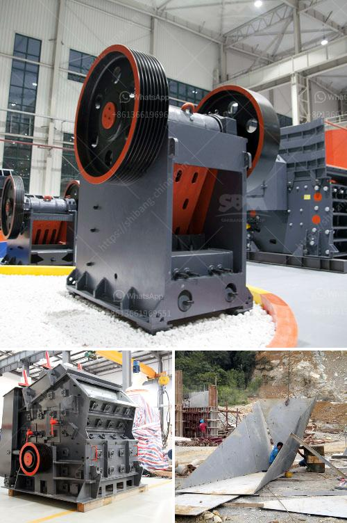

<h3>combined gold and diamond wash plants</h3>
Gold and diamonds have always been highly valued for their rarity and beauty. Therefore, it comes as no surprise that mining for these precious minerals is a lucrative endeavor. However, the process of extracting gold and diamonds from their natural sources is anything but simple. It requires advanced equipment, expertise, and a deep understanding of the resources at hand. One such innovation in the mining field is the combined gold and diamond wash plants, which have revolutionized the industry and made mining operations more efficient than ever before.

Gold and diamond wash plants are sophisticated pieces of machinery that combine various techniques to extract these precious minerals. These plants are designed to wash and separate the gold and diamond-rich gravels or ore from the source material effectively. They utilize water, which is a vital component in the mining process, to wash away unwanted materials while retaining the valuable gold and diamonds.

One of the key features of these combined wash plants is their versatility. They can be used for both alluvial and hard rock mining operations. Alluvial mining refers to the process of extracting minerals from placer deposits, such as rivers and streams, while hard rock mining involves extracting minerals from solid rock formations. The combined wash plants are designed to handle both types of mining efficiently, making them a valuable asset for miners working in diverse geological conditions.

The equipment used in these wash plants varies depending on the scale and complexity of the mining operation. Generally, a wash plant consists of a trommel screen, which acts as a classifier to separate out the larger materials and allows the finer particles to pass through. Other components include jigs and sluice boxes, which help capture the gold and diamonds during the washing process. Additionally, pumps and water supply systems are utilized to ensure a steady flow of water to the wash plant.

The effectiveness of these combined wash plants can be attributed to the use of proper techniques and the right equipment. By utilizing different methods of classification, such as vibrating screens and trommel screens, the plants ensure that the materials are thoroughly washed and separated according to their size and density. This improves the efficiency of the mining operation and maximizes the recovery of valuable minerals.

Another advantage of using combined gold and diamond wash plants is their eco-friendliness. By utilizing water as the main component of the washing process, these plants minimize the use of harmful chemicals. This not only reduces the environmental impact but also ensures the safety of the miners and the surrounding ecosystem.

In conclusion, combined gold and diamond wash plants have revolutionized the mining industry by improving the efficiency and effectiveness of mining operations. These versatile plants can handle both alluvial and hard rock mining, making them suitable for a wide range of geological conditions. With the use of proper equipment and techniques, these wash plants effectively wash and separate gold and diamonds from the source material. Moreover, their eco-friendliness makes them a more sustainable option for mining operations. As the demand for gold and diamonds continues to rise, combined wash plants will undoubtedly play a vital role in meeting these demands while minimizing the environmental impact of mining activities.
<h3>Contact us</h3><ul><li><strong>Whatsapp:&nbsp;<a href="https://wa.me/8613661969651">+8613661969651</a></strong></li><li><a href="https://swt.shibang-china.com/?git&amp;zhl&amp;combined gold and diamond wash plants"><strong>Online Service(chat now)</strong></a></li></ul><h3>Related</h3><ul><li><a href='floating processing mining plants.md'>floating processing mining plants</a></li><li><a href='coal mill crusher for sale stone crusher machine.md'>coal mill crusher for sale stone crusher machine</a></li><li><a href='used stone crusher sale in ethiopia.md'>used stone crusher sale in ethiopia</a></li><li><a href='quartz mining equipments.md'>quartz mining equipments</a></li><li><a href='crusher plant equipment supplier in saudi arabia.md'>crusher plant equipment supplier in saudi arabia</a></li></ul>