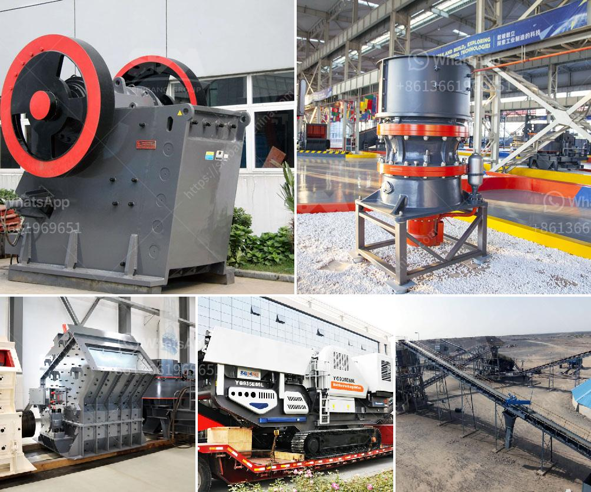

<h3>compact concrete crusher</h3>
Compact concrete crushers are a convenient and cost-effective solution for homeowners and construction companies alike. These innovative machines are perfect for crushing and recycling concrete materials that are used for various applications. With compact sizes and easy maneuverability, they can be easily transported to different sites, making them an essential tool for any construction project.

The primary advantage of using a compact concrete crusher is that it saves time and money. Instead of hauling broken concrete to a landfill, construction companies can recycle it on-site. This eliminates the need for transportation costs and landfill fees, saving both time and money. Additionally, recycling concrete helps reduce the environmental impact of construction, as it reduces the need for raw materials and decreases the amount of waste sent to landfills.

Compact concrete crushers are also incredibly versatile. They can be used to crush various types of concrete, such as reinforced concrete, precast concrete, and asphalt materials. These crushers are particularly useful when it comes to recycling concrete from demolition sites and construction projects. Not only do they crush concrete into smaller, more manageable pieces, but they can also separate steel reinforcement from the concrete, allowing for easier recycling of both materials.

One of the main features of compact concrete crushers is their size. These machines are small and can be easily transported to any site. They can fit through narrow doorways and passageways, making them ideal for indoor demolition projects. Their compact size also means they can be used in tight spaces, such as residential areas where larger equipment may not be feasible.

Another advantage of compact concrete crushers is their ease of operation. These machines are designed to be user-friendly, with simple controls and mechanisms. They can be operated by one person and do not require specialized training or expertise. This makes them accessible to a wide range of users, from experienced contractors to DIY homeowners.

In terms of maintenance, compact concrete crushers are relatively low-maintenance machines. They are designed to withstand heavy use and are built to last. Regular maintenance, such as lubricating moving parts and cleaning the machine, is typically all that is required to keep them in good working condition.

Compact concrete crushers are an invaluable tool for any construction project. With their ability to crush and recycle concrete materials, they offer numerous benefits, including cost savings, environmental sustainability, and increased efficiency. These machines bring convenience and versatility to the construction industry, making them an indispensable asset for any contractor or homeowner.
<h3>Contact us</h3><ul><li><strong>Whatsapp:&nbsp;<a href="https://wa.me/8613661969651">+8613661969651</a></strong></li><li><a href="https://swt.shibang-china.com/?git&amp;zhl&amp;compact concrete crusher"><strong>Online Service(chat now)</strong></a></li></ul><h3>Related</h3><ul><li><a href='screen clay from limestone rock.md'>screen clay from limestone rock</a></li><li><a href='sand core making machine.md'>sand core making machine</a></li><li><a href='used gold crusher for sale in tanzania.md'>used gold crusher for sale in tanzania</a></li><li><a href='calcium carbonate powder machine.md'>calcium carbonate powder machine</a></li><li><a href='jaw crushers south africa.md'>jaw crushers south africa</a></li></ul>