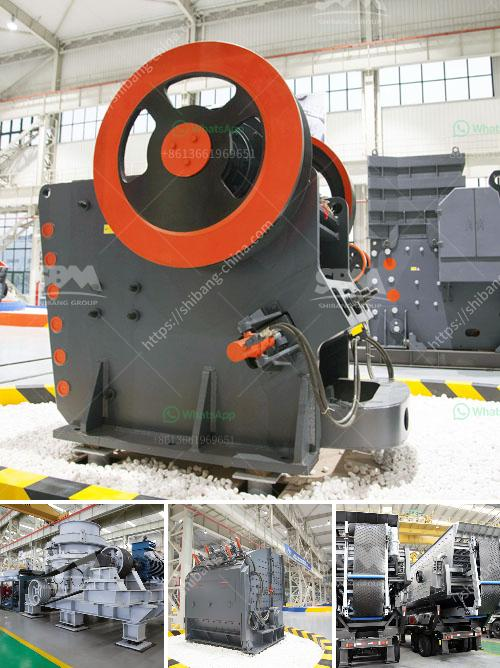

<h3>compact vibrating ball mill manufactures</h3>
Compact vibrating ball mills are widely used in various industries such as mining, pharmaceuticals, and manufacturing to pulverize materials into fine powders. These mills consist of a cylinder-shaped container that vibrates at a high frequency, causing the balls inside it to collide with and grind the material. The compact design of these mills makes them ideal for smaller-scale operations where space is limited.

One of the leading manufacturers of compact vibrating ball mills is XYZ Company. With years of experience in the industry, XYZ Company has perfected the design and manufacturing process of these mills to ensure optimal performance and reliability. Their mills are known for their efficiency in grinding a wide range of materials, including ores, chemicals, and ceramics.

One of the key features of XYZ Company's compact vibrating ball mills is their ability to operate at a high frequency, resulting in faster grinding times. This not only increases productivity but also reduces energy consumption, making these mills more cost-effective compared to traditional ball mills.

Another advantage of XYZ Company's compact vibrating ball mills is their versatility. These mills can be easily adjusted to accommodate different material types and sizes, allowing for greater flexibility in the manufacturing process. Whether it is grinding ores for extraction or producing fine powders for pharmaceutical applications, XYZ Company's mills can handle various tasks efficiently.

In addition to their compact design and high performance, XYZ Company's compact vibrating ball mills are also known for their durability. Built with high-quality materials, these mills are designed to withstand the harsh conditions of the industrial environment, ensuring a long lifespan and minimal maintenance requirements.

Overall, compact vibrating ball mills offer numerous advantages for manufacturers looking to efficiently grind materials into fine powders. With XYZ Company's expertise in the field, customers can trust in the quality and reliability of their mills to meet their production needs. Whether it is for small-scale operations or larger industrial facilities, XYZ Company's compact vibrating ball mills are a top choice for manufacturers worldwide.
<h3>Contact us</h3><ul><li><strong>Whatsapp:&nbsp;<a href="https://wa.me/8613661969651">+8613661969651</a></strong></li><li><a href="https://swt.shibang-china.com/?git&amp;zhl&amp;compact vibrating ball mill manufactures"><strong>Online Service(chat now)</strong></a></li></ul><h3>Related</h3><ul><li><a href='starting up a small scale gold mine in zimbabwe.md'>starting up a small scale gold mine in zimbabwe</a></li><li><a href='bentonite mill project report.md'>bentonite mill project report</a></li><li><a href='quartz crushing plant for engineered stone.md'>quartz crushing plant for engineered stone</a></li><li><a href='calcite processing plant.md'>calcite processing plant</a></li><li><a href='cement plant machinery supplier in korea.md'>cement plant machinery supplier in korea</a></li></ul>