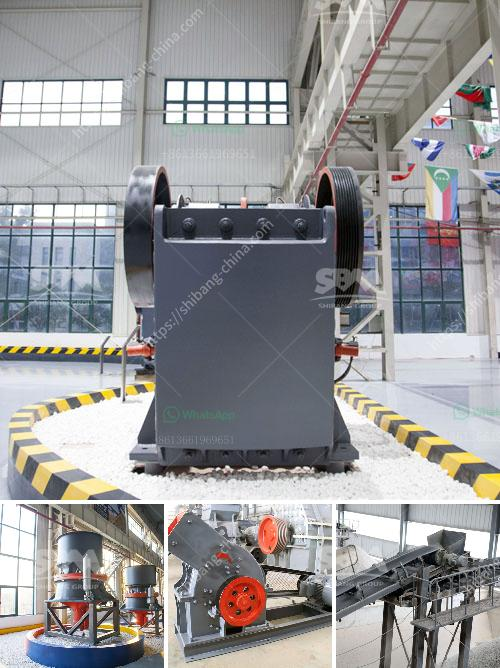

<h3>companies manufacturing quarry plant in uk</h3>
The United Kingdom is renowned for its rich history in the mining and quarrying industry. Over the years, companies in the UK have specialized in manufacturing state-of-the-art quarry plants to cater to the growing demands of the industry. These companies have not only provided innovative solutions but have also played a significant role in boosting the economy through their manufacturing prowess. This article explores the thriving industry of manufacturing quarry plants in the UK.

As the construction and infrastructure sectors continue to grow, the demand for quarry plants has significantly increased. Quarry plants are key to efficient mining operations, as they extract, crush, and screen high-quality aggregates for a range of applications. To meet these evolving demands, companies in the UK have been at the forefront of developing cutting-edge equipment and machinery for quarrying operations.

To maintain competitiveness, UK-based quarry plant manufacturers have consistently invested in research and development, leading to innovative solutions. These manufacturers have embraced the integration of advanced technologies, such as computer-aided design (CAD), automation, and GPS tracking. These advancements have not only improved the efficiency and productivity of quarry plants but have also enhanced worker safety.

Sustainability has become a top priority for companies worldwide, and the UK is no exception. Quarry plant manufacturers in the UK have paved the way for green solutions in the industry. They have focused on incorporating environmentally friendly manufacturing processes and creating equipment that reduces emissions, conserves energy, and minimizes waste. These sustainable practices not only benefit the environment but also attract environmentally-conscious customers.

UK manufacturers of quarry plants adhere to strict quality control and safety standards. The Health and Safety Executive (HSE), a UK government body, ensures that these plants comply with regulations, guaranteeing safe operations for workers and reducing the risk of accidents. Manufacturers have also implemented stringent quality control measures to ensure that their quarry plants meet the highest industry standards, providing customers with reliable and durable equipment.

The manufacturing industry of quarry plants has played a vital role in boosting the UK economy. These companies generate employment opportunities, contributing to job creation across various disciplines, including engineering, design, production, and service. Additionally, the exportation of UK-manufactured quarry plants has bolstered international trade, strengthening the country's economic ties with global partners.

Looking ahead, the UK manufacturing sector for quarry plants shows promise. As global demand for construction aggregates continues to rise, UK manufacturers are well-positioned to capitalize on these opportunities. The industry will likely witness further technological advancements, including the integration of artificial intelligence and robotics, further revolutionizing quarry plant operations.

The manufacturing industry for quarry plants in the UK has thrived due to its commitment to innovation, sustainability, and safety. These companies have demonstrated their excellence in producing high-quality equipment that meets the growing needs of the construction and infrastructure sectors. Moving forward, the industry is poised for further growth, driven by advancements in technology and the global demand for aggregates. The UK's expertise in manufacturing quarry plants is set to play a significant role in shaping the future of the mining and quarrying industry.
<h3>Contact us</h3><ul><li><strong>Whatsapp:&nbsp;<a href="https://wa.me/8613661969651">+8613661969651</a></strong></li><li><a href="https://swt.shibang-china.com/?git&amp;zhl&amp;companies manufacturing quarry plant in uk"><strong>Online Service(chat now)</strong></a></li></ul><h3>Related</h3><ul><li><a href='quartz crusher for sale.md'>quartz crusher for sale</a></li><li><a href='jaw crusher specifications.md'>jaw crusher specifications</a></li><li><a href='copper ore ball mill.md'>copper ore ball mill</a></li><li><a href='industrial gypsum rotary kiln.md'>industrial gypsum rotary kiln</a></li><li><a href='barite production lines manufacturers.md'>barite production lines manufacturers</a></li></ul>