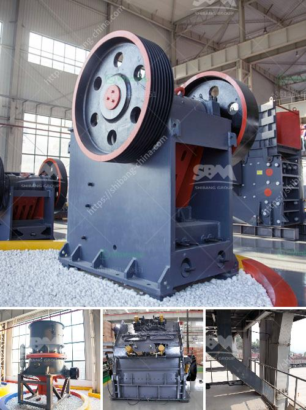

<h3>companies that manufacture ball mill</h3>
Ball mills are a staple in the manufacturing industry, capable of grinding materials into fine powders. They are popular due to their ability to grind a variety of materials efficiently and effectively. This article delves into some companies that manufacture ball mills, exploring their features and offerings.

Fote Machinery specializes in producing ball mill equipment with high efficiency and energy-saving features. Their ball mills are widely used in cement, silicate products, new building materials, refractory materials, fertilizers, black and non-ferrous metal ore dressing, and glass ceramics industries. Fote Machinery also offers customized solutions to meet specific requirements. Their ball mills are known for their durability and reliability.

DOVE Equipment and Machinery is a leading supplier of ball mills and other mining equipment. Their extensive experience in the mining field ensures that their products deliver excellent performance. DOVE ball mills are designed for grinding materials in mining, construction, metallurgy, and chemical industries. Their ball mills are highly efficient, with various stages of material refining, depending on the specs of the end product.

FL Smidth is a leading supplier of equipment and services to the global cement and minerals industries. Their ball mill grinding solutions are customized to suit specific operational requirements. They provide solutions for both wet and dry grinding applications. FL Smidth offers a complete range of grinding mills that can be tailored to match various desired production capacities. They can also help optimize existing mills with customised upgrades.

ELE Bead Mill is a leading manufacturer of wet grinding mills, offering a wide range of engineered bead mills for industries including paints, inks, pigments, food, chemical, cosmetics, and pharmaceuticals. Their wet grinding mills are suitable for grinding materials down to sub-micron level, making these mills ideal for nano grinding. This company offers skilled engineering assistance to recommend the right grinding media material and size for your specific requirements.

Union Process manufactures high-quality Attritor and DMQX-Mill devices for both laboratory and production applications. Their Attritor mills have unique features such as variable speed drive, automatic temperature control, and easy cleaning and maintenance. Union Process also provides toll milling and refurbishing services.

Ball mills are a critical piece of equipment in the manufacturing industry, capable of grinding a variety of materials efficiently and effectively. Some top companies offering ball mill solutions include Fote Machinery, DOVE Equipment and Machinery, FL Smidth, ELE Bead Mill, and Union Process. Each company offers a diverse range of ball mill solutions, tailored to suit specific operational needs, making them ideal for various industries.
<h3>Contact us</h3><ul><li><strong>Whatsapp:&nbsp;<a href="https://wa.me/8613661969651">+8613661969651</a></strong></li><li><a href="https://swt.shibang-china.com/?git&amp;zhl&amp;companies that manufacture ball mill"><strong>Online Service(chat now)</strong></a></li></ul><h3>Related</h3><ul><li><a href='used ball mills for sale.md'>used ball mills for sale</a></li><li><a href='different size mining cone crusher.md'>different size mining cone crusher</a></li><li><a href='mill grinding plants balls.md'>mill grinding plants balls</a></li><li><a href='manganese wash plant zambia.md'>manganese wash plant zambia</a></li><li><a href='roller crusher for sale.md'>roller crusher for sale</a></li></ul>