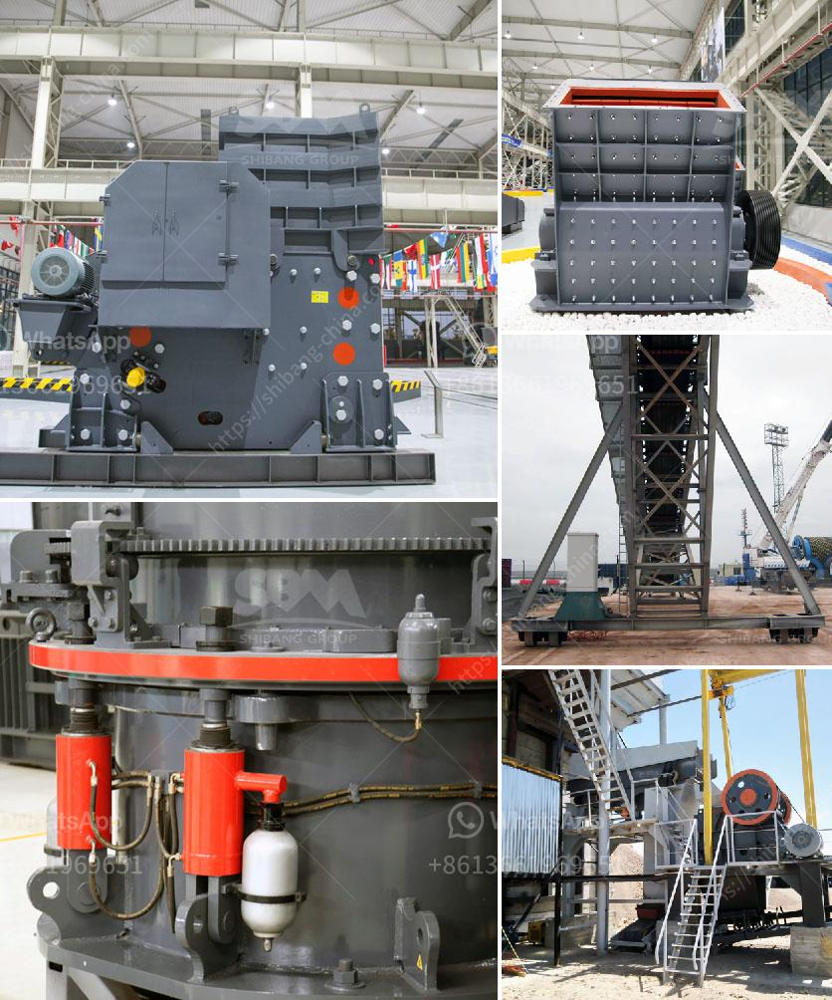

<h3>company manufactures the best ball mill</h3>
Grinding is an essential process in many industries, and a reliable ball mill is crucial for achieving high-quality and consistent results. Company X, a renowned manufacturer in the field, offers its cutting-edge ball mills for both wet and dry grinding applications. With a longstanding commitment to innovation and engineering excellence, they provide the best solutions for grinding processes.

Company X's ball mills are fabricated with top-quality materials and components to ensure durability and optimum performance. The mills are built using robust steel frames and highly resistant internal lining, providing unmatched resistance to wear and tear. Additionally, the company's advanced manufacturing techniques ensure precise construction that guarantees continuous, trouble-free operation.

Company X's ball mills are designed to deliver superior grinding efficiency due to their advanced design and innovative engineering. The mills' rotating drums are specifically designed to enhance grinding, resulting in efficient particle size reduction. The mills' mechanisms promote optimal cascading and tumbling of the grinding media, ensuring consistent and highly effective results.

Company X's ball mills excel in various applications, making them ideal for a diverse range of industries. Whether it's the pharmaceutical, chemical, or mining industry, these mills are capable of handling both wet and dry grinding processes, accommodating different material properties and required end products. From fine grinding to producing high-quality powders, Company X's ball mills can meet the precise needs of every customer.

Company X sets itself apart by offering comprehensive support and exceptional customer service. Their team of highly trained experts is readily available to assist customers throughout the manufacturing process, from initial consultation and product selection to installation and maintenance. Customers can rely on their expertise to ensure optimal performance and longevity of the ball mills.

In a world where precise grinding is essential for quality production, Company X stands out as a leading manufacturer of ball mills. Their commitment to excellence, high-quality construction, superior grinding efficiency, versatile applicability, and comprehensive customer support make them the go-to choice for businesses seeking reliable grinding solutions. Invest in Company X's ball mills and experience unrivaled performance and efficiency in your grinding operations.
<h3>Contact us</h3><ul><li><strong>Whatsapp:&nbsp;<a href="https://wa.me/8613661969651">+8613661969651</a></strong></li><li><a href="https://swt.shibang-china.com/?git&amp;zhl&amp;company manufactures the best ball mill"><strong>Online Service(chat now)</strong></a></li></ul><h3>Related</h3><ul><li><a href='quarry rock stone crusher germany machine manufacturer.md'>quarry rock stone crusher germany machine manufacturer</a></li><li><a href='alluvial gold mining process.md'>alluvial gold mining process</a></li><li><a href='machinery for starch plant japan.md'>machinery for starch plant japan</a></li><li><a href='mobile and modular coal washing plants.md'>mobile and modular coal washing plants</a></li><li><a href='gyratory crusher harga.md'>gyratory crusher harga</a></li></ul>