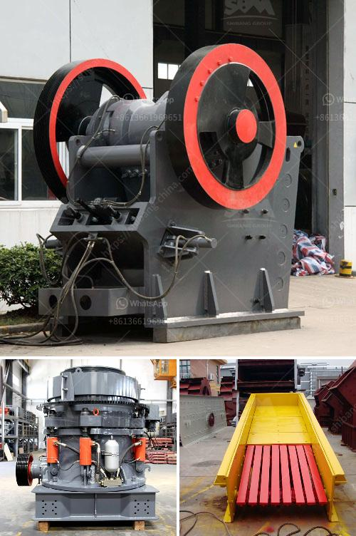

<h3>company of stone crusher</h3>
Stone crushing machine is the necessary equipment in the mining machinery, common stone crusher main including:jaw crusher, cone crusher, impact crusher,vertical roller mill, Raymond mill and sand making machine ect.This article main introduce various stone production line matching equipment.

Firstly, the whole production line of stone crushing machinery runs stably and reliably, including the equipment configuration, crushers, vibrating screen and belt conveyor,etc. Each production link has special equipment for processing, and each equipment has its unique advantages. For example, the jaw crusher has a large crushing ratio and is a very important equipment in the production line.

The cone crusher in the first stage crushing in the stone crushing production line has large processing capacity and high crushing efficiency. The impact crusher specially configured for the second stage crushing realizes the production requirements of allieving 40-60mm stones to below 20mm and breaking the crushed materials into uniform particles of 5-10mm. The sand making machine further processes the particle size of the material so that the processed material has a uniform particle size and meets the requirements of the sand making machine. The crusher can also process the material to make the grain shape more regular.

Secondly, the crushers provided by the company have high quality and performance, and many stone crushers have been put into use in the market. The crushers produced by our company can be used together with other equipment to form a stone production line. This is due to the different materials used by customers for the production line, and the resulting series of equipment are also different.

Finally, our company has been adhering to the concept of "surviving by quality, developing by reputation". In terms of technical improvements, our company's research and development team has made great efforts and achieved good results. We have applied for national patent protection for many of our technologies. In terms of production, our company has strict production standards, and each machine will be inspected before leaving the factory to ensure that it can be put into use at the customer's site.

In conclusion, the stone crushing machine introduced by our company is a new type of machine with high efficiency, energy saving and environmental protection. The stone production line mainly includes vibrating feeder, jaw crusher, cone crusher, impact crusher, vibrating screen, belt conveyor and other mining equipment. In order to meet different processing needs of various customers, it can be equipped with cone crusher and dust removal equipment. The sawdust crusher produced by our company is made of imported high-carbon steel. The sawdust machine has the advantages of reasonable structure, convenient operation, high production efficiency and safe use. It is widely used in the production of sawdust particles in the charcoal industry and can also be used in the production of sawdust particles in the pharmaceutical industry, the breeding industry and the raw material of mushroom cultivation.
<h3>Contact us</h3><ul><li><strong>Whatsapp:&nbsp;<a href="https://wa.me/8613661969651">+8613661969651</a></strong></li><li><a href="https://swt.shibang-china.com/?git&amp;zhl&amp;company of stone crusher"><strong>Online Service(chat now)</strong></a></li></ul><h3>Related</h3><ul><li><a href='ball mill grinder for sale.md'>ball mill grinder for sale</a></li><li><a href='coal grinding mill in bhopal india.md'>coal grinding mill in bhopal india</a></li><li><a href='quartz crushing machine.md'>quartz crushing machine</a></li><li><a href='silica sand grinding.md'>silica sand grinding</a></li><li><a href='jual stone crusher merk.md'>jual stone crusher merk</a></li></ul>