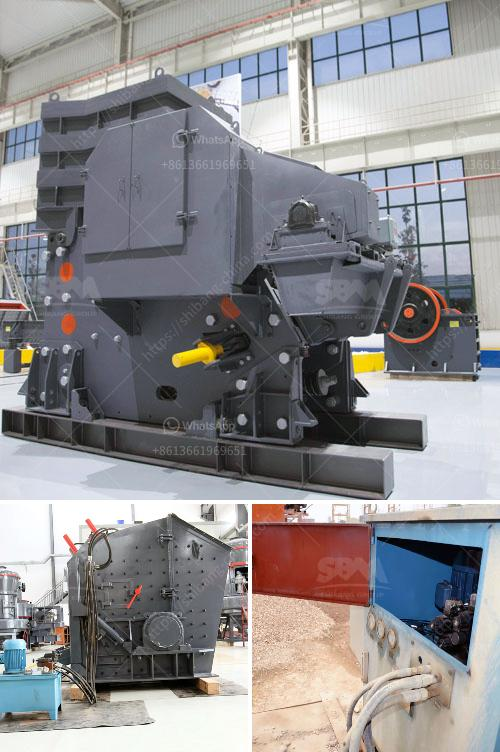

<h3>company that sells vibratory sieves in spain</h3>
In the vibrant industrial landscape of Spain, the demand for equipment that enhances productivity and efficiency is incessant. One such company that has gained recognition in the market for its high-quality vibratory sieves is XYZ Company. With a range of innovative products and a customer-centric approach, XYZ Company has established itself as a leading supplier of vibratory sieves in Spain.

Vibratory sieves are instrumental in the separation process of solids and liquids in various industries, including pharmaceuticals, food processing, ceramics, and chemicals. XYZ Company boasts an extensive range of vibratory sieves designed to meet the diverse needs of its clientele. These robust sieves are built to efficiently separate particles of different sizes without compromising quality.

With the rapid advancement of technology, XYZ Company has consistently upgraded its products to stay at the forefront of the industry. Their vibratory sieves incorporate state-of-the-art features such as variable speed control, customizable settings, and advanced screening capabilities. Additionally, their sieves are equipped with precision-engineered vibratory motors that minimize energy consumption, resulting in cost-effective operations for businesses.

XYZ Company understands that every industry has unique requirements. To cater to specific needs, they offer customization options for their vibratory sieves. This ensures that their sieves are tailored to suit the clients' applications, materials, and production volumes. By collaborating closely with their customers, XYZ Company can provide truly personalized solutions, boosting operational efficiency and reducing downtime.

XYZ Company takes pride in providing vibratory sieves that are not only highly efficient but also robust and long-lasting. The company utilizes high-quality materials and employs stringent quality control measures to ensure that their products withstand demanding industrial requirements. Durability is a crucial factor for businesses investing in sieving equipment, and XYZ Company guarantees that their sieves provide years of uninterrupted service.

In a competitive market, XYZ Company goes the extra mile to foster long-lasting relationships with its customers. They believe in providing exceptional customer service, from the initial inquiry to post-purchase assistance. Their team of highly skilled engineers and technical experts is always available to offer guidance, support, and quick solutions to any sieving-related issues, ensuring minimal disruptions to their clients' operations.

XYZ Company has gained a commendable reputation for its vibratory sieves in Spain due to its commitment to innovation, customization, durability, and outstanding customer service. For businesses seeking efficient separation solutions, XYZ Company provides a range of high-quality vibratory sieves that are poised to transform productivity and generate significant cost savings.

As industries in Spain continue to strive for improved productivity and quality control, XYZ Company remains a trusted partner for vibratory sieving solutions. With their advanced technology, customized offerings, and exemplary customer service, XYZ Company is well-equipped to meet the demanding requirements of various industries across the country.
<h3>Contact us</h3><ul><li><strong>Whatsapp:&nbsp;<a href="https://wa.me/8613661969651">+8613661969651</a></strong></li><li><a href="https://swt.shibang-china.com/?git&amp;zhl&amp;company that sells vibratory sieves in spain"><strong>Online Service(chat now)</strong></a></li></ul><h3>Related</h3><ul><li><a href='stone crusher cement factories in africa.md'>stone crusher cement factories in africa</a></li><li><a href='hammer mill for cerelaes.md'>hammer mill for cerelaes</a></li><li><a href='new mini portable rock impact crusher.md'>new mini portable rock impact crusher</a></li><li><a href='barite production lines manufacturers.md'>barite production lines manufacturers</a></li><li><a href='barite mining crusher in nigeria.md'>barite mining crusher in nigeria</a></li></ul>