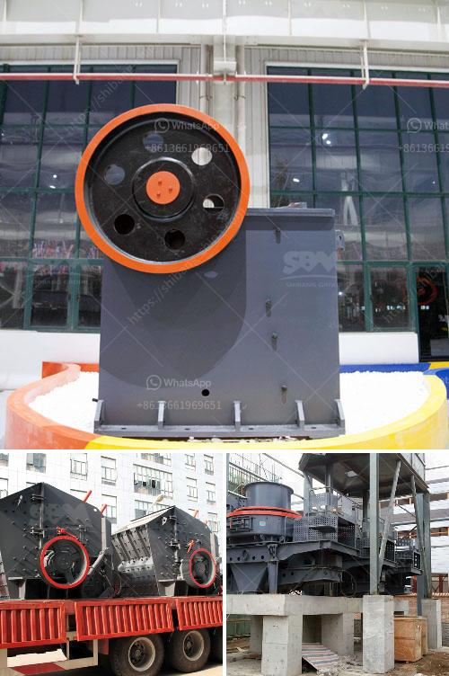

<h3>complete aggregate crushing plant in usa</h3>
Aggregate crushing plants are used to process sand, gravel, and rock for specific markets. We provide aggregate production line and complete aggregate crushing plant for quarrying operations. Complete Aggregate Crushing Process

Crushing is the first step of processing begins after the extraction from quarry or pit. Many of these steps also are common to recycled materials, clay, and other manufactured aggregates. The first stage in most aggregate production operations is the reduction and sizing by crushing.

Impact crushers may be used as primary, secondary, or tertiary crushers. Despite having a somewhat higher operating cost than other crushers, they tend to produce a more uniform particle shape. Impact crushers usually will benefit the aggregate better than compression crushers, and they may generate more fines.

Common types of aggregate crushers include: cone crushers, jaw crushers, impact crushers, and mobile crushers. Different types of aggregate crushers have different advantages and can be used for different purposes.

The primary main steps in aggregate crushing plant: process design, equipment selection, and layout. The first two are dictated by production requirements and design parameters, but layout can reflect the input, preferences and operational experience of a number of parties. These are driven by a number of different factors.

Some of the factors influencing the selection of a crusher for this service are the material characteristics, including hardness and the shape of the final product, the processing stage, electric power and transportation costs, and the desired output size. Regardless of the crusher type selected, Roll crushers allow for the material to fracture along naturally occurring cleavage lines, which helps with minimizing fines generation.

In conclusion, the complete aggregate crushing plant not only provides high-quality sand and gravel aggregate for the market, but also offers efficient operation, reliability and flexibility.

Moreover, the plant can be customized according to your specific requirements. If you are interested in the complete aggregate crushing plant, please contact us for more information. We are here to help you achieve success in your project.
<h3>Contact us</h3><ul><li><strong>Whatsapp:&nbsp;<a href="https://wa.me/8613661969651">+8613661969651</a></strong></li><li><a href="https://swt.shibang-china.com/?git&amp;zhl&amp;complete aggregate crushing plant in usa"><strong>Online Service(chat now)</strong></a></li></ul><h3>Related</h3><ul><li><a href='grinding media for ball mill.md'>grinding media for ball mill</a></li><li><a href='picture of silica sand process plant.md'>picture of silica sand process plant</a></li><li><a href='ball mill capacity 26 x 41.md'>ball mill capacity 26 x 41</a></li><li><a href='gold crusher philippines.md'>gold crusher philippines</a></li><li><a href='stone ball mill up to 2500 mesh.md'>stone ball mill up to 2500 mesh</a></li></ul>