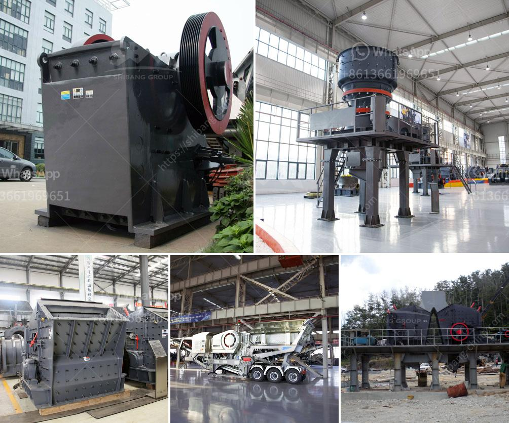

<h3>complete crusher for sale in ghana</h3>
Ghana is rich in various minerals, such as gold, diamond, bauxite, manganese, and limestone. The mining industry in Ghana is thriving, with the increasing demand for these minerals, as well as the lucrative export market. One crucial equipment that is extensively used in the mining industry is the crusher.

Crushers are used to break down large rocks and stones into smaller particles, making it easier for transportation and further processing. In Ghana, there are various types of crushers available for sale, including jaw crusher, impact crusher, and cone crusher.

A complete crusher plant consists of primary crusher, secondary crusher, and tertiary crusher, vibrating screens, and feeders, along with other auxiliary equipment such as conveyor belts, transfer stations, and control rooms. It is a comprehensive setup that requires the entire system to work in harmony to achieve maximum efficiency and productivity.

When looking for complete crushers for sale in Ghana, it is crucial to consider various factors before making a purchase. First and foremost, the type of crusher required should be determined based on the specific needs of the mining operation. Different crushers have different capabilities and can handle different types of materials.

For example, a jaw crusher is suitable for primary crushing, while an impact crusher is ideal for secondary crushing. It is essential to have a clear understanding of the type of material that will be processed and the desired particle size to select the appropriate crusher.

Additionally, the capacity of the crusher is another crucial factor to consider. The capacity of the crusher should match the production requirements of the mining operation. It is essential to assess the expected tonnage of material that needs to be processed per hour to select a crusher with the appropriate capacity.

Furthermore, the quality and durability of the crusher should not be overlooked. The crusher should be manufactured by a reputable company with a proven track record for producing reliable and long-lasting equipment. Investing in a high-quality crusher might require a higher upfront cost, but it can result in significant long-term savings by reducing downtime and maintenance costs.

Lastly, after-sales support and service should also be considered when purchasing a complete crusher. A reliable supplier should provide technical support, spare parts availability, and assistance with installation and training.

In conclusion, a complete crusher for sale in Ghana is an essential equipment for the mining industry. It helps break down large rocks and stones into smaller particles, making it easier for transportation and further processing. When purchasing a crusher, factors such as the type, capacity, quality, and after-sales support should be carefully considered to ensure maximum efficiency and productivity for the mining operation.
<h3>Contact us</h3><ul><li><strong>Whatsapp:&nbsp;<a href="https://wa.me/8613661969651">+8613661969651</a></strong></li><li><a href="https://swt.shibang-china.com/?git&amp;zhl&amp;complete crusher for sale in ghana"><strong>Online Service(chat now)</strong></a></li></ul><h3>Related</h3><ul><li><a href='used gold crusher for sale in tanzania.md'>used gold crusher for sale in tanzania</a></li><li><a href='cost of 1000 tpd cement plant.md'>cost of 1000 tpd cement plant</a></li><li><a href='bentonite mill project report.md'>bentonite mill project report</a></li><li><a href='complete rock crusher machine prices in pakistan.md'>complete rock crusher machine prices in pakistan</a></li><li><a href='granite crusher for sale.md'>granite crusher for sale</a></li></ul>