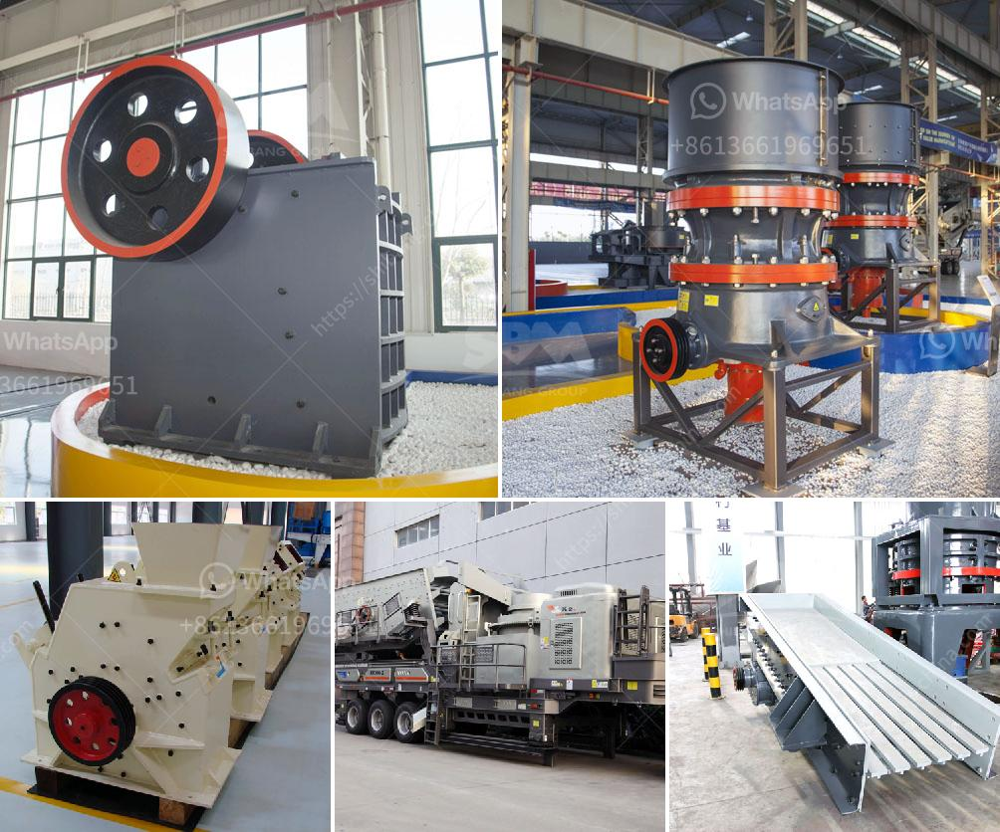

<h3>complete crushing plant solutions prices</h3>
A complete crushing plant is a crucial part of any construction or mining project. A quarry or mine site needs to consider multiple factors when selecting the equipment to use, including the production requirements, the materials being mined, and the geographical location. Depending on these factors, a comprehensive solution consisting of various crushers, screens, and conveyors can be tailored to fit specific market needs.

When it comes to purchasing a complete crushing plant solution, a typical crushing plant supplier or manufacturer will need to assess the site and make calculations on the production requirements. It is important to consider factors such as the required capacity, the desired final product size, and the plant's lifespan. With this information, the supplier will be able to recommend the best equipment that suits the client's needs.

The price of a complete crushing plant can vary greatly depending on several factors. First and foremost, the brand, geographical location, and capabilities of the supplier will greatly affect the final price. Larger and more reputable suppliers may offer higher prices but offer a quality assurance and comprehensive after-sales support. Smaller or less experienced suppliers may provide lower prices but with potentially fewer guarantees.

Another factor that affects the price is the type and capacity of crushers and screens required for the plant. For example, a plant that requires a primary jaw crusher and a secondary cone crusher will have different prices than a plant that requires a primary impact crusher and a vibrating screen. Similarly, the price of a plant with a higher production capacity will be higher compared to a plant with a lower capacity. Each equipment option has its own price range, and the total plant cost can vary accordingly.

In addition to crushers and screens, the price of a complete crushing plant solution also depends on the conveyors used to transport the materials. The length and complexity of the conveyor system, as well as the required capacity, influence the overall price. Other factors that may increase the cost are the need for additional equipment, such as generators, control rooms, or feeding systems.

It is essential to discuss the installation and commissioning costs with the supplier before finalizing the purchase of a complete crushing plant solution. The supplier should provide a clear breakdown of these costs, including any additional labor or equipment required for a successful installation. Moreover, the supplier should also include information about the warranty and after-sales services provided, as these can greatly impact the overall value of the solution.

In conclusion, the price of a complete crushing plant solution depends on several factors, including the production requirements, the type and capacity of crushers and screens, as well as the supplier's reputation and geographical location. It is important for buyers to evaluate these factors carefully and choose a supplier that offers the best balance between price and quality. By doing so, they can ensure a successful and cost-effective solution that meets their specific needs.
<h3>Contact us</h3><ul><li><strong>Whatsapp:&nbsp;<a href="https://wa.me/8613661969651">+8613661969651</a></strong></li><li><a href="https://swt.shibang-china.com/?git&amp;zhl&amp;complete crushing plant solutions prices"><strong>Online Service(chat now)</strong></a></li></ul><h3>Related</h3><ul><li><a href='track mounted mobile crusher plant.md'>track mounted mobile crusher plant</a></li><li><a href='gypsum crushing plant.md'>gypsum crushing plant</a></li><li><a href='silica sand washing.md'>silica sand washing</a></li><li><a href='crushing plant aggregates in south africa.md'>crushing plant aggregates in south africa</a></li><li><a href='grinder mill china.md'>grinder mill china</a></li></ul>