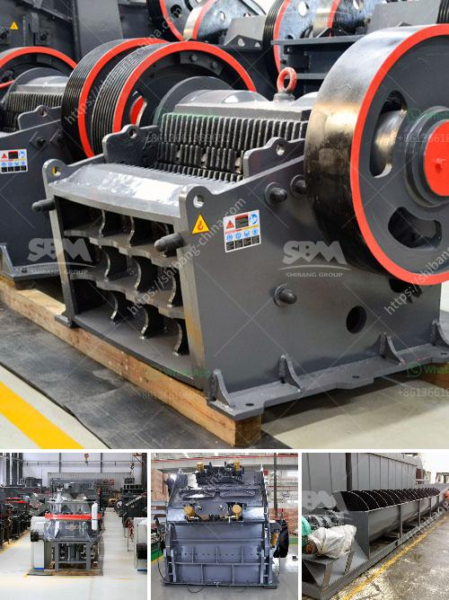

<h3>complete new stone crusher plant in south africa</h3>
South Africa is officially known as the Republic of South Africa and it is located in Southern Africa on the southernmost tip of the African continent. It has a land area of approximately 1,219,090 square kilometers, making it the 25th largest country in the world. With close to 60 million people, it is the 24th most populous nation globally. Having rich mineral resources, South Africa is one of the leading mining countries in the world. It has extensive reserves of gold, platinum, coal, iron ore, manganese, nickel, andalusite, chromite, and vanadium, making it a crucial player in the global mining industry.

With such vast resources, the mining industry plays a vital role in South Africa's economy, contributing significantly to its GDP and creating employment opportunities. One of the key elements in the mining industry is crushing. Crushing refers to the process of breaking down large pieces of material into smaller particles, suitable for further processing or use. In the mining industry, crushing is often the first step in the extraction process and plays a crucial role in ensuring the ores or minerals are properly extracted and processed.

To meet the growing demand for crushed stones, the government of South Africa has made an admirable effort to promote the establishment of new stone crusher plants. As a result, a comprehensive new stone crusher plant has emerged as a profitable venture for both individuals and industries.

A stone crusher plant is a profitable venture for new entrepreneurs. The demand for quality stones is increasing. In addition to the increasing demand, the government is providing construction incentives, which makes the investment even more rewarding. With a stone crusher plant, entrepreneurs can effectively utilize the vast resources available in South Africa to produce quality stones which can then be used for various purposes.

The complete new stone crusher plant in South Africa is designed by SBM, a professional stone crusher plant manufacturer. It has a whole set of equipment which includes jaw crusher, impact crusher, cone crusher, vibrating feeder, vibrating screen etc. But for the complete new stone crusher plant, there are still some factors lacking. For example, the overall design of a stone crushing plant in South Africa should be reasonable, and matching, so as to minimize the operating cost. But it must have the features of compact structure, high efficiency, and low energy consumption. The high-performance crushing and screening equipment can be combined to form a complete crushing production line according to customer requirements. It has been exported to more than 120 countries in the world, such as Africa, Europe, Asia, South America, Middle East and so on, and has great influence and reputation in the industry.

In conclusion, the new stone crusher plant in South Africa is subject to factors such as environmental protection, energy-saving, high-efficiency and stability, systematically controlling the parameters of the production line, and ensuring the stability of the process, to obtain high production efficiency in order to achieve profitable and sustainable production. With the growing demand for construction materials, the establishment of a new stone crusher plant in South Africa is an excellent opportunity for investment.
<h3>Contact us</h3><ul><li><strong>Whatsapp:&nbsp;<a href="https://wa.me/8613661969651">+8613661969651</a></strong></li><li><a href="https://swt.shibang-china.com/?git&amp;zhl&amp;complete new stone crusher plant in south africa"><strong>Online Service(chat now)</strong></a></li></ul><h3>Related</h3><ul><li><a href='complete crushing plant solutions prices.md'>complete crushing plant solutions prices</a></li><li><a href='gold mining equipment stamp mill.md'>gold mining equipment stamp mill</a></li><li><a href='harga stone crusher 250 ton jam indonesia.md'>harga stone crusher 250 ton jam indonesia</a></li><li><a href='stone crusher in spain.md'>stone crusher in spain</a></li><li><a href='industrial gypsum rotary kiln.md'>industrial gypsum rotary kiln</a></li></ul>