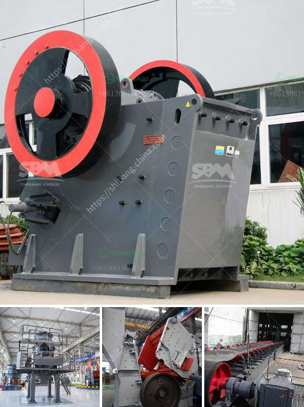

<h3>complete rock crusher machine prices in pakistan</h3>
Rock crusher machine is the main crushing equipment in the mining industry. It is used to crush big stones or rocks into smaller pieces. These machines have different types, such as jaw crushers, cone crushers, impact crushers, etc. but they all have the same function, to crush rocks.

In Pakistan, rock crusher machines are widely used for different mining activities. It is important to note that the prices of these machines can vary depending on the specific requirements and specifications of the project. Some important factors that can influence the price of a rock crusher machine include the production capacity, the type of material being crushed, and the brand of the machine.

The production capacity of a rock crusher machine determines how much rock can be crushed in a specific time period. Machines with higher production capacities are generally more expensive than those with lower capacities. Similarly, if the machine is used to crush hard and abrasive materials like granite or quartz, it may be more expensive than a machine used for softer materials.

The brand of a rock crusher machine can also affect its price. Well-known brands with a good reputation tend to have higher prices compared to lesser-known brands. However, it is important to consider the quality and reliability of the machine rather than just focusing on the brand.

In Pakistan, the prices of rock crusher machines can range from a few thousand dollars to hundreds of thousands of dollars, depending on the specific needs of the buyer. It is important to consider the budget and requirements before making a purchase decision.

In conclusion, rock crusher machines are essential equipment in the mining industry. The prices of these machines can vary depending on factors such as production capacity, type of material being crushed, and brand. Buyers should carefully consider their needs and budget before purchasing a rock crusher machine.
<h3>Contact us</h3><ul><li><strong>Whatsapp:&nbsp;<a href="https://wa.me/8613661969651">+8613661969651</a></strong></li><li><a href="https://swt.shibang-china.com/?git&amp;zhl&amp;complete rock crusher machine prices in pakistan"><strong>Online Service(chat now)</strong></a></li></ul><h3>Related</h3><ul><li><a href='granite quarrying companies.md'>granite quarrying companies</a></li><li><a href='two prefabricated concrete production line.md'>two prefabricated concrete production line</a></li><li><a href='prices of complete crushing plant.md'>prices of complete crushing plant</a></li><li><a href='by products of copper processing.md'>by products of copper processing</a></li><li><a href='vertical grinding machine for marble.md'>vertical grinding machine for marble</a></li></ul>