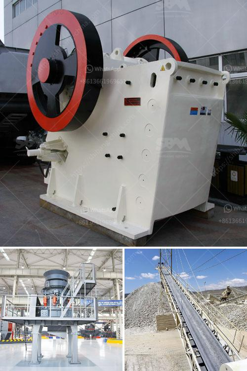

<h3>complete scm stone crushing plant 4tph</h3>
In today's competitive market, quarry owners need to utilize every opportunity to maximize their productivity and reduce operating costs. The Complete SCM Stone Crushing Plant 4TPH offers a comprehensive solution to address these challenges. With its advanced technology and efficient design, this plant ensures that quarry owners can achieve a high level of output while maintaining excellent quality standards.

The Complete SCM Stone Crushing Plant 4TPH comprises various components that work together to fulfill its purpose - to crush stones into desired sizes for various construction applications. The primary component is the SCM jaw crusher, which is known for its exceptional durability and versatility. It can handle a wide range of materials, including hard and abrasive rocks, while delivering consistently high performance.

To ensure efficient feeding of the jaw crusher, the plant includes a vibrating feeder. This component optimizes the flow of materials, preventing congestion and reducing wear on the jaw crusher. Additionally, it enables a consistent and controlled feed rate, contributing to the overall productivity of the plant.

For further processing of the crushed stones, the plant also features a cone crusher. This secondary crusher is capable of producing fine aggregates, meeting the requirements of different construction projects. The cone crusher's advanced design emphasizes efficiency and versatility, allowing quarry owners to adjust the settings to achieve the desired product size and shape.

To complete the process, the plant incorporates a vibrating screen. This component separates the crushed stones into different sizes, making it easier to meet the specific needs of each construction project. By efficiently screening the materials, the plant helps to eliminate unnecessary use of resources, ultimately saving costs.

In terms of mobility and convenience, the Complete SCM Stone Crushing Plant 4TPH stands out. It is compact and easily transportable, allowing quarry owners to set it up in different locations as needed. This feature is particularly beneficial for infrastructure projects that require stone crushing at multiple sites.

Another noteworthy advantage of this plant is its eco-friendly design. It incorporates advanced dust suppression and noise reduction measures, minimizing the environmental impact of quarry operations. By adhering to strict emission control regulations and minimizing noise pollution, quarry owners can not only comply with local regulations but also enhance their reputation as responsible corporate citizens.

Maintenance is also simplified with the Complete SCM Stone Crushing Plant 4TPH. The plant features an easy-access platform, allowing operators to reach critical components for regular inspections and maintenance. Additionally, it incorporates reliable and durable components, minimizing the need for frequent replacements and costly downtime.

In conclusion, the Complete SCM Stone Crushing Plant 4TPH offers quarry owners a comprehensive solution to optimize their operations. With its advanced technology, mobility, and eco-friendly design, this plant ensures high productivity, excellent quality, and cost-efficiency. By investing in such a solution, quarry owners can adapt to changing market demands, enhance their competitiveness, and maximize their return on investment.
<h3>Contact us</h3><ul><li><strong>Whatsapp:&nbsp;<a href="https://wa.me/8613661969651">+8613661969651</a></strong></li><li><a href="https://swt.shibang-china.com/?git&amp;zhl&amp;complete scm stone crushing plant 4tph"><strong>Online Service(chat now)</strong></a></li></ul><h3>Related</h3><ul><li><a href='how many kg in 1 cubic feet of 20mm crusher stone.md'>how many kg in 1 cubic feet of 20mm crusher stone</a></li><li><a href='checklist for heavy stone crusher machine.md'>checklist for heavy stone crusher machine</a></li><li><a href='quarry crusher equipment costs.md'>quarry crusher equipment costs</a></li><li><a href='market analysis of stone crusher.md'>market analysis of stone crusher</a></li><li><a href='jaw crusher price 200mm.md'>jaw crusher price 200mm</a></li></ul>