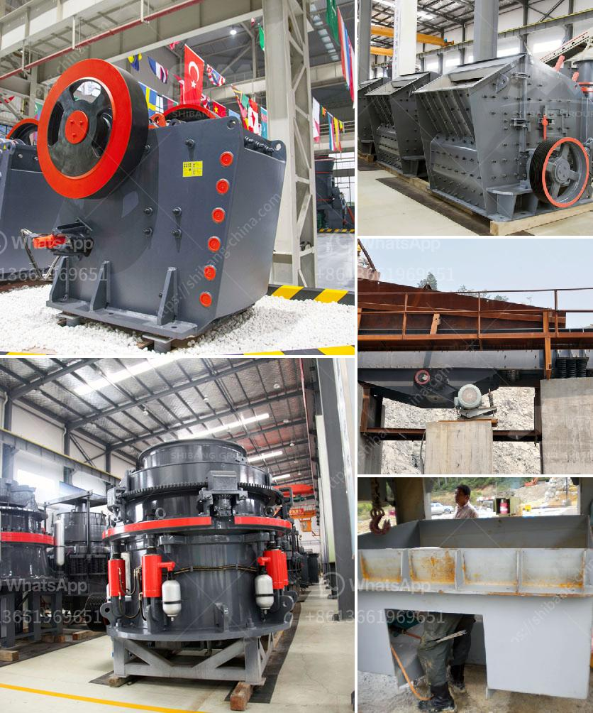

<h3>concrete aggregate crushing plant</h3>
Concrete aggregate crushing plant is a crucial gear in obtaining construction materials for building roads, bridges and buildings. This crushing plant is undertaken to reduce the size of large stones, rocks, boulders or gravel to smaller sizes for use in concrete mixtures, pavement, building materials, and other construction applications.

The process of crushing aggregate involves several stages. Initially, the raw material is delivered to the crushing plant and unloaded into the primary crusher, which is usually a jaw crusher. The primary crusher breaks the raw material into coarse fragments, then the secondary crusher, such as an impact crusher or cone crusher, further reduces the size of the material. Finally, the crushed material is screened to obtain various sizes of aggregate.

There are numerous advantages of using a concrete aggregate crushing plant. Firstly, it allows for the efficient utilization of natural resources. By crushing larger stones and rocks into smaller sizes, it reduces the need for mining and quarrying, thus minimizing environmental impact. Additionally, using recycled aggregates from demolished buildings or other sources can further reduce the depletion of natural resources.

Secondly, a crushing plant enhances the quality of concrete. The shape and texture of the aggregate play a vital role in determining the strength, durability, and workability of concrete. By crushing the aggregate to the required specifications, it ensures that the resulting concrete will have the desired properties for its intended use.

Furthermore, a well-designed aggregate crushing plant improves the efficiency of the construction process. By providing a consistent supply of high-quality aggregates, it eliminates the need for transportation of materials from distant sources. This reduces costs, saves time, and improves overall project productivity.

In addition to these benefits, a concrete aggregate crushing plant also contributes to the economic growth and development of local communities. It creates job opportunities for individuals involved in the operation and maintenance of the plant. Moreover, the production and sale of aggregates contribute to the regional economy by generating revenue and supporting related industries such as transportation and construction.

However, it is important to consider certain factors when planning and operating a concrete aggregate crushing plant. Proper maintenance and regular inspections of the machinery are essential to ensure its optimal performance and minimize downtime. Adequate dust control measures must be implemented to protect the health and safety of workers. Additionally, environmental regulations and permits must be complied with to prevent any negative impact on air, water, and soil quality.

To conclude, a concrete aggregate crushing plant plays a critical role in the production of construction materials. It not only promotes resource conservation and environmental sustainability but also improves the quality, efficiency, and economic viability of construction projects. By considering the various factors involved in its operation and maintenance, the plant can be a valuable asset for both the industry and the local community.
<h3>Contact us</h3><ul><li><strong>Whatsapp:&nbsp;<a href="https://wa.me/8613661969651">+8613661969651</a></strong></li><li><a href="https://swt.shibang-china.com/?git&amp;zhl&amp;concrete aggregate crushing plant"><strong>Online Service(chat now)</strong></a></li></ul><h3>Related</h3><ul><li><a href='tph granite crushing plant for sale.md'>tph granite crushing plant for sale</a></li><li><a href='roller mill manufacturers in nigeria.md'>roller mill manufacturers in nigeria</a></li><li><a href='hammer crusher birotor.md'>hammer crusher birotor</a></li><li><a href='sand making machine application.md'>sand making machine application</a></li><li><a href='mobile jaw crusher tons per hour.md'>mobile jaw crusher tons per hour</a></li></ul>