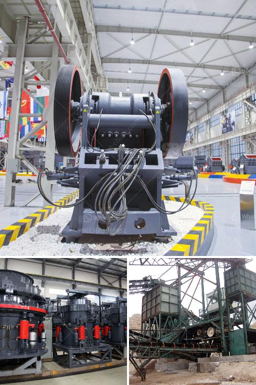

<h3>concrete batching plant for sale</h3>
A concrete batching plant is a facility that combines various ingredients to form concrete. It plays a crucial role in construction projects as it provides the required concrete mixture for building structures, roads, bridges, and many other applications. For those in need of a concrete batching plant, there are various options available for sale in the market.

One important factor to consider when purchasing a concrete batching plant is the output capacity. The capacity of the plant determines the amount of concrete that can be produced in a specific time frame. A concrete batching plant for sale with a capacity ranging from 100 to 300 cubic meters per hour can meet the needs of most construction projects, whether big or small.

Investing in a concrete batching plant offers several advantages. Firstly, it brings efficiency to the construction process by providing a reliable supply of high-quality concrete. This eliminates the need for transporting concrete from external suppliers, saving time and reducing costs.

Furthermore, a concrete batching plant allows for greater control over the concrete mixture. The operator can adjust the proportions of the ingredients and monitor the mixing process to ensure consistency and adherence to project specifications. This results in superior quality concrete, improving the durability and longevity of the structures being built.

In addition to its benefits in terms of efficiency and quality, a concrete batching plant for sale also offers flexibility. It can be easily installed and set up at the construction site, allowing for on-site production of concrete. This facilitates quick adjustments to the concrete mixture and ensures a steady supply of concrete as per project requirements.

In conclusion, a concrete batching plant for sale with a capacity ranging from 100 to 300 cubic meters per hour is a valuable asset for construction projects. It provides a reliable supply of high-quality concrete, improves efficiency, offers greater control over the mixture, and provides flexibility in on-site production. By investing in a concrete batching plant, construction companies can enhance their productivity and deliver projects on time and within budget.
<h3>Contact us</h3><ul><li><strong>Whatsapp:&nbsp;<a href="https://wa.me/8613661969651">+8613661969651</a></strong></li><li><a href="https://swt.shibang-china.com/?git&amp;zhl&amp;concrete batching plant for sale"><strong>Online Service(chat now)</strong></a></li></ul><h3>Related</h3><ul><li><a href='granite quarry plants for sale.md'>granite quarry plants for sale</a></li><li><a href='equipments used in cement industry.md'>equipments used in cement industry</a></li><li><a href='iron ore pelletisation plant china.md'>iron ore pelletisation plant china</a></li><li><a href='gypsum washing equipment for sale.md'>gypsum washing equipment for sale</a></li><li><a href='mobile crusher  china.md'>mobile crusher - china</a></li></ul>