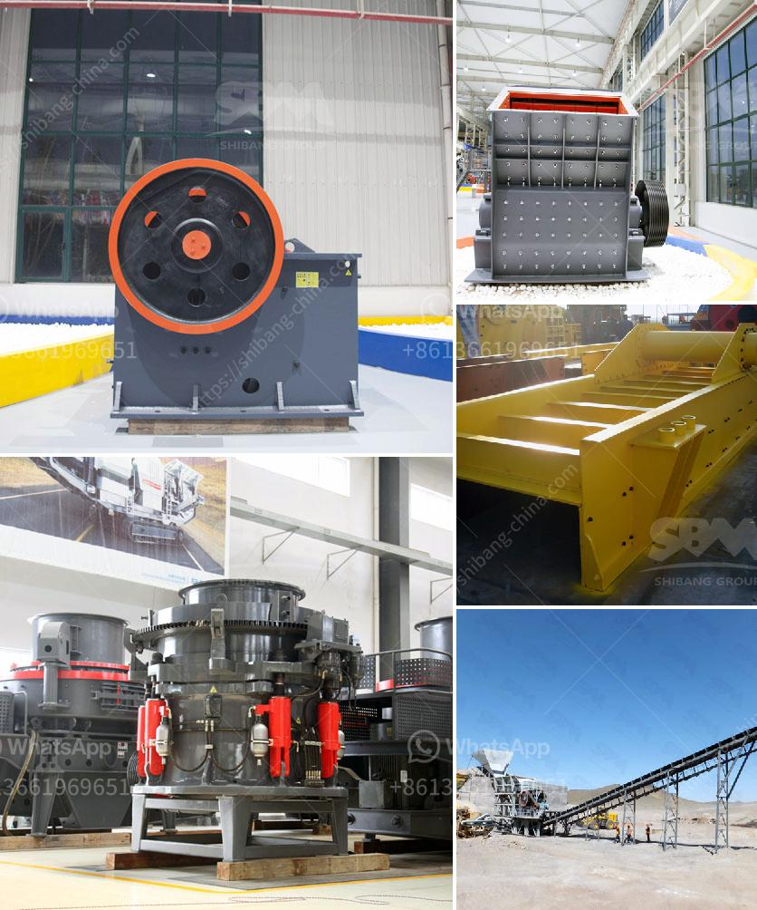

<h3>concrete crusher for sale in nigeria</h3>
A Case study of a concrete crusher for sale in Nigeria, with dimensions of 40 x 11 x 7, you can have a look at it here: https://www.rebecca-miningcrusher.com/product-category/crushing-plant/. Here are a few details about the machine:

- The machine weighs about 80 tons and its main dimensions are: length: 40 ft, width: 11 ft, and height: 7 ft.

- The crusher can handle unsorted concrete rubble and reduces it to manageable sizes ranging from 10 to 60 mm.

- The manufacturer has indicated a productivity rate of around 180-200 tons per hour. This is ideal for small to medium-sized construction projects or for contractors who are looking to process the concrete waste on-site.

One of the main advantages of the concrete crusher for sale in Nigeria is its ability to produce uniform-sized end products. While traditional crushers have a limited reduction ratio and often generate excessive fines, this concrete crusher has a 3:1 ratio and enables you to control the final product size through its adjustable jaws.

The machine is hydraulically powered by a 350 hp Caterpillar engine, which keeps the noise and emissions to a minimum. The engine is also EU Stage V emission-compliant, making it suitable for use in urban environments as well. Furthermore, the crusher is equipped with a dust suppression system, which further reduces dust and noise during operation.

In terms of maintenance, the crusher is built to be durable and robust. It has a reinforced frame construction and uses high-quality wear-resistant materials for its critical components. This ensures a long service life and reduces downtime due to wear and tear.

Apart from its primary function of crushing concrete, the machine can also be used to process other materials such as asphalt, brick, and natural stone. Its versatility makes it a valuable asset for any construction site or recycling center.

In Nigeria, where there is a growing demand for construction materials, particularly concrete, investing in a concrete crusher for sale could be a profitable venture. As more construction projects spring up across the country, the demand for concrete will continue to rise.

With the proper equipment in place, contractors can take advantage of the recycling potential of concrete and turn waste material into a valuable resource. This not only reduces the environmental impact of construction but also saves costs in terms of raw materials and landfill fees.

In conclusion, a concrete crusher for sale in Nigeria is a valuable investment for any construction company or contractor. It provides a solution to reduce costs and increase productivity by crushing concrete rubble on-site into reusable aggregate material. This, in turn, saves on transportation costs and reduces the need for new raw materials. With the right equipment and proper maintenance, a concrete crusher can last for years, providing a sustainable solution for the construction industry.
<h3>Contact us</h3><ul><li><strong>Whatsapp:&nbsp;<a href="https://wa.me/8613661969651">+8613661969651</a></strong></li><li><a href="https://swt.shibang-china.com/?git&amp;zhl&amp;concrete crusher for sale in nigeria"><strong>Online Service(chat now)</strong></a></li></ul><h3>Related</h3><ul><li><a href='grinding size of limestone.md'>grinding size of limestone</a></li><li><a href='types of stone crusher machine list.md'>types of stone crusher machine list</a></li><li><a href='ton per hour stone crusher plant.md'>ton per hour stone crusher plant</a></li><li><a href='concrete crusher in georgia.md'>concrete crusher in georgia</a></li><li><a href='primary impact crusher.md'>primary impact crusher</a></li></ul>