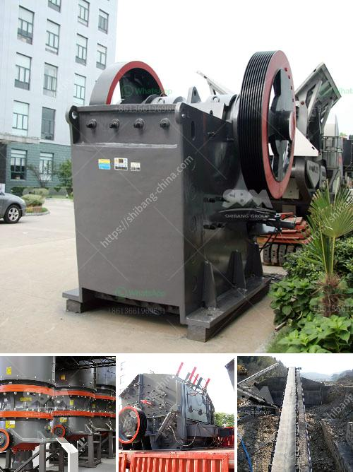

<h3>concrete crusher in georgia</h3>
Concrete crushers are versatile machines that are used to crush and grind concrete debris. These machines efficiently break down large chunks of concrete into smaller pieces, making disposal and recycling easier. Georgia, known for its thriving construction industry, is home to several concrete crusher companies that provide reliable crushing services.

One such company is Georgia Concrete Crushers. This locally owned and operated business offers affordable solutions for both residential and commercial clients. Equipped with state-of-the-art machinery, they can handle a wide range of concrete crushing needs.

Concrete crushers play a crucial role in sustainable construction practices. Instead of discarding old concrete materials, these crushers can process them into usable aggregates. These aggregates can be used as a base for new construction projects or as fill material in road and pavement works. By recycling concrete, Georgia can reduce its reliance on natural resources, conserve energy, and minimize landfill waste.

The concrete crushing process involves feeding the concrete chunks into the crusher where they are pulverized into smaller pieces. The machine's powerful jaws apply pressure to break down the concrete effectively. Once crushed, the concrete can be used as recycled aggregate, which has the same properties as natural aggregates.

Georgia Concrete Crushers prioritizes sustainability and adheres to environmental regulations. They ensure the proper handling and disposal of any byproducts or waste generated during the concrete crushing process. By partnering with such companies, individuals and businesses can contribute to a greener environment and promote the circular economy.

Whether it's a small-scale residential project or a large-scale commercial undertaking, concrete crushers in Georgia provide efficient and cost-effective solutions for concrete recycling. By investing in these services, individuals and businesses can reduce their carbon footprint and contribute to sustainable construction practices.

In conclusion, concrete crushers in Georgia offer a convenient and eco-friendly solution for concrete waste management. These machines effectively crush and process concrete debris into usable aggregates, promoting recycling and sustainable construction practices. By utilizing concrete crushers, Georgia can reduce its environmental impact and conserve natural resources while contributing to a greener future.
<h3>Contact us</h3><ul><li><strong>Whatsapp:&nbsp;<a href="https://wa.me/8613661969651">+8613661969651</a></strong></li><li><a href="https://swt.shibang-china.com/?git&amp;zhl&amp;concrete crusher in georgia"><strong>Online Service(chat now)</strong></a></li></ul><h3>Related</h3><ul><li><a href='complete scm stone crushing plant 4tph.md'>complete scm stone crushing plant 4tph</a></li><li><a href='operating costs for a stone crusher plant.md'>operating costs for a stone crusher plant</a></li><li><a href='hammer pulverizer machine.md'>hammer pulverizer machine</a></li><li><a href='raymond mills india.md'>raymond mills india</a></li><li><a href='mobile crusher namibia.md'>mobile crusher namibia</a></li></ul>