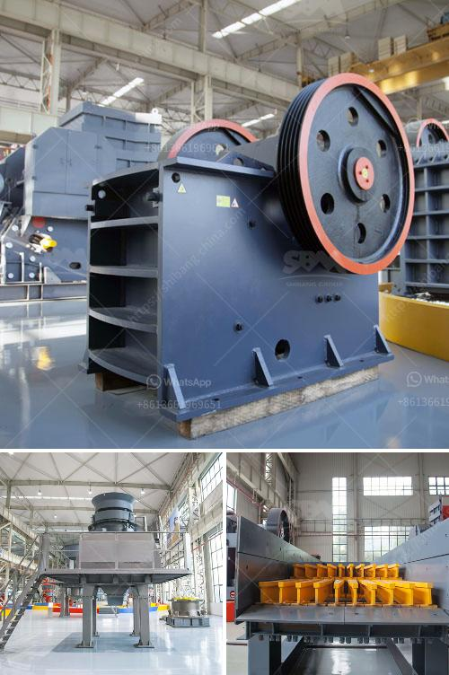

<h3>concrete crushers for recycling</h3>
Concrete crushers are becoming increasingly popular in the field of recycling concrete. Thanks to advancements in technology, concrete crushers can efficiently remove concrete from a demolition site, allowing the material to be repurposed elsewhere. Concrete crushers are ideal for concrete structures such as reinforced concrete that may not be able to withstand the pressure exerted by traditional crushers. This makes concrete crushers perfect for use in recycling operations.

Crushing concrete from a demolition site is not only environmentally friendly, but it also saves money. Recycling concrete protects natural resources and eliminates the need for disposal by utilizing the existing material. Furthermore, it reduces the carbon footprint associated with manufacturing new concrete. When concrete crushers are used, the concrete is reduced in size and can be reused as fill, base material, or as aggregate for new concrete production.

Concrete crushers are extremely powerful machines but the crushing process itself is simple. Crushers work on basic mechanical principles: leverage, impact, grinding and rolling being some of the techniques employed to break materials apart. Most crushers can be fed with large slabs and chunks of concrete, up to the size of the crusher's opening.

Crushers can even extract rebar and mesh, separating the concrete from the metal with ease. With proper planning, concrete crushing operations can be mobilized to fit your specific requirements. Once the concrete structures are dismantled or demolished, the resulting debris is often transported for recycling or reuse. Reprocessing concrete into desired construction materials is a sustainable practice that contributes to the preservation of our environment.

The primary advantage of using a concrete crusher is that it provides easy workability. This means reduced labor costs and increased efficiency in processing. Crushing concrete blocks reduces transportation costs and pollution generated when compared with transporting raw materials to and from a quarry. Moreover, the need to extract raw materials such as limestone and clay or petroleum products is also reduced when using recycled aggregate, which further benefits the environment.

Additionally, using concrete crushers significantly reduces the need for landfill space, which is already limited in many areas. By recycling concrete, the volume of waste sent to landfills is reduced, conserving valuable space and extending the landfill's lifespan.

It is important to note that not all kinds of concrete can be recycled efficiently. For instance, concrete contaminated with hazardous materials or chemicals may pose a risk to both workers and the environment. Therefore, it is crucial to properly assess the content of the concrete before deciding to recycle it. If any hazardous materials are detected, careful handling and disposal are necessary.

In conclusion, concrete crushers offer an efficient and cost-effective solution for crushing and recycling concrete. With advancements in technology, more and more concrete crushers are being used in construction and demolition projects across the globe. Reducing waste, conserving resources, and cutting down on carbon emissions are just a few of the benefits that concrete crushers bring to the table. By utilizing these machines, we can make significant strides towards a more sustainable future.
<h3>Contact us</h3><ul><li><strong>Whatsapp:&nbsp;<a href="https://wa.me/8613661969651">+8613661969651</a></strong></li><li><a href="https://swt.shibang-china.com/?git&amp;zhl&amp;concrete crushers for recycling"><strong>Online Service(chat now)</strong></a></li></ul><h3>Related</h3><ul><li><a href='capital cost gold processing plant.md'>capital cost gold processing plant</a></li><li><a href='gypsum powder production process pdf.md'>gypsum powder production process pdf</a></li><li><a href='gravel conveyor belt.md'>gravel conveyor belt</a></li><li><a href='stone ball mill up to 2500 mesh.md'>stone ball mill up to 2500 mesh</a></li><li><a href='jaw crushers south africa.md'>jaw crushers south africa</a></li></ul>