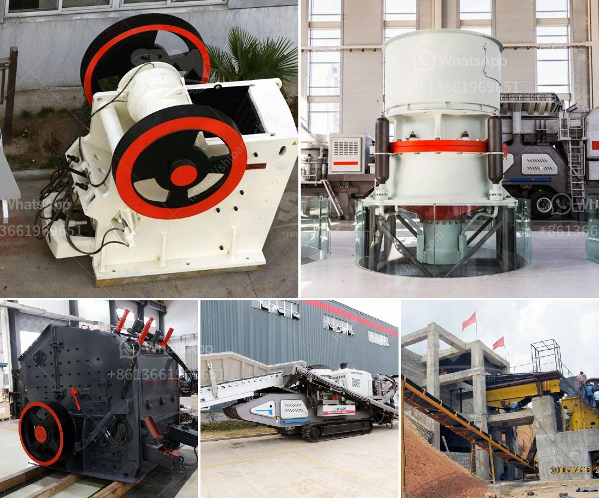

<h3>concrete crushing testing equipment</h3>
Concrete crushing testing equipment is an essential tool in the construction industry. These machines provide an efficient way to break down concrete into manageable pieces, allowing for easier disposal and recycling. Concrete crushing testers come in different shapes and sizes, but all of them serve a similar purpose: to crush concrete samples for testing.

The process of testing concrete involves crushing the specimens to determine its compressive strength. This is done by applying a force to the concrete specimen until it breaks. The maximum force that the concrete can withstand before failing is its compressive strength, which is a crucial parameter in the design and construction of structures.

Concrete crushing testing equipment is robust and durable, ensuring that it can withstand the demanding conditions of the construction site. These machines are designed to apply a maximum amount of force to the concrete sample, allowing for accurate and reliable test results. Some common types of concrete crushing testers include hydraulic crushers, hammer crushers, and jaw crushers.

Hydraulic crushers are widely used for crushing concrete, as they provide high crushing forces and can easily handle large and hard samples. They are typically powered by hydraulic systems, which allow for precise control over the crushing force applied. Hammer crushers, on the other hand, use rotating hammers to break down the concrete. They are known for their simplicity and ease of use, making them a popular choice for field testing.

Jaw crushers are another popular option for concrete crushing testing. These machines work by compressing the concrete between two jaws, resulting in the breaking of the concrete particles. They are highly efficient and can handle a wide range of materials.

In summary, concrete crushing testing equipment is a valuable tool in the construction industry. It provides an efficient way to test the compressive strength of concrete, ensuring that structures are safe and durable. With different types of crushers available, contractors can choose the most suitable machine for their needs. By investing in high-quality testing equipment, construction professionals can ensure the integrity and reliability of their concrete structures.
<h3>Contact us</h3><ul><li><strong>Whatsapp:&nbsp;<a href="https://wa.me/8613661969651">+8613661969651</a></strong></li><li><a href="https://swt.shibang-china.com/?git&amp;zhl&amp;concrete crushing testing equipment"><strong>Online Service(chat now)</strong></a></li></ul><h3>Related</h3><ul><li><a href='harga powerful crusher machine.md'>harga powerful crusher machine</a></li><li><a href='limestone crusher machine limus.md'>limestone crusher machine limus</a></li><li><a href='aggregate washing plant price.md'>aggregate washing plant price</a></li><li><a href='gypsum processing machines.md'>gypsum processing machines</a></li><li><a href='different size mining cone crusher.md'>different size mining cone crusher</a></li></ul>