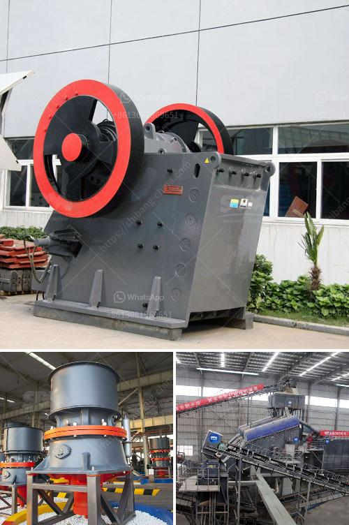

<h3>concrete grinding machine rental hk</h3>
If you are looking to give your concrete floors a brand-new look, then concrete grinding is the way to go. Concrete grinding not only enhances the aesthetics of your floors but also improves their durability and longevity. However, purchasing a concrete grinding machine may not be feasible for everyone, especially if you have a one-time project or a limited budget. That is where concrete grinding machine rental in Hong Kong comes to the rescue.

When it comes to concrete grinding machine rental in HK, there are plenty of options available for both professionals and DIY enthusiasts. These rental services provide you with the necessary equipment and tools to complete your concrete flooring project efficiently and effectively. Here are some reasons why opting for a concrete grinding machine rental in HK is the perfect solution for your flooring needs:

Cost-effective: Renting a concrete grinding machine is much more cost-effective than purchasing one. Buying equipment that you may only need for a single project can be quite expensive. On the other hand, renting allows you to use top-quality equipment without the hassle of maintenance and storage, saving you both time and money.

Wide range of options: Concrete grinding machine rental services in HK offer a wide range of options to choose from. Depending on the size and complexity of your project, you can select the most suitable machine for your needs. These rental services often provide professional-grade machines that are easy to operate and deliver exceptional results.

Quality equipment: The concrete grinding machines available for rent in HK are of top-notch quality. Rental companies invest in high-performance equipment, ensuring that you have access to the latest technology and the best tools in the industry. This allows you to achieve superior results in a shorter span of time.

Expert guidance: Most concrete grinding machine rental services in HK have knowledgeable staff who can guide you through the renting process and provide you with valuable advice on how to operate the equipment. They can give you tips and tricks on grinding techniques, which can help you achieve the desired finish for your floors.

Flexibility and convenience: Renting a concrete grinding machine offers you the flexibility to work at your own pace and according to your schedule. Whether you need the machine for a day, a week, or even longer, rental services can accommodate your specific requirements. Plus, these services often provide convenient delivery and pickup options, saving you time and effort.

Environmentally friendly: Opting for concrete grinding machine rental is an environmentally friendly choice. Rental services often maintain and service their machines, ensuring that they are in optimal condition and produce minimal environmental impact. By choosing to rent, you contribute to reducing waste and promoting sustainability.

In conclusion, concrete grinding machine rental in HK is the perfect solution for anyone looking to rejuvenate their concrete floors. It offers a cost-effective, convenient, and environmentally friendly option to achieve professional-grade results. Whether you are a DIY enthusiast or a professional, renting a concrete grinding machine saves you time, money, and effort, allowing you to transform your floors with ease. So, why wait? Explore the range of rental options available in HK and give your floors the makeover they deserve.
<h3>Contact us</h3><ul><li><strong>Whatsapp:&nbsp;<a href="https://wa.me/8613661969651">+8613661969651</a></strong></li><li><a href="https://swt.shibang-china.com/?git&amp;zhl&amp;concrete grinding machine rental hk"><strong>Online Service(chat now)</strong></a></li></ul><h3>Related</h3><ul><li><a href='cone crusher in the philippines.md'>cone crusher in the philippines</a></li><li><a href='ball mill screen 200 tph.md'>ball mill screen 200 tph</a></li><li><a href='copper ore ball mill.md'>copper ore ball mill</a></li><li><a href='price of crusher.md'>price of crusher</a></li><li><a href='sand making machine zenith.md'>sand making machine zenith</a></li></ul>