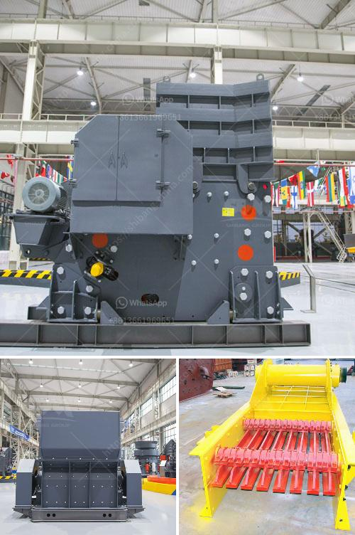

<h3>concrete recycling crushing plant crusher for sale</h3>
Concrete recycling crushing plant crusher for sale is a kind of environmentally friendly concrete recycling equipment, which can be used for urban construction waste recycling, road demolition, site clearance and other operations. It truly realizes the recycling of construction waste by using the most advanced crushing and screening technology. With the development of urbanization and industrialization, the construction industry has produced a large amount of construction waste, which puts forward higher requirements for the recycling of construction waste.

The concrete recycling crushing plant includes jaw crusher, impact crusher, cone crusher, crawler crusher and other concrete recycling equipment. According to the customer's specific needs, the design and production line layout can be customized to meet the different production requirements of customers. The concrete recycling crusher has high crushing efficiency, low energy consumption and large crushing ratio. It can economically and effectively recycle concrete waste, reduce material transportation costs and improve production efficiency.

The concrete recycling crushing plant crusher for sale not only has the advantages of stable and reliable operation, high crushing efficiency, environmental protection and energy saving, but also has the characteristics of large output, easy maintenance and convenient use. It is an indispensable equipment in the process of concrete recycling. The overall structure of the concrete recycling crusher is compact, the installation is simple, and the operation and maintenance are convenient. It has the characteristics of high automation, low failure rate and high reliability.

In the process of concrete recycling, the concrete recycling crushing plant crusher for sale plays a vital role in the recycling and utilization of construction waste. The recycled concrete has a wide range of applications, such as road construction, building materials, etc. The main source of waste concrete is the demolition and renovation of old buildings, which generates a large amount of construction waste. The recycling of construction waste not only saves resources, protects the environment, but also generates huge economic benefits.

The concrete recycling crushing plant crusher for sale has the advantages of high efficiency, low energy consumption, high crushing efficiency, environmental protection and energy saving. It not only brings economic benefits to customers, but also contributes to the sustainable development of construction waste recycling. It is an ideal choice for the recycling of construction waste. With the continuous development of society, the demand for construction waste recycling equipment is increasing. The concrete recycling crushing plant crusher for sale provides a reliable and efficient solution for the recycling of construction waste, creating greater value for customers and promoting the development of green building materials.

In conclusion, the concrete recycling crushing plant crusher for sale is a good investment choice. It has high efficiency, low energy consumption, good crushing effect, and can produce environmentally friendly recycled aggregates. It is a reliable and efficient concrete recycling equipment. With the increasing attention to environmental protection and the widespread use of recycled aggregates, the concrete recycling crushing plant crusher for sale will have a broad market prospect in the future.
<h3>Contact us</h3><ul><li><strong>Whatsapp:&nbsp;<a href="https://wa.me/8613661969651">+8613661969651</a></strong></li><li><a href="https://swt.shibang-china.com/?git&amp;zhl&amp;concrete recycling crushing plant crusher for sale"><strong>Online Service(chat now)</strong></a></li></ul><h3>Related</h3><ul><li><a href='processing plan for feldspar ore.md'>processing plan for feldspar ore</a></li><li><a href='proposal for cement plant crusher.md'>proposal for cement plant crusher</a></li><li><a href='company that sells vibratory sieves in spain.md'>company that sells vibratory sieves in spain</a></li><li><a href='lime stone screw conveyor.md'>lime stone screw conveyor</a></li><li><a href='granite crusher for sale.md'>granite crusher for sale</a></li></ul>