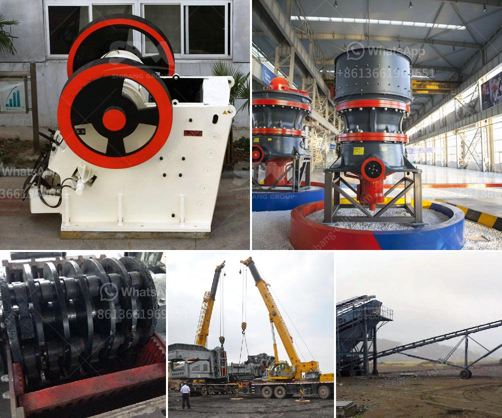

<h3>concrete stone crusher south africa</h3>
The development is characterized by low energy consumption, pollution-free, easy to operate, and maintain. Use this version of the concrete stone crusher is the latest which is a further development of the stone crusher and other mining equipment. It absorbs the latest technology, improves the quality of wear-resistant parts, and achieves a more efficient work. In the material processing, there are strong shear forces generated by the movement of the movable jaw plate to the fixed jaw plate, and the teeth on the jaw plate tear and crush the material until it is broken into multiple pieces. It ensures that the product size is more uniform and the particle size is more uniform.

Compared with the traditional crushing machine, the concrete stone crusher in South Africa has undergone continuous improvements, and the equipment has matured with the passing of time. For the production process of these concrete stones, the crushing process is needed. The equipment needed for crushing is mainly composed of jaw crusher, impact crusher, cone crusher, etc., and the technological process is simple.

The concrete stone crusher in South Africa has a large crushing ratio, high efficiency, low energy consumption, and uniform product size. It is suitable for crushing medium and fine materials, such as limestone, calcite, talc, gypsum, coal coke, clay, slag, etc. It is widely used in concrete plants, gravel yards, construction sites, highways, railways and other fields. It has the advantages of high efficiency, low energy consumption, reliable performance, and simple maintenance.

In recent years, with the continuous development of infrastructure construction in South Africa, the demand for aggregate and sand has also increased significantly. The concrete stone crusher in South Africa not only accelerates the infrastructure construction, but also attracts more and more investors to join. So, if you have a project related to construction and infrastructure in South Africa, the concrete stone crusher is definitely the best choice.
<h3>Contact us</h3><ul><li><strong>Whatsapp:&nbsp;<a href="https://wa.me/8613661969651">+8613661969651</a></strong></li><li><a href="https://swt.shibang-china.com/?git&amp;zhl&amp;concrete stone crusher south africa"><strong>Online Service(chat now)</strong></a></li></ul><h3>Related</h3><ul><li><a href='lime and dolomite plant details.md'>lime and dolomite plant details</a></li><li><a href='conveyor belts for shelves.md'>conveyor belts for shelves</a></li><li><a href='slag jaw crusher long size.md'>slag jaw crusher long size</a></li><li><a href='slag grinderr capling.md'>slag grinderr capling</a></li><li><a href='high energy ball mill price.md'>high energy ball mill price</a></li></ul>