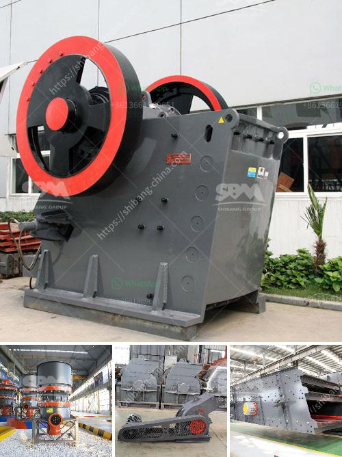

<h3>concrete waste crusher plant malaysia</h3>
The concrete waste crusher plant is equipped with advanced technology and high-efficient waste recycling system. It produces 30% of the total building construction waste and meets the certification standards of recycling disposal waste. The concrete waste crusher plant consists of several major components which include a jaw crusher for primary crushing, a secondary crusher for secondary crushing, a vibrating screen, and several belt conveyors.

In order to improve the efficiency of concrete waste recycling, the manufacturer has developed different types of concrete waste crushers, including jaw crusher, impact crusher, and cone crusher. With the experience of more than 30 years in the production and manufacturing of mining machinery, the manufacturer has successfully launched various concrete waste crushers which are suitable for the crushing and recycling of concrete waste.

The concrete waste crusher plant is designed for recycling concrete waste generated in the construction industry. The construction waste recycling equipment consists of mobile and semi-mobile crushing stations. These recycling plants are equipped with hydraulic-driven track mobile plant and multi-functional screening station, which can completely realize the automation of construction waste crushing production.

The construction waste crusher plant can be operated independently or in combination with each other. It is designed based on the clients' demands for material discharge, types of crushing and screening operations, intermediate crushing, fine crushing, and ultra-fine crushing. It ensures the high-efficiency performance, reliability, and flexibility of the equipment.

The concrete waste crusher plant is located in Selangor, Malaysia and is one of the leading construction waste disposal sites in Malaysia. It has a 3-acre site with a capacity of producing 50 tons of aggregate per hour, a fine crushing and blending line, a screen and a conveyor system.

As the leader in concrete waste recycling technology, we currently offer the most advanced plant configuration as the ideal solution for the crushing of construction and demolition waste in Malaysia. Whether you are an individual contractor or a large construction company, we can tailor the solution according to your specific requirements.

Overall, the concrete waste crusher plant Malaysia is an ideal choice for crushing and recycling construction waste safely and efficiently. In addition to the outstanding performance and productivity, it also provides a way to reduce landfill costs, protect the environment, and conserve natural resources. With more and more construction waste being generated, the importance of recycling and reusing construction waste has become increasingly significant. The concrete waste crusher plant Malaysia is an investment in the future and a great way to turn waste into profit.
<h3>Contact us</h3><ul><li><strong>Whatsapp:&nbsp;<a href="https://wa.me/8613661969651">+8613661969651</a></strong></li><li><a href="https://swt.shibang-china.com/?git&amp;zhl&amp;concrete waste crusher plant malaysia"><strong>Online Service(chat now)</strong></a></li></ul><h3>Related</h3><ul><li><a href='china clay washing equipment sale supplier.md'>china clay washing equipment sale supplier</a></li><li><a href='automation coal crushing and conveyor.md'>automation coal crushing and conveyor</a></li><li><a href='aggregate washing plant price.md'>aggregate washing plant price</a></li><li><a href='silica sand washing.md'>silica sand washing</a></li><li><a href='proposal pabrik stone crusher.md'>proposal pabrik stone crusher</a></li></ul>