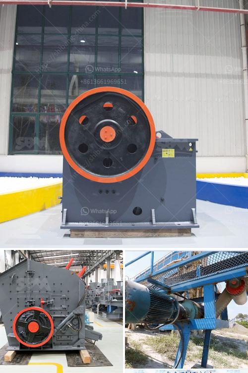

<h3>cone crusher 100tph prices in india</h3>
Cone crushers are commonly used for secondary crushing in the mineral processing industry. These machines are an essential part of any aggregate or mining operation. They are also used in the construction industry where rock materials need to be reduced in size and shaped for various applications.

In India, cone crushers are widely used in the mining industry for their high efficiency and low operating costs. As more and more mining companies are investing in India, the demand for cone crushers is growing significantly. To cater to this increasing demand, cone crusher manufacturers are introducing various models and specifications to meet the needs of different customers.

One of the popular cone crusher models in India is the 100tph model. This model offers a high performance and cost-effective solution for medium to large-sized mining and aggregate projects. With its robust design and excellent engineering, the 100tph cone crusher delivers efficient crushing performance with relatively low energy consumption.

When it comes to pricing, cone crushers in India can vary significantly depending on the manufacturer, the model, and the features included. However, a cone crusher with 100tph capacity and all the necessary features can be found at a reasonable price range of INR 30-40 lakhs in the Indian market.

It is important for customers to consider factors such as the quality of the machine, after-sales service, and the reputation of the manufacturer before making a purchase. It is also advisable to compare prices and features from different manufacturers to ensure that you are getting the best value for your money.

In conclusion, cone crushers are essential equipment in the mining and construction industries in India. The 100tph cone crusher offers a cost-effective and efficient solution for medium to large-sized projects. With proper research and consideration, customers can find cone crushers at reasonable prices, ensuring maximum productivity and return on investment.
<h3>Contact us</h3><ul><li><strong>Whatsapp:&nbsp;<a href="https://wa.me/8613661969651">+8613661969651</a></strong></li><li><a href="https://swt.shibang-china.com/?git&amp;zhl&amp;cone crusher 100tph prices in india"><strong>Online Service(chat now)</strong></a></li></ul><h3>Related</h3><ul><li><a href='jaw stone crusher in turkey.md'>jaw stone crusher in turkey</a></li><li><a href='granite tiles processing machines.md'>granite tiles processing machines</a></li><li><a href='mining process of calcium carbonate in south africa.md'>mining process of calcium carbonate in south africa</a></li><li><a href='activated carbon gold mining processing equipment supplier.md'>activated carbon gold mining processing equipment supplier</a></li><li><a href='gold processing crusher.md'>gold processing crusher</a></li></ul>