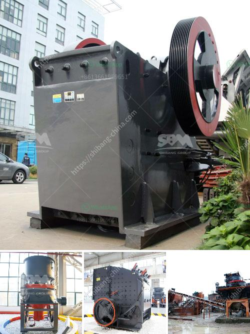

<h3>cone crusher hp 300</h3>
The cone crusher HP 300 is known for being a reliable, versatile and efficient machine. It is a multi-purpose crusher utilized for producing aggregates, crushed stones, and manufacturing sand. This cone crusher is designed for high productivity and efficiency. It is ideal for secondary and tertiary crushing stages with high capacity and reliability.

The cone crusher HP 300 features Metso's innovative technology such as Hydroset™ and Optiagg™. It also benefits from reinforced spindles, thermal sensors for detection of overload conditions, and optimization of the crushing chamber design. This means better performance, less downtime, and reduced maintenance costs.

This crusher is equipped with a powerful motor, oversized bearings, and an automatic oil lubrication system. All these features ensure outstanding reliability and continuous operation. Its hydraulic system enables the crusher to adjust the CSS (closed side setting) and also to compensate for liner wear, ensuring the machine operates at its optimal performance level.

Additionally, the HP 300 cone crusher is safe and easy to operate and maintain. Metso has designed the crusher with automated settings, such as a limited number of maintenance points and automatic shutdown in case of any overload. This ensures the operator's safety and simplifies the maintenance process.

In conclusion, the cone crusher HP 300 is a powerful and efficient machine that is trusted by many industries worldwide. It delivers maximum productivity while ensuring low operating costs and reduced downtime. Whether it is used for aggregates, manufacturing sand, or recycling materials, this crusher is a reliable choice. With its advanced technology and robust design, it is a valuable asset to any operation.
<h3>Contact us</h3><ul><li><strong>Whatsapp:&nbsp;<a href="https://wa.me/8613661969651">+8613661969651</a></strong></li><li><a href="https://swt.shibang-china.com/?git&amp;zhl&amp;cone crusher hp 300"><strong>Online Service(chat now)</strong></a></li></ul><h3>Related</h3><ul><li><a href='bauxite processing into aluminum.md'>bauxite processing into aluminum</a></li><li><a href='bentonite processing plant alibaba.md'>bentonite processing plant alibaba</a></li><li><a href='barite powder production process.md'>barite powder production process</a></li><li><a href='grinding machine project report.md'>grinding machine project report</a></li><li><a href='basalt mining crusher.md'>basalt mining crusher</a></li></ul>