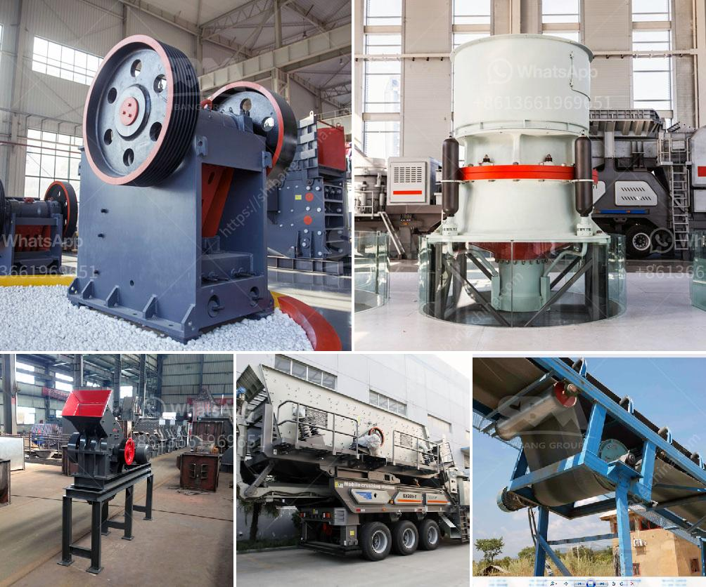

<h3>cone crusher in the philippines</h3>
As the construction industry continues to grow in the Philippines, the demand for cone crushers is also increasing. With the numerous projects underway, it can be hard to find the right equipment that will perfectly suit all your crushing needs. However, there are several cone crusher equipment in the market, which can help you with the process.

Cone crushers are essential rock crushing machines that help in the reduction of large-sized rocks. They are mainly used as a secondary crusher, especially when producing aggregate for road construction or concrete production. Moreover, cone crushers have been widely used in metallurgical, chemical, and mineral industries.

Here in the Philippines, cone crushers are known for their high-quality craftsmanship and excellent reliability, making them a top choice for crushing operations. These machines are one of the most versatile and efficient options available, allowing operators to produce aggregates that meet specific specifications.

One popular example is the Symons cone crusher, which has several benefits such as reliable structure, high productivity, easy adjustment, and low operation costs. Another option is the hydraulic cone crusher, which provides excellent performance for secondary crushing operations.

Cone crushers in the Philippines are also equipped with advanced technology to ensure maximum productivity and efficiency. These machines are built with high strength components that are durable and reliable, allowing them to withstand high crushing forces.

Overall, the cone crusher is an essential piece of equipment in ensuring efficient and reliable crushing performance in any industry. From construction to mining, the cone crusher is a versatile machine that can help in your projects. So, whether you work in road construction, heavy machinery, or mineral mining, a reliable cone crusher will always be a valuable asset in your operation.
<h3>Contact us</h3><ul><li><strong>Whatsapp:&nbsp;<a href="https://wa.me/8613661969651">+8613661969651</a></strong></li><li><a href="https://swt.shibang-china.com/?git&amp;zhl&amp;cone crusher in the philippines"><strong>Online Service(chat now)</strong></a></li></ul><h3>Related</h3><ul><li><a href='mobile crusher company.md'>mobile crusher company</a></li><li><a href='gyratory crusher harga.md'>gyratory crusher harga</a></li><li><a href='coal dry processing plant.md'>coal dry processing plant</a></li><li><a href='small stone crushers ontario canada.md'>small stone crushers ontario canada</a></li><li><a href='price of crushers and crushers.md'>price of crushers and crushers</a></li></ul>