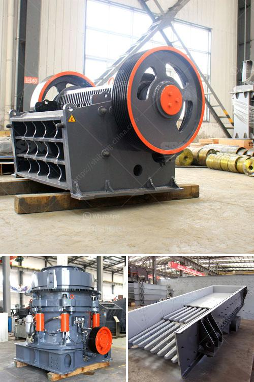

<h3>construction machinery company</h3>
In the fast-paced world of construction, having reliable and efficient machinery is crucial to meet project deadlines and ensure high-quality results. Construction machinery companies play a pivotal role in the industry, supplying a wide range of equipment that aids in various phases of the construction process. From groundbreaking excavators to towering cranes, these companies are at the forefront of innovation and continue to shape the future of construction.

Construction machinery companies are responsible for designing, manufacturing, and distributing the heavy equipment used in construction projects. These companies understand the unique needs and challenges faced by contractors and developers and provide cutting-edge solutions to address these demands efficiently.

From compact excavators, bulldozers, and loaders to concrete mixers, tower cranes, and road rollers, construction machinery companies cater to diverse construction needs. They ensure that their machines are engineered to tackle different terrains, withstand heavy loads, offer exceptional performance, and enhance the safety of workers on construction sites.

The construction machinery industry is characterized by a continuous pursuit of innovation and technological advancements. Companies engage in extensive research and development to introduce newer, more advanced machinery that streamlines construction processes, improves efficiency, and reduces the industry's overall environmental impact.

These companies invest heavily in state-of-the-art technologies such as automation, robotics, telematics, and IoT integration, allowing real-time monitoring, diagnostics, and remote control of the machinery. These advanced features result in increased operational efficiency, reduced downtime, and improved safety. For instance, automated excavators equipped with sensors and cameras can precisely dig trenches and foundations, minimizing errors and speeding up construction.

With growing concerns about environmental sustainability, construction machinery companies are actively incorporating eco-friendly practices into their operations. Hybrid and electric machines have gained traction as they significantly reduce emissions and noise pollution while offering exceptional performance and durability.

Furthermore, these companies are focusing on the development of machinery that promotes resource conservation and efficient energy usage. Machines that enable recovery and recycling of materials offer substantial benefits, both ecologically and economically.

Construction machinery companies understand the value of collaboration with construction firms. They work closely with contractors and developers to understand their specific requirements, providing tailored solutions that optimize productivity on construction sites.

From leasing and rental of machinery to providing training and maintenance services, construction machinery companies offer comprehensive support to their clients. This collaboration ensures that construction professionals have access to the latest technology and machinery, ultimately enhancing project outcomes.

Construction machinery companies are instrumental in the success of construction projects worldwide. With their commitment to innovation, technological advancements, sustainability, and close collaboration, these companies enable construction firms to develop infrastructure and shape cities for a better future. As the industry continues to evolve, construction machinery companies will remain vital players, driving growth and transforming the face of construction.
<h3>Contact us</h3><ul><li><strong>Whatsapp:&nbsp;<a href="https://wa.me/8613661969651">+8613661969651</a></strong></li><li><a href="https://swt.shibang-china.com/?git&amp;zhl&amp;construction machinery company"><strong>Online Service(chat now)</strong></a></li></ul><h3>Related</h3><ul><li><a href='jaw crushers impact.md'>jaw crushers impact</a></li><li><a href='technical features of stone crusher.md'>technical features of stone crusher</a></li><li><a href='barite processing plant information.md'>barite processing plant information</a></li><li><a href='cement plant operations handbook.md'>cement plant operations handbook</a></li><li><a href='mini cement plant project report.md'>mini cement plant project report</a></li></ul>