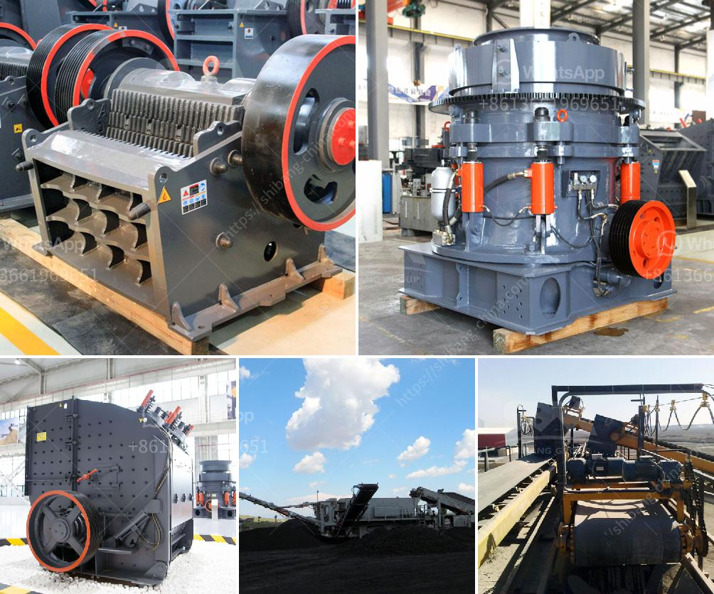

<h3>construction waste recycling</h3>
Each year, the construction industry generates a staggering amount of waste. From demolition debris to leftover materials, construction sites are the source of large quantities of discarded materials that contribute to environmental degradation. However, increasingly, there has been growing awareness and implementation of construction waste recycling practices to mitigate the environmental impact and create a more sustainable future.

Construction waste recycling is the process of repurposing or reusing materials from construction sites, rather than disposing of them in landfills. Recycling not only minimizes the harmful effects on the environment but also provides economic benefits and reduces the consumption of natural resources.

One of the primary benefits of construction waste recycling is the reduction of landfill waste. Construction sites are notorious for producing large volumes of waste, including concrete, wood, metal, and plastic. By recycling these materials, they are diverted from landfills, which helps conserve precious land space and prevents the release of harmful substances into the environment.

Recycling construction waste also plays a vital role in conserving natural resources. Many construction materials, such as aggregates and metals, require extensive extraction processes that contribute to habitat destruction, air pollution, and water contamination. By reusing these materials, the demand for new resource extraction is reduced, ultimately preserving natural habitats and reducing the carbon footprint associated with their production.

Moreover, construction waste recycling has economic benefits. The repurposed materials can be used in future construction projects, significantly reducing costs associated with purchasing new materials. Additionally, recycling waste creates job opportunities in the recycling industry, contributing to economic growth and promoting sustainable development.

Successful construction waste recycling requires a systematic approach. It begins with effective waste management plans and proper sorting of materials. Construction sites must implement dedicated waste stations and separate designated areas for recycling different types of materials. Training and educating personnel on proper waste segregation are crucial to ensure the success of recycling efforts.

Once materials are sorted, they can be sent to local recycling facilities or repurposed on-site. Concrete and masonry can be crushed and used as aggregates for road construction or as a foundation for new buildings. Wood waste can be processed into wood chips for landscaping or composting. Metals can be melted and reshaped into new structural components. Plastic waste can be shredded and recycled into various plastic products.

To encourage and promote construction waste recycling, governments and regulatory bodies should introduce policies and incentives that support sustainable practices. Tax breaks, grants, or other financial incentives can encourage construction companies to adopt recycling initiatives. Municipal governments can collaborate with local recycling facilities to create convenient drop-off centers for construction site waste. Educational campaigns can raise awareness among contractors and workers about the benefits of recycling and provide information on recycling options and requirements.

In conclusion, construction waste recycling is an essential practice that transforms waste into opportunity. By diverting waste from landfills, reducing resource consumption, and promoting the reuse of materials, construction waste recycling contributes to environmental preservation, economic growth, and a more sustainable future. It is time for the construction industry to embrace recycling practices and make a positive impact on our planet.
<h3>Contact us</h3><ul><li><strong>Whatsapp:&nbsp;<a href="https://wa.me/8613661969651">+8613661969651</a></strong></li><li><a href="https://swt.shibang-china.com/?git&amp;zhl&amp;construction waste recycling"><strong>Online Service(chat now)</strong></a></li></ul><h3>Related</h3><ul><li><a href='jaw crushing plant cost.md'>jaw crushing plant cost</a></li><li><a href='pf impact crusher.md'>pf impact crusher</a></li><li><a href='vertical ball mill technology.md'>vertical ball mill technology</a></li><li><a href='roller mill manufacturers in nigeria.md'>roller mill manufacturers in nigeria</a></li><li><a href='rock crushing machine for concrete use.md'>rock crushing machine for concrete use</a></li></ul>