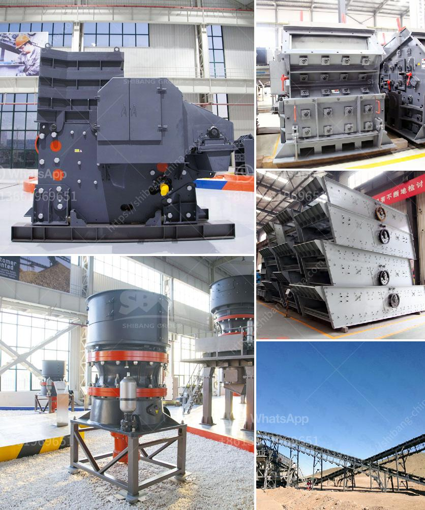

<h3>controlling parameter of impact crusher</h3>
An impact crusher is a versatile machine which has the potential to break a variety of rock and stone materials into required sizes. Thanks to their high levels of efficiency and productivity, impact crushers are widely used in various industries such as mining, quarrying, and recycling. However, to ensure optimal performance and output, it is crucial to understand and control several important parameters of the impact crusher.

Feed Size: One of the most critical parameters to control in an impact crusher is the feed size. The size of the incoming feed material directly affects the performance and efficiency of the crusher. Larger feed sizes often result in higher throughput and coarser product, while smaller feed sizes allow for finer product and better overall particle size distribution. Therefore, it is essential to monitor and control the feed size to achieve the desired output.

Rotor Speed: The rotor speed of an impact crusher significantly impacts its performance. The faster the rotor rotates, the more energy is transferred to the material being crushed. This increased energy leads to higher throughput and improved overall crushing efficiency. However, excessively high rotor speeds can also cause excessive wear and tear on the crusher components. Therefore, finding the optimum rotor speed is essential to balance productivity and longevity.

Blow Bars Configuration: Impact crushers utilize blow bars or hammers that repeatedly impact the material being crushed. These blow bars are crucial in determining the final product shape and size. Different configurations of blow bars can produce various product gradations and impact forces. By adjusting the blow bar configuration, an operator can control the shape and size of the final product, optimize performance according to specific requirements, and minimize the need for secondary crushing stages.

Gap Setting: Another crucial parameter to control in an impact crusher is the gap setting between the rotor and impact plates. This gap determines the size of the crushed material and influences the overall product gradation. An appropriate gap setting allows for consistent and uniform particle size distribution, while an inadequate gap setting may result in oversized or undersized material. Therefore, regularly monitoring and adjusting the gap setting is critical to maintain optimal productivity and product quality.

Material Hardness: The hardness of the material being crushed also has a significant impact on the crusher's performance. Softer materials require less energy to crush, resulting in higher throughput and reduced wear. On the other hand, harder materials may cause excessive wear and tear on the crusher components. Understanding the material hardness and adjusting the operating parameters accordingly can improve the crusher's efficiency and prolong its lifespan.

Overall, controlling the parameters of an impact crusher is essential to ensure its efficiency and productivity. By monitoring and adjusting the feed size, rotor speed, blow bar configuration, gap setting, and material hardness, operators can achieve the desired product quality, shape, and size while optimizing the crusher's performance. Regular maintenance and inspection of the crusher are also critical to ensure its longevity and prevent unexpected breakdowns. By keeping these parameters under control, impact crushers can process a wide range of materials and deliver consistent, high-quality output.
<h3>Contact us</h3><ul><li><strong>Whatsapp:&nbsp;<a href="https://wa.me/8613661969651">+8613661969651</a></strong></li><li><a href="https://swt.shibang-china.com/?git&amp;zhl&amp;controlling parameter of impact crusher"><strong>Online Service(chat now)</strong></a></li></ul><h3>Related</h3><ul><li><a href='impact crusher on sale.md'>impact crusher on sale</a></li><li><a href='jaw crusher price 200mm.md'>jaw crusher price 200mm</a></li><li><a href='mobile and modular coal washing plants.md'>mobile and modular coal washing plants</a></li><li><a href='prices on cone crusher parts.md'>prices on cone crusher parts</a></li><li><a href='company manufactures the best ball mill.md'>company manufactures the best ball mill</a></li></ul>